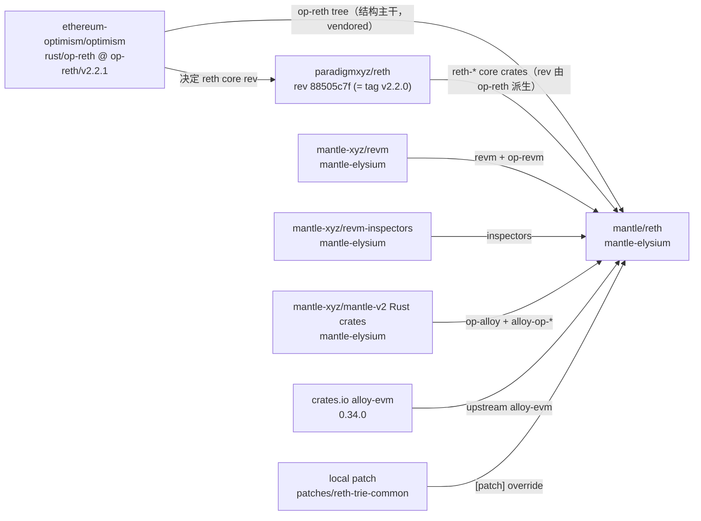
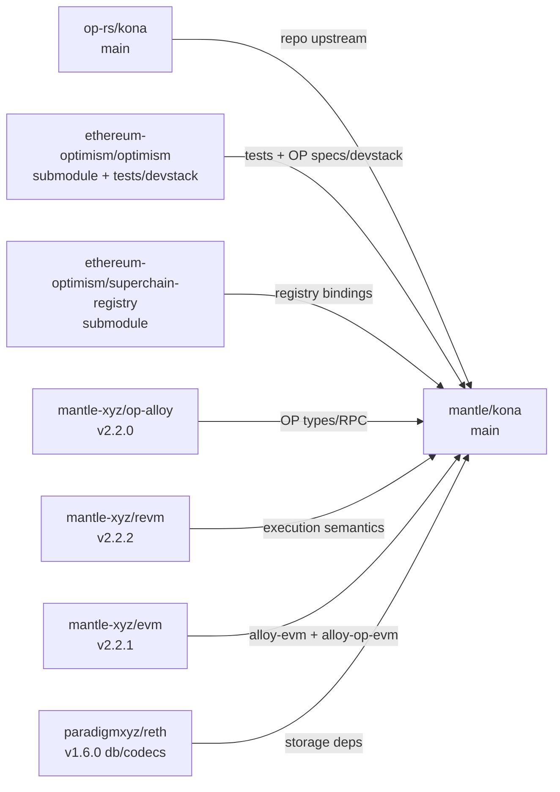
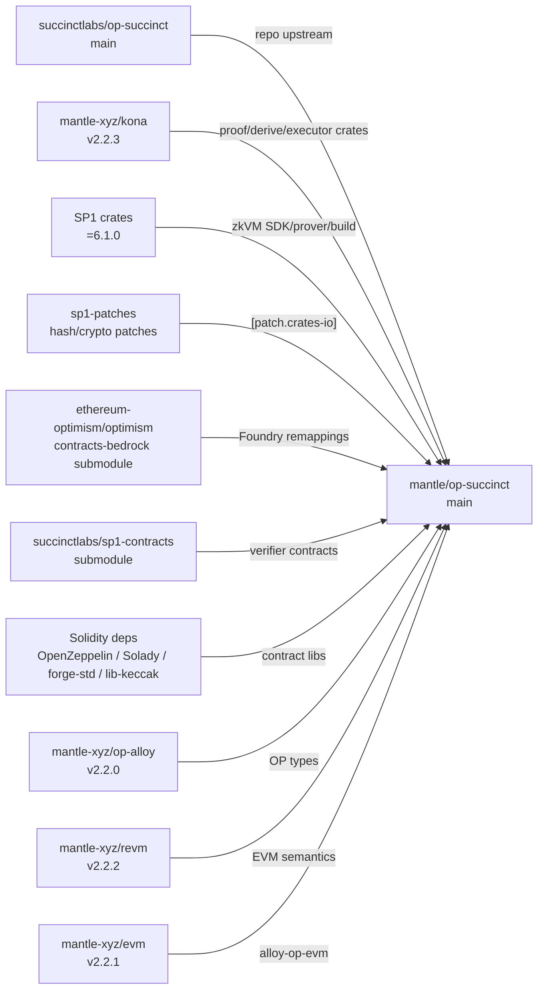
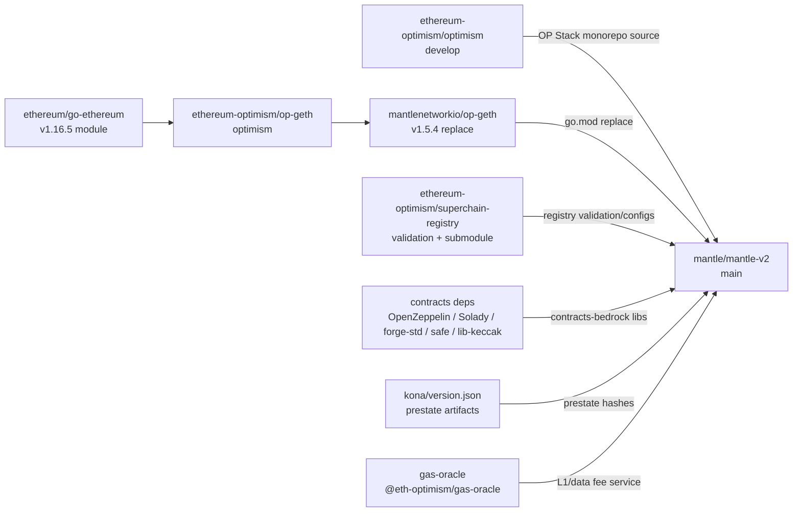
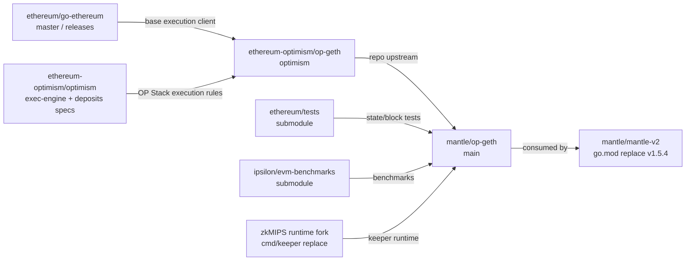
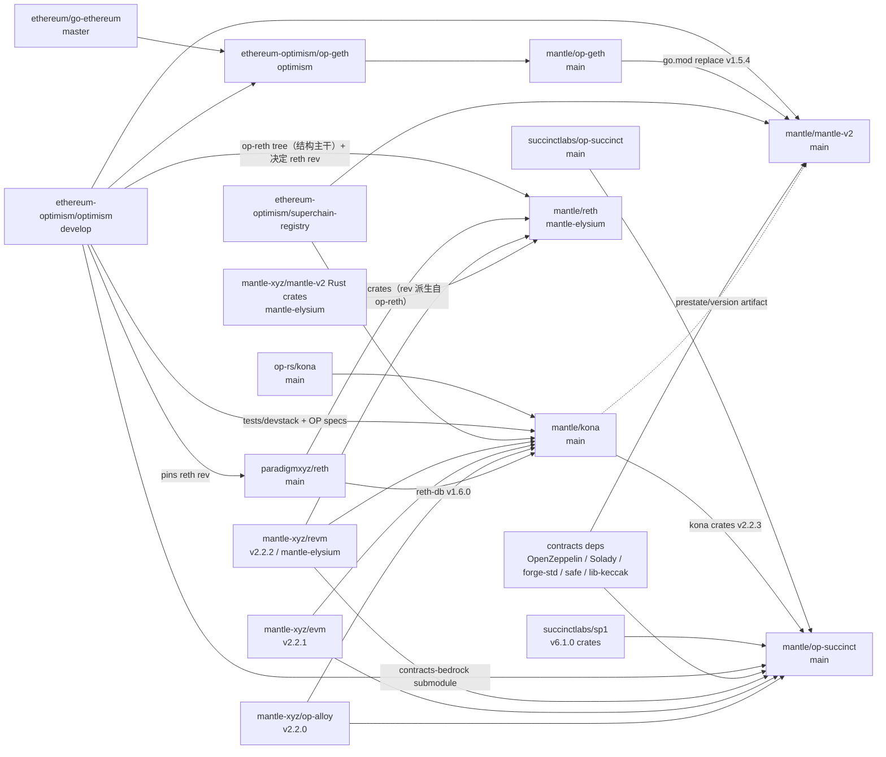

# Mantle Codebase Upstream Dependency Map

> 调研日期：2026-06-13  
> 本地源码根目录：`/Users/whisker/Work/src/networks/mantle/`  
> 目标仓库：`mantle/reth`（`mantle-elysium` branch）、`mantle/kona`、`mantle/op-succinct`、`mantle/mantle-v2`、`mantle/op-geth`

这份文档只梳理代码与依赖关系，不评估 CI/CD workflow。结论分两类：

- **显式依赖**：来自 `Cargo.toml`、`Cargo.lock`、`go.mod`、`.gitmodules`、`foundry.toml`、本地 git remote。
- **结构来源**：来自仓库结构、README、manifest 注释，说明这份 Mantle 代码应跟哪个上游代码族同步。

## 总览

| Mantle repo | 本地分支/HEAD | 主要结构来源或直接上游 | 显式依赖里最关键的上游 | 需要优先监控的变化 |
| --- | --- | --- | --- | --- |
| `mantle/reth` | `mantle-elysium` / `2e835dd42` | OP Stack `op-reth`（`ethereum-optimism/optimism` 的 `rust/op-reth`，base `op-reth/v2.2.1`）为结构主干；`paradigmxyz/reth` 只提供 op-reth 所 pin 的 core crates | `op-reth/v2.2.1` →（派生）`paradigmxyz/reth@88505c7f`(=v2.2.0)、`mantle-xyz/revm:mantle-elysium`、`mantle-xyz/mantle-v2:mantle-elysium` | **`op-reth/vX.Y.Z` 发布 tag（bump 触发源）**、reth core API、trie/db、payload/Engine API、OP hardfork/RPC、Mantle fee/hardfork crates |
| `mantle/kona` | `main` / `72a20ab9` | `op-rs/kona` | `mantle-xyz/op-alloy@v2.2.0`、`mantle-xyz/revm@v2.2.2`、`mantle-xyz/evm@v2.2.1`、`paradigmxyz/reth@v1.6.0` | OP derivation/spec、proof executor、MPT/preimage、superchain registry、Mantle execution semantics |
| `mantle/op-succinct` | `main` / `664a1bd` | `succinctlabs/op-succinct` | `mantle-xyz/kona@v2.2.3`、SP1 `=6.1.0`、Mantle `op-alloy`/`evm`/`revm` forks | Kona crate versions、SP1/zkVM patches、Optimism contracts-bedrock、proof program assumptions |
| `mantle/mantle-v2` | `main` / `feb2a588c` | `ethereum-optimism/optimism`（本地未配置 `upstream` remote） | `replace github.com/ethereum/go-ethereum => github.com/mantlenetworkio/op-geth v1.5.4` | OP Stack Go monorepo、contracts-bedrock、op-geth version、superchain-registry、Mantle native token/EigenDA/data fee |
| `mantle/op-geth` | `main` / `3c1c571e5` | `ethereum-optimism/op-geth`，再上游是 `ethereum/go-ethereum` | Go module `github.com/ethereum/go-ethereum`，子模块 `ethereum/tests`、`ipsilon/evm-benchmarks` | go-ethereum hardfork/EVM/DB/API、OP deposit/L1 cost/Engine API、Mantle hardfork/preconf/native fee |

远端头校验（非 fetch，只用 `git ls-remote`）：

| Upstream | 当前远端分支 | 2026-06-13 远端 HEAD |
| --- | --- | --- |
| `paradigmxyz/reth` | `main` | `6cb4cbf1b50b1861f0ce0c38e4ecc9858f10c7cd` |
| `op-rs/kona` | `main` | `2586fc56ea0b0f17a8b47c44196012e33a321ea7` |
| `succinctlabs/op-succinct` | `main` | `320e8f32b609c543fd347663976b03cbbfd33baf` |
| `ethereum-optimism/optimism` | `develop` | `cc17dfe50dd21e748c50e7982e87369797eb213d` |
| `ethereum-optimism/op-geth` | `optimism` | `545816cfedc6dfd6d6293f924771da84bf45f398` |
| `ethereum/go-ethereum` | `master` | `23483010a479fea7aabfce9c8f6605d0ba62ee8d` |

注意：本地 remote refs 不都新鲜。`mantle/op-succinct` 本地 `upstream/main` 是 `a0baa19`，但远端当前 `main` 是 `320e8f32`；`mantle/op-geth` 本地 `upstream/optimism` 是 `f89d06824`，但远端当前 `optimism` 是 `545816cf`。后续做差异分析前应先 fetch。

注意（reth 例外）：上表给 `paradigmxyz/reth` 列的是 `main` HEAD，但**这对 `mantle/reth` 不是有意义的同步信号**。`mantle/reth` 不跟随 paradigm `main`，而是跟随 `ethereum-optimism/optimism` 的 `op-reth/vX.Y.Z` 发布 tag；它 pin 的 `paradigmxyz/reth` rev 是「该 op-reth 发布所 pin 的 rev」的原样复制（详见 §1）。要监控 reth bump，应看 op-reth 的发布 tag，而不是 paradigm `main`。

## 1. `mantle/reth`

### 结构与上游

本地仓库：`/Users/whisker/Work/src/networks/mantle/reth`

git remote：

- `origin`: `git@github.com:mantle-xyz/reth.git`
- `upstream`: `git@github.com:paradigmxyz/reth.git`

根 `Cargo.toml` 已经把结构说明写得很清楚：

- `op-reth/`: OP Stack execution layer，注释标注来自 `ethereum-optimism/optimism` 的 `op-reth/v2.2.1`。
- `mantle-reth/`: Mantle trait override layer。
- `patches/`: 对 reth core 的最小 patch。

证据：

- `reth/Cargo.toml:1-16`
- `reth/Cargo.toml:29-62`

**关键：bump 模型是 op-reth 驱动，`paradigmxyz/reth` rev 是派生值。**

`mantle/reth` 的结构主干是 `ethereum-optimism/optimism` 仓库里的 `rust/op-reth`（OP 以 `op-reth/vX.Y.Z` tag 发布，本仓库 base 是 `op-reth/v2.2.1`），整棵 `op-reth/` 是它的 vendored copy。`paradigmxyz/reth` 虽然是 git `upstream` remote，但 **Mantle 不独立选它的 rev**：它把所有 `reth-*` core crate pin 在 `op-reth/v2.2.1` 自己所 pin 的那个 rev 上，直接原样抄过来。Mantle 自己的注释写得很直白——`reth/Cargo.toml:9`「same as upstream op-reth pins」、`reth/Cargo.toml:146`「pinned by upstream op-reth」。

已核对的链条（2026-06-13）：

1. `op-reth/v2.2.1` = `ethereum-optimism/optimism` commit `a027cc82`；其 `rust/Cargo.toml` 唯一 pin `paradigmxyz/reth", rev = "88505c7f…"`（op-reth 源码在该 monorepo 的 `rust/op-reth/`，由 `docker-bake.hcl` → `op-reth/DockerfileOp`、context `rust/` 构建）。
2. `mantle/reth/Cargo.toml` 把全部 `reth-*` core crate pin 到同一个 `88505c7f`。
3. `88505c7f` = `paradigmxyz/reth` 的 tag `v2.2.0`（`git ls-remote` 核对，`git describe` 为 `v1.11.0-832-g88505c7fc`）。
4. 含义：reth 的 bump 触发源是 **`ethereum-optimism/optimism` 的 `op-reth/vX.Y.Z` 发布 tag**，不是 `paradigmxyz/reth@main`；后者前移不会进入 Mantle，只有新的 op-reth 发布才会。注意 op-reth 版本号比它 pin 的 reth core tag 略快（op-reth `v2.2.1` → reth `v2.2.0`），所以要知道某个 op-reth 发布对应哪个 reth rev，必须读该 op-reth tag 的 `rust/Cargo.toml`。

### 依赖 DAG

### 显式依赖

| 依赖 | 来源 | 当前 pin | 作用 |
| --- | --- | --- | --- |
| `paradigmxyz/reth` | `Cargo.toml` git deps | `rev = 88505c7fcbfdebfd3b56d88c86b62e950043c6c4` | 大量 `reth-*` core crates；**rev 非独立选取，= `op-reth/v2.2.1` 所 pin 的值（= reth tag v2.2.0）** |
| `mantle-xyz/revm` | `Cargo.toml` git deps + `[patch.crates-io]` | `branch = mantle-elysium`，`Cargo.lock` pin `b4f6182` | Mantle fee model / EVM semantics，含 `op-revm` |
| `mantle-xyz/revm-inspectors` | `Cargo.toml` git deps + patch | `branch = mantle-elysium`，`Cargo.lock` pin `af52253` | tracing/inspection |
| `mantle-xyz/mantle-v2` | `Cargo.toml` git deps + patch | `branch = mantle-elysium`，`Cargo.lock` pin `c06cb72` | `alloy-op-evm`、`alloy-op-hardforks`、`op-alloy-*` |
| `alloy-evm` | crates.io | `0.34.0` | upstream Alloy EVM，无 Mantle patch |
| local `patches/reth-trie-common` | `[patch."https://github.com/paradigmxyz/reth"]` | path patch | 覆盖 `reth-trie-common` |

证据：

- `reth/Cargo.toml:146-216`
- `reth/Cargo.toml:218-254`
- `reth/Cargo.toml:400-434`
- `reth/Cargo.lock` 中 `mantle-xyz/mantle-v2?branch=mantle-elysium#c06cb72`、`mantle-xyz/revm?branch=mantle-elysium#b4f6182`、`mantle-xyz/revm-inspectors?branch=mantle-elysium#af52253`
- 上游核对：`ethereum-optimism/optimism` 在 `op-reth/v2.2.1`(commit `a027cc82`) 的 `rust/Cargo.toml` 同样 pin `paradigmxyz/reth@88505c7f`，与本仓库逐字一致 → 证实 rev 是从 op-reth 复制而来

### 需要监控的上游变化

| 上游变化 | 可能影响 |
| --- | --- |
| **新的 `op-reth/vX.Y.Z` 发布（主要 bump 触发源）** | 决定下一棵 op-reth 树 + 下一个 `paradigmxyz/reth` rev。Mantle 跟随 op-reth 发布做 bump，需同步 vendored `op-reth/` 树、reth core rev，以及随之而来的 OP hardfork、payload envelope、Engine API、OP RPC。 |
| `paradigmxyz/reth` core crates 更新（间接） | 仅当某个 `op-reth` 发布把 reth rev 前移时才进入 Mantle；直接盯 `paradigmxyz/reth@main` 是错误信号。变化面：`reth-node-*`、provider/db/trie、payload builder、RPC traits、transaction pool API——会打破 `mantle-reth` 与 `op-reth` 的 wrapper/trait 实现，但只有先被某个 op-reth release 采纳后才需 Mantle 适配。 |
| `mantle-xyz/revm` / `op-revm` 更新 | EVM gas、precompile、L1/data fee、hardfork rule 变化会影响区块执行、receipt/state root。 |
| `mantle-xyz/mantle-v2` Rust crates 更新 | `op-alloy-*`、`alloy-op-evm`、`alloy-op-hardforks` 的类型和 hardfork 枚举一变，`reth`、`kona`、`op-succinct` 可能同时需要适配。 |
| `reth-trie-common` 上游变化 | 本地 path patch 覆盖了上游 crate。上游 trie/hash/state-root 修复容易和 Mantle patch 冲突。 |

### 适配风险

- `mantle-elysium` 使用多个 branch 依赖。`Cargo.lock` 当前固定了 commit，但一旦更新 lock 或做 cargo update，就可能引入跨仓库 API 不一致。
- `reth` 同时依赖 `paradigmxyz/reth`、OP `op-reth`、Mantle `revm`、Mantle `mantle-v2` Rust crates；但前两者不是独立维度——`op-reth` 发布 tag 决定 `paradigmxyz/reth` rev，二者锁定在一起移动。真正要对齐的三方是：op-reth tag ↔ 它所 pin 的 reth rev ↔ Mantle `revm`/`mantle-v2` fork。
- 高风险代码面：chain spec/hardfork 时间、L1/data fee、payload builder/Engine API、RPC eth-api extension、txpool、trie/state root。

## 2. `mantle/kona`

### 结构与上游

本地仓库：`/Users/whisker/Work/src/networks/mantle/kona`

git remote：

- `origin`: `git@github.com:mantle-xyz/kona.git`
- `upstream`: `git@github.com:op-rs/kona.git`

根 `Cargo.toml` 表明这是 `op-rs/kona` 风格的 Rust monorepo：

- binaries: `bin/host`、`bin/client`、`bin/node`、`bin/supervisor`、`bin/rollup`
- crates: `proof`、`node`、`supervisor`、`protocol`、`batcher`、`providers`、`utilities`
- repository metadata 仍指向 `https://github.com/op-rs/kona`

证据：

- `kona/Cargo.toml:1-31`
- `kona/Cargo.toml:76-124`

### 依赖 DAG

### 显式依赖

| 依赖 | 来源 | 当前 pin | 作用 |
| --- | --- | --- | --- |
| `mantle-xyz/op-alloy` | `Cargo.toml` git deps | `tag = v2.2.0` | OP Alloy network/consensus/RPC types |
| `mantle-xyz/revm` | `Cargo.toml` git deps | `tag = v2.2.2` | `revm`、`op-revm` |
| `mantle-xyz/evm` | `Cargo.toml` git deps | `tag = v2.2.1` | `alloy-evm`、`alloy-op-evm` |
| `paradigmxyz/reth` | `Cargo.toml` git deps | `tag = v1.6.0` | `reth-db-api`、`reth-db`、`reth-codecs`，注释说明给 `kona-supervisor-storage` 使用 |
| `ethereum-optimism/superchain-registry` | submodule | path `crates/protocol/registry/superchain-registry` | chain registry bindings |
| `ethereum-optimism/optimism` | submodule + tests `go.mod` | tests pseudo version `v1.14.4-0.20251029204710-ebbff51f4cc9` | devstack / tests |
| `paradigmxyz/reth` | submodule | path `tests/reth` | test fixture |

证据：

- `kona/Cargo.toml:151-169`
- `kona/.gitmodules:1-9`
- `kona/tests/go.mod:1-14`

### 需要监控的上游变化

| 上游变化 | 可能影响 |
| --- | --- |
| `op-rs/kona` proof/protocol/node 更新 | derivation pipeline、preimage oracle、MPT、executor、registry、node service API 变化会影响 Mantle Kona fork。 |
| `ethereum-optimism/optimism` specs/devstack 更新 | `tests/go.mod` 明确使用 Optimism develop 侧 devstack；OP specs、devnet、interoperability 测试变化可能要求同步 test harness。 |
| `superchain-registry` 更新 | chain config、hardfork schedule、registry format 会影响 `kona-registry`。 |
| Mantle `op-alloy` / `revm` / `evm` tag 更新 | 同一组 execution/type crates 也被 `op-succinct` 使用，版本不一致会导致 proof 与执行语义偏移。 |
| `paradigmxyz/reth v1.6.0` 相关 DB crates | storage codec/db API 变化会影响 `kona-supervisor-storage`。 |

### 适配风险

- `kona` 是 `op-succinct` 的核心依赖。`op-succinct` 当前显式依赖 `mantle-xyz/kona@v2.2.3`，其 lock 指向 commit `72a20ab9`，也就是当前 `mantle/kona` HEAD。Kona tag 的任何升级都要和 `op-succinct` proof 程序一起验证。
- `kona` 同时承载 proof/client/host 与 node/supervisor 代码。OP upstream 改 derivation、interop、preimage 或 superchain registry 时，需要分别跑 native tests 和 proof-target tests。
- `tests/go.mod` 使用 Optimism develop pseudo version。Optimism devstack API 变化可能先破测试，再暴露协议适配问题。

## 3. `mantle/op-succinct`

### 结构与上游

本地仓库：`/Users/whisker/Work/src/networks/mantle/op-succinct`

git remote：

- `origin`: `git@github.com:mantle-xyz/op-succinct.git`
- `upstream`: `git@github.com:succinctlabs/op-succinct.git`

根 `Cargo.toml` 表明这是 `succinctlabs/op-succinct` workspace：

- `utils/client`、`utils/host`、`utils/proof`、`utils/signer`
- `programs/range/*`、`programs/aggregation`
- `validity`
- `scripts/*`

证据：

- `op-succinct/Cargo.toml:1-24`

### 依赖 DAG

### 显式依赖

| 依赖 | 来源 | 当前 pin | 作用 |
| --- | --- | --- | --- |
| `mantle-xyz/kona` | `Cargo.toml` git deps | `tag = v2.2.3`，`Cargo.lock` pin `72a20ab9` | proof/derive/executor/preimage/client/host/protocol/registry |
| `mantle-xyz/op-alloy` | `Cargo.toml` git deps | `tag = v2.2.0` | OP Alloy types |
| `mantle-xyz/evm` | `Cargo.toml` git deps | `tag = v2.2.1` | `alloy-evm`、`alloy-op-evm` |
| `mantle-xyz/revm` | `Cargo.toml` git deps | `tag = v2.2.2` | `revm`、`op-revm`、`revm-precompile` |
| SP1 crates | `Cargo.toml` crates.io exact versions | `=6.1.0` | zkVM SDK/prover/build/runtime |
| `sp1-patches/*` | `[patch.crates-io]` | SP1 6.0 patch tags | zkVM-compatible crypto/hash crates |
| `ethereum-optimism/optimism` | submodule + Foundry remapping | `contracts/lib/optimism` | contracts-bedrock imports |
| `succinctlabs/sp1-contracts` | submodule | `contracts/lib/sp1-contracts` | verifier/contracts |
| OpenZeppelin / Solady / forge-std / lib-keccak | submodules | paths under `contracts/lib` | Solidity deps |

证据：

- `op-succinct/Cargo.toml:74-91`
- `op-succinct/Cargo.toml:147-176`
- `op-succinct/Cargo.toml:187-193`
- `op-succinct/.gitmodules:1-21`
- `op-succinct/contracts/foundry.toml:1-32`

### 需要监控的上游变化

| 上游变化 | 可能影响 |
| --- | --- |
| `succinctlabs/op-succinct` main/release | service layout、validity/fault-proof flow、contract ABI、SP1 integration 会影响 Mantle fork。 |
| `mantle-xyz/kona` tag 更新 | 这是 proof 程序执行 OP Stack/Mantle 状态转换的核心。Kona proof/executor/preimage 变化会直接影响 proof 生成和验证。 |
| SP1 `6.1.0` 之后的 SDK/prover/build 更新 | zkVM runtime、patch crate、proof format 或 verifier ABI 变化会要求同步程序、contracts、CI cache。 |
| Optimism contracts-bedrock 更新 | Foundry remapping 直接引用 `contracts/lib/optimism/packages/contracts-bedrock`。合约路径、接口、storage layout 或 compiler constraints 变化会影响 deployment/verification。 |
| Mantle execution crates 更新 | `op-alloy`、`evm`、`revm` 的 tag 必须与 `kona` 和 Mantle execution clients 保持语义一致。 |

### 适配风险

- `op-succinct` 位于依赖链下游：`op-geth`/`mantle-v2` 的 execution/hardfork/fee model 变化，必须先进入 `kona` 和 Mantle execution crates，再进入 proving program。只同步 `succinctlabs/op-succinct` 不够。
- SP1 patch crates 锁定在特定 tag。RustCrypto、elliptic-curves、tiny-keccak 等上游安全或 API 更新，不能直接升级，需要确认 SP1 patch 是否同步。
- 合约侧依赖 Optimism contracts-bedrock 绝对路径 remapping。上游移动目录或改 import，会破 Foundry build。

## 4. `mantle/mantle-v2`

### 结构与上游

本地仓库：`/Users/whisker/Work/src/networks/mantle/mantle-v2`

git remote：

- `origin`: `git@github.com:mantlenetworkio/mantle-v2.git`
- 本地未配置 `upstream` remote。

虽然本地没有 upstream remote，但代码结构强烈指向 `ethereum-optimism/optimism`：

- `go.mod` module 是 `github.com/ethereum-optimism/optimism`。
- README 明确说 Mantle V2 是基于 OP Stack infrastructure 的适配，目录包含 `op-node`、`op-batcher`、`op-program`、`op-service`、`op-chain-ops`、`op-e2e`、`packages/contracts-bedrock` 等 Optimism monorepo 组件。
- 远端 `ethereum-optimism/optimism` 当前活跃默认分支是 `develop`。

证据：

- `mantle-v2/go.mod:1-5`
- `mantle-v2/README.md:21-37`
- `mantle-v2/README.md:43-85`

### 依赖 DAG

### 显式依赖

| 依赖 | 来源 | 当前 pin | 作用 |
| --- | --- | --- | --- |
| `github.com/ethereum/go-ethereum` | `go.mod require` | `v1.16.5` | upstream module name |
| `github.com/mantlenetworkio/op-geth` | `go.mod replace` | `v1.5.4` | 实际替代 `github.com/ethereum/go-ethereum`，是 `mantle-v2` 的硬依赖 |
| `ethereum-optimism/superchain-registry/validation` | `go.mod require` | pseudo version `20251009180028-9b4658b9b7af` | registry validation |
| `ethereum-optimism/go-ethereum-hdwallet` | `go.mod require` | pseudo version `20251001155152-4eb15ccedf7e` | hd wallet |
| contracts libs | `.gitmodules` | OpenZeppelin、solmate、forge-std、safe-contracts、kontrol、solady、lib-keccak、superchain-registry | contracts-bedrock dependencies |
| `kona/version.json` | local file | version `1.2.4`，prestate hashes | fault proof / prestate artifact reference |
| `@eth-optimism/gas-oracle` | `gas-oracle/package.json` | `0.1.13` | gas oracle package |

证据：

- `mantle-v2/go.mod:24-26`
- `mantle-v2/go.mod:325-329`
- `mantle-v2/.gitmodules:1-34`
- `mantle-v2/packages/contracts-bedrock/foundry.toml:1-78`
- `mantle-v2/kona/version.json:1-5`
- `mantle-v2/gas-oracle/package.json:1-5`

### 需要监控的上游变化

| 上游变化 | 可能影响 |
| --- | --- |
| `ethereum-optimism/optimism` develop/release | `op-node`、`op-batcher`、`op-proposer`、`op-program`、`op-service`、`contracts-bedrock`、devnet/e2e/test framework 的 API 与配置变化。 |
| `mantlenetworkio/op-geth` release | `go.mod replace` 使所有 `github.com/ethereum/go-ethereum` imports 实际落到 Mantle op-geth。op-geth 版本不匹配会破 build、Engine API、payload attributes、tx/receipt types。 |
| `ethereum-optimism/op-geth` / `ethereum/go-ethereum` | `mantlenetworkio/op-geth` 的上游变化会间接传入。 |
| `superchain-registry` | chain config validation、standard config、contracts registry format 变化会影响 deploy/validate 工具。 |
| contracts-bedrock deps | OpenZeppelin、solady、forge-std、safe contracts、lib-keccak 变化会影响 Solidity build、storage layout、ABI、verification。 |
| Kona/prestate artifact | `kona/version.json` 的 prestate hash 变化意味着 fault proof / op-program 相关验证链路要同步。 |

### 适配风险

- 这是跨仓库耦合最强的 repo：`mantle-v2` 是 OP Stack Go monorepo fork，同时通过 `replace` 绑定 `mantle/op-geth`。OP upstream 更新时，要同时确认 `op-geth` 版本和 Engine API 是否匹配。
- Mantle README 中明确列出 Mantle fork sequence：`BaseFee -> Everest -> Euboea -> Skadi -> Limb -> Arsia`，且 Arsia 对齐 OP Stack Canyon through Jovian 并引入新 L1 data fee model。OP upstream 继续引入 hardfork、interop 或 fee model 变化时，需要重新映射 Mantle hardfork schedule。
- Mantle 特性包括 `$MNT` native token、EigenDA、新 DA/data fee、gas oracle、acceptance tests。OP Stack upstream 默认假设 ETH/native OP behavior 的地方都可能需要 Mantle 适配。

## 5. `mantle/op-geth`

### 结构与上游

本地仓库：`/Users/whisker/Work/src/networks/mantle/op-geth`

git remote：

- `origin`: `git@github.com:mantlenetworkio/op-geth.git`
- `upstream`: `git@github.com:ethereum-optimism/op-geth.git`

上游层级：

1. `ethereum/go-ethereum` 是基础执行层客户端。
2. `ethereum-optimism/op-geth` 的 `optimism` 分支在 geth 上加入 OP Stack execution engine 修改。
3. `mantlenetworkio/op-geth` 在 OP geth 上加入 Mantle hardfork、native fee/precompile/preconf 等修改。

证据：

- `op-geth/go.mod:1-5`
- `op-geth/fork.yaml:1-20`
- `op-geth/fork.yaml:25-110`

### 依赖 DAG

### 显式依赖

| 依赖 | 来源 | 当前 pin | 作用 |
| --- | --- | --- | --- |
| `github.com/ethereum/go-ethereum` | root `go.mod` module | repo itself | module path 保持 geth upstream |
| `ethereum/tests` | submodule | `tests/testdata` | Ethereum state/block tests |
| `ipsilon/evm-benchmarks` | submodule | `tests/evm-benchmarks` | EVM benchmarks |
| `zkMIPS` runtime fork | `cmd/keeper/go.mod` replace | `github.com/weilzkm/zkMIPS/.../zkvm_runtime` pseudo version | `cmd/keeper` runtime |

证据：

- `op-geth/go.mod:1-26`
- `op-geth/.gitmodules:1-7`
- `op-geth/cmd/keeper/go.mod:1-49`

### 需要监控的上游变化

| 上游变化 | 可能影响 |
| --- | --- |
| `ethereum/go-ethereum` master/release | EVM、hardfork params、trie/db、state transition、txpool、RPC、Engine API types、P2P、consensus changes。 |
| `ethereum-optimism/op-geth` `optimism` branch | OP deposit tx、L1 cost、chain config、Engine API payload attributes、block building、txpool cost、receipt metadata、sequencer forwarding。 |
| `ethereum-optimism/optimism` specs | `op-geth/fork.yaml` 引用 OP exec-engine/deposits specs。spec 更新可能要求 op-geth 与 op-node 同步改。 |
| Mantle-specific forks/features | `Skadi`、`Limb`、`Arsia`、L1 data fee、native MNT、precompiles、preconf checker、DA footprint 等。 |
| `mantle-v2` `replace` pin | `mantle-v2` 依赖 `mantlenetworkio/op-geth v1.5.4`。op-geth 新 tag 需要配套更新 `mantle-v2/go.mod`。 |

### 适配风险

- `op-geth` 的上游是双层的：要分别看 OP geth 对 go-ethereum 的适配，以及 Mantle 对 OP geth 的适配。只比较 `mantlenetworkio/op-geth` 与 `ethereum-optimism/op-geth` 会漏掉 go-ethereum 新 hardfork/API 变化。
- 高风险代码面来自 `fork.yaml` 和本地 Mantle 修改：deposit tx、L1 cost、chain config、Engine API、miner/block building、txpool、receipt metadata。
- Mantle 本地新增/修改面包括 `ApplyMantleUpgrades`、`MantleSkadiTime`、`MantleLimbTime`、`MantleArsiaTime`、withdrawals/message passer storage root、precompile sets、EIP-1559/extraData 规则、preconf checker、DA space。任何上游 hardfork 或 payload format 变化都需要重新验证这些路径。

## 跨仓库依赖关系 DAG

图中实线表示代码或 manifest 里的明确依赖/来源；虚线表示再上游来源或需要单独纳入监控的上游代码族。

## 建议的监控分层

### P0：必须成组监控

| 监控组 | 包含 | 原因 |
| --- | --- | --- |
| OP Stack core | `ethereum-optimism/optimism`、`ethereum-optimism/op-geth`、`ethereum/go-ethereum` | `mantle-v2` 与 `mantle/op-geth` 的主干来源。Engine API、hardfork、contracts、op-node/op-program 变化必须联动。 |
| Mantle execution Rust stack | `mantle-xyz/revm`、`mantle-xyz/evm`、`mantle-xyz/op-alloy`、`mantle-xyz/mantle-v2` Rust crates | `reth`、`kona`、`op-succinct` 同时依赖这些 crates。版本漂移会导致类型不兼容或执行语义不一致。 |
| Kona proof chain | `mantle/kona`、`mantle/op-succinct`、SP1 crates/patches | `op-succinct` 的 proof correctness 依赖 Kona execution/derive 语义与 SP1 runtime。 |

### P1：高价值监控

| 监控对象 | 原因 |
| --- | --- |
| `ethereum-optimism/optimism` 的 `op-reth/vX.Y.Z` tag（+ 它 pin 的 `paradigmxyz/reth` rev） | 这是 `mantle/reth` 真正的 bump 触发源：新 op-reth tag → 新 reth rev → Mantle 跟随复制。直接盯 `paradigmxyz/reth@main` 会误报——上游 trie/db/payload/RPC 变化只有进入某个 op-reth release 后才会影响 Mantle 同步。 |
| `superchain-registry` | `kona`、`mantle-v2` 都使用 registry 或 validation。chain config schema/standard 变化容易破部署和测试。 |
| contracts dependencies | `mantle-v2` 与 `op-succinct` 都依赖 OpenZeppelin、Solady、forge-std、lib-keccak 等。合约 build 和 audit 面受影响。 |

### 适配检查清单

每次上游同步或依赖升级时，至少检查：

1. Engine API / payload attributes / executable data 是否在 `op-geth`、`mantle-v2`、`reth` 中一致。
2. Mantle hardfork 时间映射是否仍覆盖 OP upstream 新 hardfork：Skadi、Limb、Arsia 与 Canyon/Fjord/Granite/Holocene/Isthmus/Jovian 等。
3. L1/data fee、native MNT、operator fee、DA footprint、precompile set 是否在 `op-geth`、`reth`、`kona`、`op-succinct` 里保持相同执行语义。
4. `mantle-v2/go.mod` 的 `op-geth` replace version 是否匹配 `op-node` / `op-batcher` / `op-program` 对 geth types 的期待。
5. `op-succinct` 的 `kona` tag、SP1 version、SP1 patch crates 是否和 proof artifacts/ELF/prestate hash 同步。
6. `reth` 的 `[patch]` 和 `[patch.crates-io]` 是否仍覆盖所有需要统一的 crate，避免同一类型来自 crates.io 与 git fork 的双份依赖。
