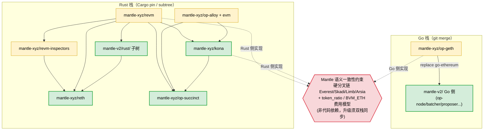
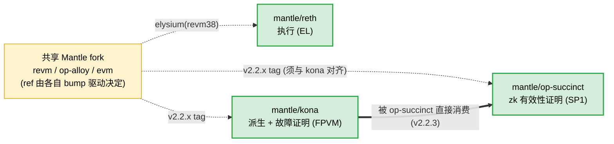

# Mantle 活跃 Repo 上游依赖拓扑总分析

> 综合对象：Mantle 当前已分析的 8 个活跃 repo（reth / kona / mantle-v2 / revm / op-alloy / op-geth / op-succinct / revm-inspectors），外加它们引用的全部上游 repo。
> 综合时间：2026-06-13
> 本文是对 `docs/outputs/sections/*` 八份单仓分析的**汇总与定稿**，给出跨仓的完整依赖拓扑图、bump 传导模型与升级影响总表。各单仓的逐条证据见对应 section 文档，本文只在结论层汇总并标注来源。
> 分析方法：静态分析（`Cargo.toml`/`Cargo.lock`、`go.mod`/`go.sum`、`git remote`/`merge-base`、subtree baseline 文档、源码 `[MANTLE]` 标记）+ GitHub 上游交叉验证。

---

## 1. 目的与核心结论

DESCRIPTION 的目标是：**明确哪些上游 repo 的更新会影响哪些 Mantle repo 的哪些组件**，并给出一张总的依赖拓扑图。综合八份分析后，三条核心结论：

1. **Mantle 的上游接入存在三种范式**，不能用同一种方式建模（详见 §3）：
   - **Cargo 依赖 pin 型**（Rust：reth/kona/op-succinct/revm/op-alloy/revm-inspectors）——上游 = 一组带 ref 的 git/registry 依赖，靠 `Cargo.toml` + `Cargo.lock` 解析。
   - **git merge 型**（Go：op-geth，以及 mantle-v2 的 Go 侧）——上游 = 一个被持续 merge 的 git 分支，靠 `git merge-base` + remote 配置识别。
   - **subtree 同步型**（mantle-v2 的 `rust/` 子树）——上游 = 经 bridge 仓库 `git subtree pull` 进来的目录快照，靠仓内 `MANTLE_CHANGES.md` baseline 表识别。

2. **「真正的上游」要区分三类角色**（这是贯穿全部分析的建模主线）：
   - **bump 驱动上游（一级）**：Mantle 主动跟随其 tag/分支。
   - **继承式上游**：版本不由 Mantle 选，而是从 bump 驱动上游的清单里复制（如 reth 的 paradigmxyz/reth rev、kona 的 reth-db v1.6.0）。
   - **Mantle 自控 fork**：revm / evm / op-alloy / revm-inspectors，Mantle 在其中注入费用模型/协议改动。

3. **OP 生态的两个 monorepo 是 Mantle 整个技术栈的总根**：
   - `ethereum-optimism/optimism`（Rust 侧：op-reth、kona、op-alloy/evm 的 path crate；通过 vendored / fork / subtree 三种方式分别喂给 reth / kona / mantle-v2）。
   - `ethereum-optimism/op-geth`（Go 侧执行层，喂给 mantle-xyz/op-geth → mantle-v2）。
   - 这两者背后才是 `paradigmxyz/reth`、`bluealloy/revm`、`alloy-rs/*`、`ethereum/go-ethereum` 等基础上游。

---

## 2. Repo 全景清单

### 2.1 Mantle 活跃 repo（已分析）

| Mantle repo | 语言/角色 | fork 形态 | bump 驱动上游 | 在 Mantle 栈中的位置 |
|---|---|---|---|---|
| **mantle-xyz/reth** | Rust · EL 执行节点 | 薄组合 workspace（vendored op-reth + 自定义层 + patch） | optimism `rust/op-reth`（tag `op-reth/v2.2.1`，vendored） | 中游消费者 |
| **mantle-xyz/kona** | Rust · 派生/故障证明栈 | 整仓 fork | kona（基线 `kona-client/v1.2.2`；后续 = optimism `rust/kona`） | 中游消费者 + op-succinct 的上游 |
| **mantle-xyz/mantle-v2** | Go + Rust · 平台/OP monorepo fork | 整仓 fork（Go）+ `rust/` subtree | optimism monorepo（Go fork 基底 + `rust/` subtree @ `kona-client/v1.5.1`） | **中间节点**（既下游又上游） |
| **mantle-xyz/revm** | Rust · EVM/费用模型 | 叶子 fork | bluealloy/revm | **根上游**（出度低、入度高） |
| **mantle-xyz/op-alloy** | Rust · OP 共识/RPC 类型 | 近根 fork（standalone） | alloy-rs/op-alloy（0.23.0 线） | 近根上游 |
| **mantle-xyz/op-geth** | Go · EL 客户端 | Go 单体 fork | ethereum-optimism/op-geth（`optimism` 分支） | 根上游（Go 侧） |
| **mantle-xyz/op-succinct** | Rust · SP1 zkVM 有效性证明 | fork + 依赖重指向 | succinctlabs/op-succinct + SP1 zkVM | **最下游** |
| **mantle-xyz/revm-inspectors** | Rust · tracing/debug | 依赖重指向 fork | paradigmxyz/revm-inspectors | **中间件**（revm→reth 之间） |

### 2.2 出现但未单独分析的 Mantle repo（节点需在总图标注）

| repo | 角色 | 证据来源 |
|---|---|---|
| **mantle-xyz/evm** | `alloy-rs/evm` 的 fork（`alloy-evm`/`alloy-op-evm` 2 包），被 kona/op-succinct 用 tag 消费 | kona §3.3、op-succinct §3.5 |
| **mantle-xyz/optimism-rust-bridge** | subtree 中转仓，把 optimism `rust/` split 后供 mantle-v2 `subtree pull` | mantle-v2 §4.1 |
| **mantlenetworkio/op-geth** | 即 mantle-xyz/op-geth（org 名差异，go.mod replace 写 `mantlenetworkio/op-geth`） | op-geth §1、mantle-v2 §2 |

### 2.3 外部上游 repo

| 上游 repo | 喂给哪些 Mantle repo | 角色 |
|---|---|---|
| **ethereum-optimism/optimism**（monorepo） | reth（`rust/op-reth` vendored）、kona（`rust/kona` 后续基线）、mantle-v2（Go fork + `rust/` subtree） | OP Stack 总根（Rust 侧 + Go 协议） |
| **ethereum-optimism/op-geth**（`optimism` 分支） | mantle-xyz/op-geth（git merge） | OP 执行层（Go） |
| **ethereum/go-ethereum**（内核 v1.16.5） | 经 op-geth 间接 | 以太坊内核 |
| **paradigmxyz/reth** | reth（rev `88505c7f`=v2.2.0，继承自 op-reth）、kona（tag `v1.6.0` 仅 reth-db，继承自 kona） | reth 执行层框架 / MDBX 存储 |
| **bluealloy/revm** | mantle-xyz/revm | EVM 核心 |
| **alloy-rs/op-alloy** | mantle-xyz/op-alloy（0.23.0）、mantle-v2/rust/op-alloy（2.0.0 子树拷贝） | OP 共识/RPC 类型 |
| **alloy-rs/evm** | mantle-xyz/evm | EVM 抽象层 |
| **paradigmxyz/revm-inspectors** | mantle-xyz/revm-inspectors | tracing inspector |
| **succinctlabs/op-succinct** | mantle-xyz/op-succinct | zkVM 证明 harness |
| **Succinct SP1 zkVM**（`sp1-*` `=6.1.0` + sp1-patches/*） | mantle-xyz/op-succinct | zkVM 运行时/证明系统 |
| **crates.io 注册表**（alloy 全家 + precompile/crypto） | 全部 Rust repo | 基础库 |
| **ethereum-optimism/superchain-registry** | mantle-v2（Go）、kona（子模块） | 链注册表数据 |

---

## 3. 三种上游接入范式（总建模框架）

> 这是把八个仓库统一到一张图里的关键——同一张拓扑图上有三类语义不同的「上游边」。

| 范式 | 适用 repo | 上游载体 | 识别方法 | 边的语义 | 边标签 |
|---|---|---|---|---|---|
| **Cargo 依赖 pin** | reth, kona, op-succinct, revm, op-alloy, revm-inspectors | 一组 git/registry 依赖 | `Cargo.toml` 声明 + `Cargo.lock` 解析（以 lock 为准） | 版本号边（可机读 pin） | `git tag/branch @ <sha>` 或 registry 版本 |
| **git merge** | op-geth, mantle-v2(Go) | 一个被持续 merge 的 git 分支 | `git remote -v` + `git merge-base HEAD upstream/<branch>` | 分支追踪边 | `<upstream-repo> @ <branch>`，权重 = merge-base + ahead 提交数 |
| **subtree 同步** | mantle-v2(`rust/`) | 经 bridge 仓库 `subtree pull` 的目录 | 仓内 `MANTLE_CHANGES.md` baseline 表 / subtree merge 提交 | 子树同步边 | `<source> @ <tag>` 经 `<bridge>` |

**两条派生原则（全仓共同印证）：**

- **判定真实依赖以 `Cargo.lock`/`go.sum` 解析值为准，不能只看声明清单。** 典型反例：mantle-v2/rust 的 `Cargo.toml` 声明了 `paradigmxyz/reth`，但 lock 中 0 引用（vestigial）；mantle-v2 声明了 registry `revm-inspectors 0.39.0`，但无成员使用、lock 中 0 条目。
- **「用哪个 fork、用哪个 ref」是逐消费者决定的，没有全局统一答案。** 见 §5 的多版本线/多拷贝问题。

---

## 4. 分层模型（根 → 中间 → 下游）

按依赖方向自上而下分四层（箭头 = 「被依赖 / 影响向下传导」）：

```
第 0 层  外部根上游
  ethereum/go-ethereum · bluealloy/revm · alloy-rs/op-alloy · alloy-rs/evm
  paradigmxyz/reth · paradigmxyz/revm-inspectors · crates.io(alloy) · SP1 zkVM · succinctlabs/op-succinct
            │
第 1 层  OP 生态中枢（两个 monorepo）
  ethereum-optimism/optimism（rust/op-reth · rust/kona · rust/ 子树）
  ethereum-optimism/op-geth（optimism 分支）
  + ethereum-optimism/superchain-registry
            │  （rust/ 子树经 mantle-xyz/optimism-rust-bridge 中转）
            │
第 2 层  Mantle 底层 fork（根/近根 + 中间件）
  mantle-xyz/revm（叶子, 费用模型真相）· mantle-xyz/op-alloy(0.23.0) · mantle-xyz/evm
  mantle-xyz/op-geth（Go 根）· mantle-xyz/revm-inspectors（中间件）
            │
第 3 层  Mantle 平台/消费 repo
  mantle-xyz/mantle-v2（中间节点：下游 of optimism+op-geth+revm，上游 of reth）
  mantle-xyz/kona（消费 revm/evm/op-alloy，是 op-succinct 的上游）
  mantle-xyz/reth（消费 op-reth+reth+revm+revm-inspectors+mantle-v2）
  mantle-xyz/op-succinct（最下游：消费 kona + SP1 + revm/op-alloy/evm）
```

---

## 5. 跨仓最关键的发现：同一上游的「多版本线 / 多拷贝」

这是单看任何一个 repo 都看不全、必须在总图层面才显现的风险。**总拓扑里以下节点绝不能合并成一个。**

### 5.1 `mantle-xyz/revm`：一仓多版本线（同源不同 ref）

| ref | revm / op-revm 版本 | 消费者 | 接入方式 |
|---|---|---|---|
| branch `mantle-elysium` | revm 38 / op-revm 19（reth lock @ `b4f61822`；mantle-v2 lock @ `e637f61e`） | **reth**、**mantle-v2/rust** | `[patch.crates-io]`（强制全图统一） |
| tag `v2.2.2` | revm 31.0.2 / op-revm 12.0.2 @ `56aee9a6` | **kona**、**op-succinct** | 直接 git workspace dep（不发 patch） |

- 同一分支在不同下游解析到**不同 commit**（reth `b4f61822` ≠ mantle-v2 `e637f61e`）——边的版本标签须取各下游自己的 lock，不能用 revm HEAD。
- 接入方式不同导致依赖图形态不同：reth/mantle-v2 用 patch 强制全图唯一；**kona 不发 patch → 其 lock 里 registry 版 `revm-*` 与 git 版并存**。
- 连 revm 自身依赖的 crates.io alloy 基础库、precompile/crypto 依赖集合也**随 ref 漂移**（elysium 有 `aws-lc-rs`、v2.2.2 有 `rug`）——到 crates.io 的边也要按版本线分别标注。

### 5.2 `op-alloy`：一生态两拷贝（非同源 ref，跟踪不同 alloy 基线）

| 拷贝 | crate 版本 | 跟踪的 alloy 基线 | 消费者 |
|---|---|---|---|
| **mantle-xyz/op-alloy**（独立仓） | **0.23.0** | crates.io alloy 1.1.2 / core 1.2.0 | **kona**、**op-succinct**（tag `v2.2.0` @ `769c12a9`） |
| **mantle-v2/rust/op-alloy**（subtree 拷贝） | **2.0.0** | crates.io alloy 2.0.4 / primitives 1.5.6 | **reth**（经 mantle-v2 branch `mantle-elysium` @ `c06cb72`） |

- 这是**两个不同仓里的两份代码**，版本线（0.23 vs 2.0）和 alloy 基线（1.1.2 vs 2.0.4）都不同，**不是同一份代码的不同 ref**。
- **双写同步约束**：改 `mantle-xyz/op-alloy`（`eth_value`/`eth_tx_value`/`token_ratio`）只自动影响 kona/op-succinct；reth 走子树拷贝，须同时落到 `mantle-v2/rust/op-alloy/` 才会波及——否则两侧看到不一致的 op-alloy 共识类型。

### 5.3 `kona`：组织内两套（基线版本与裁剪不同）

| kona 实例 | 基线 | 特点 | 消费者 |
|---|---|---|---|
| **mantle-xyz/kona**（standalone 整仓 fork） | `kona-client/v1.2.2` | 保留并接入 `MantleBlobSource` | op-succinct（tag `v2.2.3`） |
| **mantle-v2/rust/kona**（subtree） | `kona-client/v1.5.1` | 更新且**移除** blob 源（Arsia 后走标准格式） | mantle-v2 自身 Go/Rust |

### 5.4 `paradigmxyz/reth`：两条互不相关的版本线

| 线 | 版本 | 用途 | 谁决定 |
|---|---|---|---|
| reth 线 | rev `88505c7f` = **v2.2.0** | reth 执行层框架（~102 包，全局地基） | op-reth v2.2.1（继承） |
| kona 线 | tag **v1.6.0**（仅 reth-db/codecs） | kona-supervisor-storage 的 MDBX 存储 | 上游 kona 清单（继承） |

> **建模铁律**：到上述每个节点的边都必须携带「ref/tag/版本」标签；相同仓库名 + 不同 ref/拷贝 = 不同节点。这是总图不失真的前提。

---

## 6. 总依赖拓扑图

> **给 agent / 程序消费的版本**：本节的拓扑同时以机读图模型导出在 **`docs/outputs/mantle-topology-graph.json`**（schema：`docs/outputs/mantle-topology-graph.schema.json`）。要点：
> - **版本线拆成独立节点**（落实 §5「相同仓库名 + 不同 ref/拷贝 = 不同节点」）：`paradigmxyz/reth` → `…-v2.2.0` / `…-v1.6.0`；`mantle-xyz/revm` → `…-elysium` / `…-v2.2.2`。repo 级节点标 `is_group` 仅作分组、**无边**；遍历从 line 节点开始，避免把不相干版本线混进 blast radius。
> - **边有向 upstream→downstream**，分 9 种 type，每条带可机读 `via`（ref/branch/tag/rev/resolved_sha/merge_base/baseline_tag/subtree_baseline）+ impact + trigger；非 registry 边强制携带机读 ref（schema 校验）。
> - **4 类非依赖约束**（alignment / lockstep / dual-write / semantic-consistency）带 `affects` + `required_actions` + `validation_queries`,可直接转成升级 checklist。
> - 校验器在 repo 内：`python3 scripts/validate_topology.py`（JSON Schema 结构校验 + 自定义图不变量：引用完整性、group 无边、line 可达、fork-copy 出边、非 registry 边机读 ref、版本线隔离、约束不指向 group 节点）。当前 27 节点 / 39 边 / 4 约束全部通过。⚠️ 只跑 jsonschema 不够——上述不变量是脚本检的。
> agent 可直接加载它做遍历/查询（「X 上游一改波及谁」从对应 line 节点取传递闭包）,它也是未来动态工具与网页 app 的数据底座。下面的 mermaid 是同一份拓扑的人类可视化视图。

### 6.1 Repo 级主拓扑（完整，含全部 Mantle repo 与上游 repo）

> 节点 = repo（或 monorepo 内的逻辑子树）；边标签 = 接入方式 + ref。同一上游的不同版本线/拷贝已拆为独立节点（见 §5），与 JSON 模型一致、可安全用于「沿边追影响」：`paradigmxyz/reth` 拆成 v2.2.0 / v1.6.0 两节点，`mantle-xyz/revm` 拆成 elysium / v2.2.2 两节点（各自只连自己的消费者，不互相渗透）。颜色：🟥 外部上游 / 🟧 OP 中枢 monorepo / 🟪 bridge / 🟨 Mantle fork / 🟩 Mantle 消费 repo。

```mermaid
graph TD
    %% ===================== 第 0 层：外部根上游 =====================
    subgraph EXT["第 0 层 · 外部根上游"]
        GETH["ethereum/go-ethereum<br/>内核 v1.16.5"]:::ext
        BLUEALLOY["bluealloy/revm"]:::ext
        ALLOYOP["alloy-rs/op-alloy"]:::ext
        ALLOYEVM["alloy-rs/evm"]:::ext
        PXRI["paradigmxyz/revm-inspectors"]:::ext
        PXRETH220["paradigmxyz/reth @ v2.2.0<br/>(rev 88505c7f · reth 全框架)"]:::ext
        PXRETH160["paradigmxyz/reth @ v1.6.0<br/>(仅 reth-db · supervisor 存储)"]:::ext
        CRATESIO["crates.io<br/>alloy 全家 + precompile/crypto"]:::ext
        SP1["Succinct SP1 zkVM (=6.1.0)<br/>+ sp1-patches/*"]:::ext
        SUCC["succinctlabs/op-succinct"]:::ext
    end

    %% ===================== 第 1 层：OP 生态中枢 =====================
    subgraph OPHUB["第 1 层 · OP 生态中枢（两个 monorepo）"]
        OPTIMISM["ethereum-optimism/optimism (monorepo)<br/>rust/op-reth (op-reth/v2.2.1)<br/>rust/kona (kona-client/*)<br/>rust/ 子树 (kona-client/v1.5.1)"]:::ophub
        OPGETHUP["ethereum-optimism/op-geth<br/>(optimism 分支, HEAD 已 1.17.2)"]:::ophub
        SCR["ethereum-optimism/<br/>superchain-registry"]:::ext
    end

    BRIDGE["mantle-xyz/optimism-rust-bridge<br/>(git subtree 中转)"]:::bridge

    %% ===================== 第 2 层：Mantle 底层 fork =====================
    subgraph MFORK["第 2 层 · Mantle 底层 fork / 中间件"]
        MREVM_E["mantle-xyz/revm @ mantle-elysium<br/>(revm 38 → reth/mantle-v2/inspectors)"]:::mfork
        MREVM_V["mantle-xyz/revm @ v2.2.2<br/>(revm 31 → kona/op-succinct)"]:::mfork
        MOPALLOY["mantle-xyz/op-alloy<br/>(standalone, 0.23.0)"]:::mfork
        MOPALLOY_MV2["mantle-v2/rust/op-alloy<br/>(subtree 拷贝, 2.0.0)"]:::mfork
        MEVM["mantle-xyz/evm<br/>(alloy-evm/alloy-op-evm)"]:::mfork
        MRI["mantle-xyz/revm-inspectors<br/>(elysium, 依赖重指向)"]:::mfork
        MOPGETH["mantle-xyz/op-geth<br/>(v1.5.6, 126 Mantle 提交)"]:::mfork
    end

    %% ===================== 第 3 层：Mantle 平台/消费 repo =====================
    subgraph MREPO["第 3 层 · Mantle 平台 / 消费 repo"]
        MV2["mantle-xyz/mantle-v2<br/>Go(27 op-*) + rust/ 子树<br/>(含 op-alloy 2.0.0 拷贝)"]:::mrepo
        MKONA["mantle-xyz/kona<br/>(v2.2.3, 整仓 fork)"]:::mrepo
        MRETH["mantle-xyz/reth<br/>(vendored op-reth + 自定义层)"]:::mrepo
        MOPSUCC["mantle-xyz/op-succinct<br/>(SP1 zkVM, 最下游)"]:::mrepo
    end

    %% ---------- 外部 → OP 中枢 ----------
    GETH ==>|fork| OPGETHUP

    %% ---------- 外部 → Mantle fork ----------
    BLUEALLOY --> MREVM_E
    BLUEALLOY --> MREVM_V
    ALLOYEVM --> MEVM
    ALLOYOP --> MOPALLOY
    PXRI --> MRI
    OPGETHUP =="git merge (optimism 分支)"==> MOPGETH

    %% ---------- OP 中枢 → Mantle ----------
    OPTIMISM =="rust/op-reth vendored (op-reth/v2.2.1)"==> MRETH
    OPTIMISM =="rust/kona 后续基线 (v1.2.2→)"==> MKONA
    OPTIMISM =="Go 整仓 fork"==> MV2
    OPTIMISM =="rust/ subtree (v1.5.1)"==> BRIDGE
    BRIDGE =="subtree pull"==> MV2
    ALLOYOP -. "另行 rebase, 2.0.0 拷贝" .-> MOPALLOY_MV2
    SCR --> MV2
    SCR -. 子模块 .-> MKONA

    %% ---------- paradigmxyz/reth 两条线（独立节点，互不渗透）----------
    PXRETH220 ==>|"rev 88505c7f=v2.2.0 (继承)"| MRETH
    PXRETH160 -. "tag v1.6.0 仅 reth-db (继承)" .-> MKONA

    %% ---------- Mantle fork → 消费 repo ----------
    MREVM_E ==>|"patch: elysium @b4f6182"| MRETH
    MREVM_E ==>|"patch: elysium @e637f61e"| MV2
    MREVM_E ==>|"git dep: elysium"| MRI
    MREVM_V ==>|"git dep: v2.2.2"| MKONA
    MREVM_V ==>|"直接 pin: v2.2.2"| MOPSUCC
    MRI ==>|"dep+patch: elysium @af52253"| MRETH
    MOPALLOY ==>|"tag v2.2.0 @769c12a9"| MKONA
    MOPALLOY ==>|"tag v2.2.0"| MOPSUCC
    MEVM ==>|"tag v2.2.1 @ea9e2a86"| MKONA
    MEVM ==>|"tag v2.2.1"| MOPSUCC
    MOPGETH -.->|"go.mod replace<br/>(main:v1.5.4 · elysium:45ddd63ce)"| MV2

    %% ---------- Mantle repo → Mantle repo ----------
    MOPALLOY_MV2 ==>|"op-alloy 2.0.0 经 mantle-v2 branch @c06cb72"| MRETH
    MV2 ==>|"alloy-op-evm/alloy-op-hardforks<br/>branch elysium @c06cb72"| MRETH
    MKONA ==>|"tag v2.2.3 @72a20ab9 (25 包)"| MOPSUCC

    %% ---------- zkVM 维度 ----------
    SUCC ==>|"fork + 依赖重指向"| MOPSUCC
    SP1 ==>|"=6.1.0 (重建 ELF)"| MOPSUCC

    %% ---------- crates.io 基础库（汇聚边，简化） ----------
    CRATESIO -.-> MREVM_E
    CRATESIO -.-> MREVM_V
    CRATESIO -.-> MOPALLOY
    CRATESIO -.-> MKONA
    CRATESIO -.-> MRETH
    CRATESIO -.-> MOPSUCC

    classDef ext fill:#ffe0e0,stroke:#c0392b,color:#000;
    classDef ophub fill:#ffd9b3,stroke:#e8590c,stroke-width:3px,color:#000;
    classDef bridge fill:#e2d6f3,stroke:#7e57c2,color:#000;
    classDef mfork fill:#fff3cd,stroke:#d39e00,color:#000;
    classDef mrepo fill:#d4edda,stroke:#28a745,stroke-width:2px,color:#000;
```



### 6.2 双栈视图（Rust 栈 vs Go 栈 + 两栈的语义交汇）

> Mantle 是 **Rust + Go 双技术栈**：两栈代码依赖几乎不交叉，唯一的代码依赖边是 op-geth→mantle-v2(Go)；但两栈共享同一套 **Mantle 硬分叉 + 费用模型语义**（Everest/Skadi/Limb/Arsia、token_ratio、BVM_ETH），构成「语义一致性约束」（非代码依赖，但升级必须同步）。



### 6.3 「证明链」连续性（reth → kona → op-succinct 共享 fork）



---

## 7. 上游更新 → 受影响 Mantle 组件（总表）

> 「影响 repo」按本文 §6.1 的边传导汇总；影响等级取该上游对所列 repo 的最高等级。

| 上游来源 | 典型更新内容 | 直接受影响的 Mantle repo / 组件 | 影响等级 | 升级触发方式 |
|---|---|---|---|---|
| **ethereum-optimism/optimism**（monorepo） | OP Stack 协议、op-reth 执行层、kona 派生逻辑、op-alloy/evm path crate、新 hardfork | **reth**（重 vendor op-reth + rebase 费用补丁）、**kona**（reset baseline + rebase）、**mantle-v2**（Go fork + rust subtree-pull）→ 间接 **op-succinct** | 🔴 极高 | 主动跟随（vendored / fork / subtree 三方式） |
| **ethereum-optimism/op-geth**（optimism 分支） | OP 执行层、deposit tx、L1 attributes、engine API；当前 Mantle 落后约一个 minor（1.16.5→1.17.2） | **op-geth**（git merge，冲突高发：core/types·txpool·vm·ethapi）→ **mantle-v2 Go 服务** | 🔴 极高 | 主动跟随（git merge） |
| **paradigmxyz/reth** | trait 签名、db 格式、stage/engine、RPC 框架 | **reth**（v2.2.0，全局地基：op-reth 全层 + mantle-reth + patches）；**kona**（v1.6.0，仅 supervisor-storage） | 🔴 极高 / 🟡 低 | 被动继承（reth 随 op-reth；kona 随 kona 清单） |
| **bluealloy/revm** | EVM opcode / 费用模型 / precompile | **mantle-xyz/revm** → 经 patch/直接 dep 波及 **reth · kona · mantle-v2 · op-succinct** 全部 EVM 执行路径 | 🔴 高 | Mantle 自控（改动半径最大的单点） |
| **alloy-rs/op-alloy** | OP/Mantle 交易收据类型 | **mantle-xyz/op-alloy**(0.23)→kona/op-succinct；**mantle-v2/rust/op-alloy**(2.0)→reth（**两拷贝须双写同步**） | 🔴 高 | Mantle 自控（两个 fork 入口） |
| **alloy-rs/evm** | EVM 抽象 / OP EVM 工厂 | **mantle-xyz/evm** → kona、op-succinct（注意 reth 用的是 crates.io 上游 alloy-evm 0.34.0，**未打补丁**） | 🟠 中高 | Mantle 自控 |
| **paradigmxyz/revm-inspectors** | tracing inspector | **mantle-xyz/revm-inspectors** → reth 的 debug/trace RPC（reth-rpc*），不触及共识/执行 | 🟡 低 | Mantle 自控（与 revm 版本 lockstep） |
| **Succinct SP1 zkVM**（sp1-* / sp1-patches） | zkVM 版本 / 证明系统 / 验证密钥 | **op-succinct** 全部 program（重建 ELF）+ client/host/validity | 🔴 极高（独有维度） | 主动跟随（精确 `=` pin + 重建 ELF） |
| **succinctlabs/op-succinct** | 证明 harness、program 边界、witness 格式 | **op-succinct** 几乎全仓（需 rebase 依赖重指向 + DA 裁剪） | 🔴 极高 | 主动跟随（fork upstream） |
| **crates.io alloy 全家 + crypto** | 核心类型 major 变更、precompile 实现 | 全部 Rust repo 重编译（版本/集合随 ref 漂移，按各 lock 取值） | 🟠 中 | 版本号可控 |
| **ethereum/go-ethereum**（内核） | EVM / 协议 / txpool | 经 op-geth 间接流入 mantle-v2 Go 侧 | 🟠 中高 | 被动继承（随 op-geth merge） |
| **superchain-registry** | 链注册表数据 | mantle-v2（Go 链配置）、kona-registry | 🟡 低 | go.mod / 子模块 |

### 7.1 Mantle repo 之间的内部传导边（一处 bump 触发连锁）

| 源 repo bump | 直接波及 | 通过 |
|---|---|---|
| **mantle-xyz/revm** | reth · mantle-v2 · kona · op-succinct · revm-inspectors | patch / 直接 git dep |
| **mantle-xyz/op-alloy**(standalone) | kona · op-succinct | tag v2.2.0 |
| **mantle-v2/rust/op-alloy**(子树) | reth | branch elysium |
| **mantle-xyz/op-geth** | mantle-v2(Go) | go.mod replace |
| **mantle-xyz/kona** | op-succinct（重 pin tag + 重建 ELF） | tag v2.2.3 |
| **mantle-xyz/mantle-v2**(rust) | reth | branch elysium |
| **mantle-xyz/revm-inspectors** | reth(rpc) | dep + patch |

> **lockstep 约束**：revm 大版本 bump（如 38→41）时，revm-inspectors 必须同步升到匹配版本（revm 38↔inspectors 0.39），否则 reth 依赖图出现两个不兼容 revm。

---

## 8. 跨栈语义一致性约束（非代码依赖，但必须在总图标注）

Mantle 的硬分叉链与费用模型在**两条独立技术栈上各实现一次**，一次升级须同步落地：

| 语义 | Go 侧实现 | Rust 侧实现 |
|---|---|---|
| 硬分叉链 Everest/Skadi/Limb/Arsia（+BaseFee/BVMETHMint/MetaTxV2/V3/ProxyOwner） | op-geth `params/mantle.go` `MantleUpgradeChainConfig` | kona `protocol/genesis/.../mantle_hardfork.rs`、revm op-revm（ARSIA/JOVIAN） |
| token_ratio（eth/MNT 比率缩放 gas） | op-geth `core/types/rollup_cost.go` `TokenRatioSlot` | revm op-revm（gas 缩放）、op-alloy `L1BlockInfo.token_ratio`、reth `op-reth/evm/l1.rs` |
| BVM_ETH（ETH 以 BVM_ETH 代币 mint/transfer） | op-geth `core/vm` + params | revm op-revm `process_eth_deposit`、op-alloy `TxDeposit.eth_value/eth_tx_value` |
| MetaTransaction（代付交易） | op-geth `core/types/meta_transaction.go` | （Mantle 特性，主要在 Go 执行层） |
| Mantle DA blob 格式 | （op-geth 接收侧） | kona `derive/sources/mantle_blob.rs`（standalone v1.2.2 保留；mantle-v2 子树 v1.5.1 已移除） |

> 这意味着「一次 Mantle 硬分叉升级」的影响面横跨 op-geth、revm、kona、op-alloy、reth——这是一条**语义边**，工具应在总图上用区别于代码依赖的样式标注（本文 §6.2 用菱形约束节点表示）。

---

## 9. 证据索引（指针）

各结论的逐条可复现证据位于对应单仓分析的「证据索引」章节：

| 主题 | 文档 |
|---|---|
| reth：op-reth 是 bump 驱动、reth rev 继承、patch.crates-io 机制 | `sections/mantle-reth-upstream-analysis.md` §7 |
| kona：整仓 fork、v1.2.2 基线、op-rs/kona 已 archived、reth-db v1.6.0 继承 | `sections/mantle-kona-upstream-analysis.md` §7 |
| mantle-v2：双生态、Go replace op-geth、rust subtree 同步、既上游又下游 | `sections/mantle-v2-upstream-analysis.md` §8 |
| revm：叶子 fork、一仓多版本线、patch vs 直接 dep、crypto 依赖随 ref 漂移 | `sections/mantle-revm-upstream-analysis.md` §7 |
| op-alloy：两拷贝（0.23 vs 2.0）、5 文件真实 diff、双写同步约束 | `sections/mantle-op-alloy-upstream-analysis.md` §7 |
| op-geth：Go 单体 fork、merge-base 737ffd1bf、126 提交、无 fork 依赖 | `sections/mantle-op-geth-upstream-analysis.md` §7 |
| op-succinct：最下游、依赖重指向、SP1 zkVM 维度、与 kona 对齐约束 | `sections/mantle-op-succinct-upstream-analysis.md` §7 |
| revm-inspectors：中间件、依赖重指向、lockstep、声明≠消费 | `sections/mantle-revm-inspectors-upstream-analysis.md` §8 |

**最可信的机读来源（优先级）：**
1. `Cargo.lock` / `go.sum` 的解析值（`source = "git+...#<sha>"`）——真实 pin。
2. `Cargo.toml` `[workspace.dependencies]` + `[patch.*]` / `go.mod` require + replace——声明意图（注意 vestigial 声明）。
3. 仓内文档（`MANTLE_CHANGES.md` baseline 表）、头部注释（"pinned by upstream X"）、git 历史（"reset to <tag> baseline"、merge 提交）——识别 vendored/subtree/merge 来源。

---

## 10. 给后续工具阶段的备注（对应 DESCRIPTION「未来扩展」）

本文为 DESCRIPTION 第一阶段静态分析的**定稿汇总**。面向「动态扩展 + 网页 app」的下一阶段，总结建模要求：

1. **节点模型**：节点 = repo，但允许**同名仓库的不同 ref/拷贝拆为多节点**（revm 两版本线、op-alloy 两拷贝、kona 两套、paradigmxyz/reth 两条线）。节点需标注：语言、fork 形态、bump 驱动上游、在栈中的层级。

2. **边模型**：支持三类带 ref 标签的边——
   - 版本号边（Cargo pin，可机读 `Cargo.lock`）；
   - 分支追踪边（git merge，权重 = merge-base + ahead）；
   - 子树同步边（subtree，靠 `MANTLE_CHANGES.md` baseline）。
   外加两类非依赖边：**对齐约束边**（op-succinct↔kona 的 fork 版本须一致）与**语义一致性边**（硬分叉链跨 Go/Rust）。

3. **角色标注**：每条上游边标注 bump 驱动 / 继承式 / 自控 fork，用于区分「主动跟随」与「被动继承」——这直接决定「上游更新是否需要 Mantle 主动响应」。

4. **以 lock 为真相**：采集下游边必须以 `Cargo.lock`/`go.sum` 解析为准，过滤掉 vestigial 声明（mantle-v2 的 reth、revm-inspectors）与 example/dev 依赖（revm 的 op-alloy 仅在 examples）。

5. **「动态添加 repo」流程**：给定一个新 repo URL，工具应自动跑：识别 fork 范式（看 `git remote`/manifest/merge-base）→ 解析 lock 得真实 pin → 对匹配的上游 baseline tag 做 diff（区分 Mantle patch 与上游演进）→ 分类每条上游边的角色 → 合并进总图（去重时按 ref/拷贝区分节点）。

6. **网页 app 的钻取层级**：总图（repo 级，本文 §6.1）→ 单仓图（section 文档的 §6）→ crate 级（lock 解析）。点击单个 repo 展开其 section 分析与子图。
