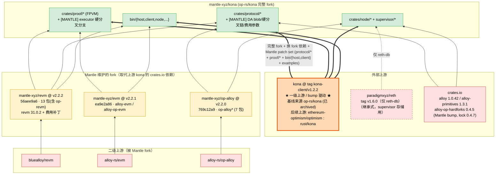
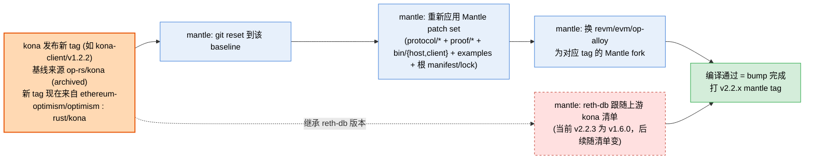

# mantle/kona 上游依赖拓扑分析

> 分析对象：`mantle-xyz/kona`（本地路径 `references/mantle/kona`）
> 分析 ref：`origin/main` 指向 commit **`72a20ab9`**，即 annotated tag **`v2.2.3`**（tag object `06f8e9ca`）的 peeled commit。⚠️ 远端已有更新的 release 分支 `release/v2.2.4-{mainnet,testnet}.4`，其依赖 ref 与本文不同（见 §2.5），本文结论仅对 `v2.2.3` 成立。
> 分析时间：2026-06-13
> 分析方法：静态分析（`Cargo.toml` workspace 配置、`Cargo.lock` 已解析的 git/registry pin、源码内 `[MANTLE]` 标记、git 历史）+ GitHub 上游交叉验证

---

## 1. 结论速览（TL;DR）

**mantle/kona 是 `op-rs/kona` 的「完整 fork」**——整个 kona 仓库被搬进来，所有 `kona-*` crate 都是 in-tree 的 path 成员（与 mantle/reth 的「薄组合工作区」形态完全不同）。

它的 **bump 驱动上游是 kona**，历史基线锁定在 tag **`kona-client/v1.2.2`**（git 历史里有提交 `chore: reset to kona-client/v1.2.2 baseline`）。

> ⚠️ **上游仓库已迁移**：`op-rs/kona` 自 **2026-01-15 起 archived**，commit 历史已转入 `ethereum-optimism/optimism` monorepo（路径 **`rust/kona`**，README 明示迁移、GitHub API `archived: true`）。因此：**历史基线**是 `op-rs/kona@kona-client/v1.2.2`，但**后续 bump 应跟 `ethereum-optimism/optimism` 的 `rust/kona`**，不再是 `op-rs/kona` 本仓库。本文下文为保留历史脉络仍写 `op-rs/kona`，指的是该基线的来源仓库。

Mantle 在这个基线上做了两件事：

1. **替换部分外部依赖为 Mantle 自己的 fork**（注入 Mantle 费用模型 / EVM 改动）；
2. **加入 Mantle 专有代码**——不止 `crates/protocol/`（自定义 DA blob 格式、硬分叉链、费用参数），还包括 `crates/proof/*`（`executor` 硬分叉分支执行语义、`proof` 的 agreed output root、`proof-interop` 的 deposit tx 字段）、`bin/{host,client}`（preimage retry、Arsia precompile、trace-extension 等运行时逻辑）、`examples`、根 manifest/lock，共 63 文件（见 §2.4）。

升级链条：

```
bluealloy/revm · alloy-rs/evm · alloy-rs/op-alloy   (二级上游)
        ▲ fork
mantle-xyz/{revm, evm, op-alloy}   (Mantle fork，注入费用/EVM 改动)
        │ git tag 依赖           ┌─ paradigmxyz/reth v1.6.0 (仅 reth-db，supervisor 存储用，继承自上游 kona)
        ▼                        ▼
kona @ tag kona-client/v1.2.2  ◀── Mantle 的真正 bump 目标（一级上游）
  历史基线来源 = op-rs/kona（已 archived）；后续上游 = ethereum-optimism/optimism : rust/kona
        ▲ 完整 fork + 换 fork 依赖 + 加 Mantle patch set（protocol/* + proof/* + bin/{host,client} + examples + 根 manifest/lock）
mantle-xyz/kona
```

各上游来源汇总：

| 上游来源 | 对 mantle 的角色 | 接入方式 | 解析版本（Cargo.lock） | 谁控制 |
|---|---|---|---|---|
| **kona** | **一级上游 / bump 驱动** | 整仓 fork（`kona-*` 全为 in-tree path 成员） | tag `kona-client/v1.2.2`（基线，来源 op-rs/kona） | 外部。⚠️ op-rs/kona 已 archived（2026-01-15），后续上游 = `ethereum-optimism/optimism : rust/kona` |
| **mantle-xyz/revm** | Mantle 替换的 fork | git tag | `v2.2.2` @ `56aee9a6`（13 包，含 op-revm；revm 基线 31.0.2） | Mantle（上游 bluealloy/revm） |
| **mantle-xyz/evm** | Mantle 替换的 fork | git tag | `v2.2.1` @ `ea9e2a86`（2 包：alloy-evm / alloy-op-evm） | Mantle（上游 alloy-rs/evm） |
| **mantle-xyz/op-alloy** | Mantle 替换的 fork | git tag | `v2.2.0` @ `769c12a9`（7 包：op-alloy*） | Mantle（上游 alloy-rs/op-alloy） |
| **paradigmxyz/reth** | **继承式上游**（仅 db 层） | git tag | `v1.6.0` @ `d8451e54`（reth-db/codecs + 16 个传递包） | 外部（Paradigm），版本由上游 kona 决定 |
| **crates.io 注册表** | 基础库 | 版本号 | alloy base 1.0.42 / alloy-primitives 1.3.1 / alloy-op-hardforks 0.4.5（lock 0.4.7，**Mantle bump**，非继承） | 外部 |

> 注意：mantle/kona 引用的 paradigmxyz/reth 是 **v1.6.0**，与 mantle/reth 用的 **v2.2.0** 完全不同——因为 kona 只用 reth 的 MDBX 存储层（`reth-db`）给 supervisor 存储，且这个版本是从上游 op-rs/kona 直接继承的。

---

## 2. mantle/kona 与 op-rs/kona 的关系（已验证）

### 2.1 fork 形态

- `homepage` / `repository` 仍指向 `https://github.com/op-rs/kona`，`authors = ["clabby", "refcell", "theochap", "emhane"]`（op-rs/kona 的维护者）——证明这是整仓 fork，不是重写。
- workspace 成员是通配 glob：`bin/*`、`crates/proof/*`、`crates/node/*`、`crates/supervisor/*`、`crates/protocol/*`、`crates/batcher/*`、`crates/providers/*`、`crates/utilities/*`、`examples/*`——即把 kona 全部 crate 纳入。
- 子模块（`.gitmodules`）也照搬上游：`superchain-registry`、`tests/optimism`、`tests/reth`（测试数据，非依赖）。

### 2.2 bump 基线验证

- git 历史含提交 `51b171f7 chore: reset to kona-client/v1.2.2 baseline`。
- 交叉验证：`gh api repos/op-rs/kona/git/refs/tags/kona-client/v1.2.2` → tag 存在。注意 `f3a41da0` 是 **annotated tag object**（`git cat-file -t` = tag），不是基线 commit 本身；peeled commit 是 **`daa3535a`**（`git rev-parse kona-client/v1.2.2^{commit}`）。自动化对比 baseline 时应使用 commit `daa3535a`，避免拿到 tag 对象。
- mantle/kona 自己另打 `v2.2.0` … `v2.2.4-{testnet,mainnet}.*` 系列 tag（Mantle 网络版本线，与 op-reth / mantle 各 fork 共用的 `v2.2.x` 方案一致）。本文分析的 `origin/main` 当前是 `v2.2.3`。

### 2.3 依赖策略对比（mantle/kona vs 上游 op-rs/kona @ kona-client/v1.2.2）

| 依赖 | 上游 kona v1.2.2 | mantle/kona | 关系 |
|---|---|---|---|
| `alloy-consensus` / 基础 alloy | `1.0.42`（crates.io） | `1.0.42`（crates.io） | **继承不变** |
| `alloy-primitives` | `1.3.1`（crates.io） | `1.3.1`（crates.io） | **继承不变** |
| `alloy-op-hardforks` | manifest `0.4.3` / lock `0.4.4`（crates.io） | manifest `0.4.5` / lock `0.4.7`（crates.io） | **Mantle bump**（非继承） |
| `reth-db` / `reth-codecs` | `paradigmxyz/reth` tag **v1.6.0** | tag **v1.6.0** | **继承不变（逐字符）** |
| `revm` / `op-revm` | `30.2.0` / `11.3.0`（crates.io） | `mantle-xyz/revm` tag `v2.2.2` | **换 fork**（且 revm 升到 31.0.2） |
| `alloy-evm` / `alloy-op-evm` | `0.22.6`（crates.io） | `mantle-xyz/evm` tag `v2.2.1` | **换 fork** |
| `op-alloy-*` | `0.22.0`（crates.io） | `mantle-xyz/op-alloy` tag `v2.2.0` | **换 fork** |

**结论**：与 mantle/reth 同理——大部分「基础库 + reth-db」从上游继承不动；「EVM/执行栈（revm、alloy-evm、op-alloy）」整体换成 Mantle git fork 以注入费用模型。两个额外细节：
- mantle-xyz/revm@v2.2.2 内含 revm **31.0.2**，而上游 kona v1.2.2 用的是 30.2.0——所以 Mantle 不只是 1:1 换源，还在 fork 里把 revm 往上 bump 了一个 minor。
- crates.io 依赖也并非全部原样继承：`alloy-op-hardforks` 被 Mantle 从上游的 `0.4.3`（lock 0.4.4）显式 bump 到 `0.4.5`（lock 0.4.7），属于 Mantle 主动调整的注册表依赖，不是「继承不变」。

### 2.4 Mantle 在 kona 源码内的改动（`kona-client/v1.2.2..HEAD` 共 **63 个文件**）

改动**主要**集中在 `crates/protocol/`，但**不止于此**：`crates/proof/{executor,proof,proof-interop}`、`bin/{host,client}`、`examples`、根 manifest/lock 都有改动，且**不是纯测试改动**——proof/* 与 bin/{host,client} 含运行时逻辑变更（执行语义、agreed output root、deposit tx、precompile 等）。

| 模块 | 文件 | 改动内容 |
|---|---|---|
| **派生层 DA** | `crates/protocol/derive/src/sources/mantle_blob.rs` | `MantleBlobSource`：Mantle 专有 blob 解码——把所有解码后的 blob 拼接再 RLP 解码 |
| | `crates/protocol/derive/src/sources/mantle_ethereum.rs` | `MantleEthereumDataSource`：先试 Mantle blob 解码，失败回退到标准 blob 解码 |
| | `crates/protocol/derive/src/attributes/stateful.rs`、`sources/mod.rs`、`lib.rs` | 接线 Mantle DA 源 |
| **硬分叉** | `crates/protocol/hardforks/src/mantle_forks.rs` | Mantle 升级交易（含 Arsia 升级的 7 笔交易） |
| **创世/链规格** | `crates/protocol/genesis/src/chain/mantle_hardfork.rs`、`config.rs`、`params.rs`、`rollup.rs`、`chain/mod.rs`、`lib.rs` | Mantle 链 ID、Mantle 硬分叉配置（见下）、`MANTLE_BASE_FEE_PARAMS`（EIP-1559 elasticity=4 / denominator=50）、rollup 配置 |
| **协议** | `crates/protocol/protocol/src/deposits.rs` | Mantle 存款处理 |
| **故障证明执行** ⚠️ | `crates/proof/executor/src/builder/assemble.rs:180` | receipt root 按 `is_mantle_skadi_active(timestamp)` 分支处理 |
| | `crates/proof/executor/src/builder/env.rs:56` | executor 用 `config.revm_spec_id(timestamp)` 选 spec；配合 Mantle Arsia base fee 逻辑 |
| | `crates/proof/executor/src/db/mod.rs:225` | trie 中 destroyed account 的删除/重建处理 |
| **故障证明（其他）** ⚠️ | `crates/proof/proof/src/sync.rs` | `agreed_l2_output_root` 传入 `TipCursor` |
| | `crates/proof/proof-interop/src/consolidation.rs` | deposit tx 字段调整（`eth_tx_value`） |
| **client/host bin** ⚠️ | `bin/host/src/backend/online.rs:151`、`bin/host/src/interop/handler.rs` | preimage fetch 的 retry / timeout（指数退避）；interop handler |
| | `bin/client/src/{single.rs,interop/transition.rs,fpvm_evm/precompiles/provider.rs}` | 运行时逻辑（single/interop 转换、Arsia precompile provider）+ `testdata/trace_extension.rs` |

> 这些是让 kona（OP Stack 的 Rust 派生 / 故障证明栈）理解 Mantle 链的核心：自定义 DA blob 格式、Mantle 费用参数、Mantle 硬分叉链。⚠️ 关键修正：改动**不限于 protocol 层**——`crates/proof/*`（executor 的硬分叉分支执行语义、proof 的 agreed output root、proof-interop 的 deposit tx 字段）与 `bin/{host,client}`（preimage retry、Arsia precompile、trace-extension 等）都有**运行时逻辑**改动，因此「上游 kona 更新 → 受影响 Mantle 组件」的判断必须把整个 `proof/*` 和 `bin/{host,client}` 都算进来，而不仅是 proof/executor + host。

**Mantle 硬分叉链（`mantle_hardfork.rs`）**：配置层是一条**完整的硬分叉序列**，而非只有 Arsia——`mantle_base_fee_time`、`everest`、`euboea`、`skadi`、`limb`、`arsia`（`MantleHardForkConfig` 的 6 个激活时间字段）。其中 `Skadi`/`Limb`/`Arsia` 不只是 protocol 层配置，还**影响 proof/executor 的执行行为**（如 receipt root、base fee、spec id 选择）。

### 2.5 release 分支的依赖差异（本文 ref 之外）

本文分析 `origin/main`（= `v2.2.3`）。远端另有更新的 release 分支/tag，其 fork 依赖 ref **已不同于 main**，分析下一代拓扑时需以这些分支为准：

| ref | revm（mantle-xyz/revm） | evm（mantle-xyz/evm） | op-alloy |
|---|---|---|---|
| `origin/main` = `v2.2.3`（本文） | tag `v2.2.2` | tag `v2.2.1` | tag `v2.2.0` |
| `release/v2.2.4-mainnet.4` / `release/v2.2.4-testnet.4` | tag **`v98-mantle-arsia.4`** | tag **`v0.25.2-mantle-arsia.4`** | tag `v2.2.0`（不变） |

> 说明：v2.2.4 release 线把 revm/evm fork 的 tag 命名方案从 `v2.2.x` 切换到 `v98-mantle-arsia.4` / `v0.25.2-mantle-arsia.4`（带硬分叉名）。这意味着拓扑图里 mantle/kona → mantle-xyz/{revm,evm} 的边标签是**随 ref 变化的**，不能写死成 `v2.2.x`。本文其余章节的 `v2.2.2` / `v2.2.1` 仅对 `v2.2.3` 成立。

---

## 3. 代码分层与上游详解

```
mantle/kona (workspace = op-rs/kona 完整 fork)
├── bin/{host,client,node,rollup,supervisor}   ← kona 二进制（in-tree）
├── crates/
│   ├── protocol/{derive,genesis,hardforks,protocol,interop,registry}  ← 派生/协议层（Mantle 改动主力，但非唯一）
│   ├── proof/{driver,mpt,proof,executor,preimage,std-fpvm,...}        ← 故障证明栈（executor 也有 Mantle 硬分叉分支改动）
│   ├── node/{rpc,engine,service,disc,gossip,peers,sources}            ← 共识节点
│   ├── supervisor/{core,rpc,storage,...}                              ← interop supervisor（用 reth-db）
│   ├── providers/{providers-alloy,providers-local}
│   └── utilities/{cli,serde,macros}
└── examples/*
```

### 3.1 kona（一级上游 / bump 驱动，tag `kona-client/v1.2.2`）

- **仓库归属**：历史基线来自 `op-rs/kona`，但该仓库 **2026-01-15 已 archived**，commit 历史与后续开发转入 `ethereum-optimism/optimism` monorepo（路径 `rust/kona`）。**后续 bump 应跟 monorepo，不再是 `op-rs/kona`。**
- **接入方式**：整仓 fork，所有 `kona-*` crate 为 in-tree path 成员（各 crate 独立版本号，如 kona-host 1.0.2 / kona-derive 0.4.5 / kona-proof 0.3.0）。
- **覆盖范围**：派生管线（derivation）、故障证明（fault proof, FPVM）、共识节点、interop supervisor、providers。
- **影响面**：🔴 **极高（全局）**，且 **主动跟随**——Mantle 通过「reset 到上游某 tag 基线 + 重新应用 Mantle 改动」来升级。上游 kona 的派生逻辑 / trait 变更会直接进入 fork。

### 3.2 mantle-xyz/revm（费用模型 fork，tag `v2.2.2`，revm 基线 31.0.2）

- 上游链路：`bluealloy/revm` → `mantle-xyz/revm`。13 包（含 `op-revm`）。
- 取代上游 kona 的 crates.io revm 30.2.0 / op-revm 11.3.0。直接消费者：`proof/{executor,proof,proof-interop}`、`bin/{client,host}`、`protocol/hardforks`、`kona-genesis`（仅 `revm` feature 下的 optional `op-revm`）。`protocol/derive` **不**直接依赖。
- 影响面：🔴 高（EVM 执行语义 + 费用模型，直接影响 proof 执行结果的正确性）。

### 3.3 mantle-xyz/evm（tag `v2.2.1`）

- 上游链路：`alloy-rs/evm` → `mantle-xyz/evm`。2 包：`alloy-evm`、`alloy-op-evm`。
- 取代上游 kona 的 crates.io alloy-evm / alloy-op-evm 0.22.6。直接消费者：`proof/{executor,driver,proof,proof-interop}`、`bin/{client,host}`。`protocol/derive` **不**直接依赖。
- 影响面：🟠 中高（EVM 抽象层 / OP EVM 工厂）。
- **与 mantle/reth 的差异**：reth 用的是 **crates.io 上游未打补丁的 alloy-evm 0.34.0**；kona 用的是 **Mantle fork**。两个 repo 在 alloy-evm 上策略相反。

### 3.4 mantle-xyz/op-alloy（tag `v2.2.0`）

- 上游链路：`alloy-rs/op-alloy` → `mantle-xyz/op-alloy`（**独立 fork 仓库**）。7 包：`op-alloy*`。
- 取代上游 kona 的 crates.io op-alloy 0.22.0。
- 影响面：🔴 高（OP/Mantle 交易收据类型——类型层地基）。
- **与 mantle/reth 的差异**：reth 的 op-alloy 来自 **`mantle-xyz/mantle-v2`（monorepo）**；kona 来自 **`mantle-xyz/op-alloy`（独立仓库）**。同一上游 alloy-rs/op-alloy 在 Mantle 侧有两个 fork 入口，被两个 repo 分别选用。

### 3.5 paradigmxyz/reth（继承式上游，tag `v1.6.0`，仅 db 层）

- **接入方式**：仅 3 条直接依赖 `reth-db` / `reth-db-api` / `reth-codecs`，git tag `v1.6.0`；Cargo.lock 含 19 个包（多为 `reth-libmdbx`/`reth-nippy-jar` 等传递依赖）。
- **用途**：`kona-supervisor-storage`（interop supervisor 的 KV/MDBX 存储）。
- **影响面**：🟡 低且局部——只影响 supervisor 存储层。**版本由上游 kona 清单决定（继承，非 Mantle 选择）**：当前 v2.2.3 继承自 `op-rs/kona@kona-client/v1.2.2` baseline，后续 bump 将继承自 optimism monorepo `rust/kona` 的清单。
- **注意**：这是 v1.6.0，与 mantle/reth 的 v2.2.0 是两条不同的 reth 线，互不相关。

### 3.6 crates.io（注册表上游）

alloy 基础库 `1.0.42`、`alloy-primitives 1.3.1`、libp2p / discv5 / rocksdb 等与上游 kona 一致。**例外**：`alloy-op-hardforks` 被 Mantle 从上游 `0.4.3`（lock 0.4.4）bump 到 `0.4.5`（lock 0.4.7），是 Mantle 主动调整的注册表依赖。影响面：🟠 中（alloy 基础类型 major 变更影响面大）。

---

## 4. 与 mantle/reth 的关键对比

两个 repo 都是 Mantle 对 OP 生态 Rust 组件的 fork，但**形态与依赖策略明显不同**：

| 维度 | mantle/reth | mantle/kona |
|---|---|---|
| fork 形态 | 薄组合工作区（vendored op-reth + 自定义层 + patch） | **整仓 fork** of op-rs/kona |
| 一级上游 / bump 驱动 | optimism monorepo `rust/op-reth`（vendored） | kona（基线 tag kona-client/v1.2.2，来源 op-rs/kona 已 archived；后续 = optimism monorepo `rust/kona`） |
| reth 核心 | git rev `88505c7f` = v2.2.0（继承自 op-reth） | 仅 reth-db tag **v1.6.0**（继承自 kona，supervisor 用） |
| revm fork ref | `mantle-xyz/revm` **branch mantle-elysium**（~revm 38） | `mantle-xyz/revm` **tag v2.2.2**（revm 31.0.2） |
| op-alloy fork 来源 | `mantle-xyz/mantle-v2`（monorepo） | `mantle-xyz/op-alloy`（独立仓库） |
| alloy-evm 策略 | crates.io 0.34.0 **上游未打补丁** | `mantle-xyz/evm` **fork（打补丁）** |
| Mantle 改动重心 | 费用模型（L1 cost / token_ratio） | 派生层 DA（Mantle blob 格式）+ 硬分叉 + 费用参数 |

**核心启示**：「用哪个 fork、用哪个 ref」是**逐消费者决定的**，没有全局统一答案。`mantle-xyz/revm` 同时服务 reth 和 kona，但分别走 `mantle-elysium` 分支（v38 线）和 `v2.2.2` tag（v31 线）。后续做总拓扑图时，节点之间的边必须携带「ref/版本」标签，不能只连仓库。

---

## 5. 「上游更新 → 受影响 Mantle 组件」对照表

| 上游来源 | 典型更新内容 | 直接受影响的 Mantle 组件 | 影响等级 | 升级触发方式 |
|---|---|---|---|---|
| **kona**（历史: op-rs/kona@kona-client/v1.2.2；后续: optimism monorepo `rust/kona`） | 派生管线、FPVM、节点、supervisor 逻辑 | 几乎所有 in-tree `kona-*` crate（需 rebase Mantle 改动：protocol/* + proof/* + bin/{host,client} + examples + 根 manifest/lockfile，共 63 文件） | 🔴 极高 | **主动跟随**（bump 入口） |
| mantle-xyz/revm（← bluealloy） | EVM opcode / 费用模型 / precompile | `proof/{executor,proof,proof-interop}`、`bin/{client,host}`、`protocol/hardforks`、`kona-genesis`（`revm` feature → optional `op-revm`）。**注意：`protocol/derive` 不直接依赖 revm** | 🔴 高 | Mantle 自控 |
| mantle-xyz/op-alloy（← alloy-rs） | OP/Mantle 交易收据类型 | 全栈类型层（derive / proof / node 等几乎所有 crate） | 🔴 高 | Mantle 自控 |
| mantle-xyz/evm（← alloy-rs/evm） | EVM 抽象 / OP EVM 工厂 | `proof/{executor,driver,proof,proof-interop}`、`bin/{client,host}`。**注意：`protocol/derive` 不直接依赖 alloy-evm** | 🟠 中高 | Mantle 自控 |
| crates.io alloy 基础库 | 核心类型 major 变更 | 全栈重编译 | 🟠 中 | 版本号可控 |
| paradigmxyz/reth v1.6.0 | MDBX / 编码格式 | 仅 kona-supervisor-storage | 🟡 低（局部） | **被动继承**（随上游 kona） |
| superchain-registry（子模块） | 链注册表数据 | kona-registry | 🟡 低 | 子模块更新 |

---

## 6. 上游依赖拓扑图

### 6.1 主拓扑



### 6.2 升级（bump）传导链



---

## 7. 证据索引（可复现）

| 结论 | 证据 |
|---|---|
| mantle/kona 是 op-rs/kona 完整 fork | `Cargo.toml` L6-7 homepage/repository = op-rs/kona；L14-24 workspace 通配成员；`.gitmodules` 照搬上游子模块 |
| bump 基线 = kona-client/v1.2.2 | git 提交 `51b171f7 chore: reset to kona-client/v1.2.2 baseline`；tag object `f3a41da0`（annotated），peeled commit `daa3535a`（`git rev-parse kona-client/v1.2.2^{commit}`） |
| 分析 ref | `origin/main` = commit `72a20ab9`；为 annotated tag `v2.2.3`（tag object `06f8e9ca`，`git cat-file -t v2.2.3` = tag）的 peeled commit（`git rev-parse v2.2.3^{commit}` = `72a20ab9`） |
| 上游仓库已迁移 | `gh api repos/op-rs/kona` → `archived: true`；README：「As of Jan 15th 2026, op-rs/kona has been transferred to the optimism monorepo」；`gh api .../ethereum-optimism/optimism/contents/rust/kona` 存在（路径 `rust/kona`） |
| monorepo 仍在出 kona-client tag | `git ls-remote https://github.com/ethereum-optimism/optimism.git 'refs/tags/kona-client/*'` → 含 `v1.2.12`/`v1.2.14`/`v1.5.2`/`v1.6.0-rc.2` 等（远高于 Mantle 基线 `v1.2.2`，说明 Mantle 落后上游若干代） |
| revm/evm 直接消费者 | `grep -rl 'revm\|op-revm' crates bin --include=Cargo.toml` → proof/{executor,proof,proof-interop} + protocol/{hardforks,genesis} + bin/{host,client}；`grep -rl 'alloy-evm\|alloy-op-evm'` → proof/{executor,driver,proof,proof-interop} + bin/{host,client}（**不含 protocol/\***）。两者**均不含 `protocol/derive`** |
| release 分支依赖差异 | `git ls-remote` 见 `release/v2.2.4-{mainnet,testnet}.4`；`gh api .../contents/Cargo.toml?ref=v2.2.4-mainnet.4` → revm `v98-mantle-arsia.4` / evm `v0.25.2-mantle-arsia.4` |
| alloy-op-hardforks 是 Mantle bump | baseline `Cargo.toml` 0.4.3 / lock 0.4.4 → HEAD `Cargo.toml` 0.4.5 / lock 0.4.7 |
| 上游 kona v1.2.2 的依赖版本 | `op-rs/kona` `Cargo.toml@kona-client/v1.2.2`：revm 30.2.0 / op-revm 11.3.0 / alloy-evm 0.22.6 / op-alloy 0.22.0 / reth-db v1.6.0 / alloy 1.0.42 |
| Mantle 换 fork | `Cargo.toml` L152-164：op-alloy→mantle-xyz/op-alloy v2.2.0、revm/op-revm→mantle-xyz/revm v2.2.2、alloy-evm/alloy-op-evm→mantle-xyz/evm v2.2.1 |
| reth-db v1.6.0 继承不变 | `Cargo.toml` L166-169 = 上游 kona 同款 paradigmxyz/reth tag v1.6.0；`Cargo.lock` 19 包 @ d8451e54 |
| fork 解析版本 | `Cargo.lock`：mantle-xyz/revm v2.2.2@56aee9a6(13包)、op-alloy v2.2.0@769c12a9(7包)、evm v2.2.1@ea9e2a86(2包) |
| mantle-xyz/revm@v2.2.2 含 revm 31.0.2 | `gh api .../mantle-xyz/revm/contents/crates/revm/Cargo.toml?ref=v2.2.2` → version 31.0.2 |
| 各 fork 上游 | `gh api repos/mantle-xyz/{revm,evm,op-alloy}` → parent = bluealloy/revm、alloy-rs/evm、alloy-rs/op-alloy |
| Mantle 源码改动 | `git diff --name-only kona-client/v1.2.2..HEAD \| wc -l` = **63** 文件，分布：protocol/{genesis 15, derive 13, hardforks 12, protocol 4, registry 1}、proof/{executor 6, proof 1, proof-interop 1}、bin/{client 4, host 2}、examples 1、根 Cargo.toml/Cargo.lock/.gitignore |
| Mantle DA 格式 | `derive/src/sources/mantle_blob.rs` 顶部文档：「concatenates all decoded blobs and then RLP decodes them」 |

---

## 8. 给后续工具阶段的备注（对应 DESCRIPTION「未来扩展」）

- 本文为第一阶段静态分析产物，覆盖 `mantle/kona`，与 `mantle/reth` 分析（见 `mantle-reth-upstream-analysis.md`）共同验证了一个通用建模原则。
- **建模原则（两个 repo 共同印证）**：判断 Mantle repo 的真正上游，要区分
  1. **bump 驱动上游**（一级）：mantle/reth = optimism op-reth；mantle/kona = kona（历史基线来自 `op-rs/kona`，但该仓库 2026-01-15 已 archived，**后续 bump 跟 `ethereum-optimism/optimism : rust/kona`**）。Mantle 主动跟随其 tag。注意 op-rs/kona 与 op-reth 现在归属同一个 optimism monorepo，建模时上游节点可能需要合并。
  2. **继承式上游**：版本不由 Mantle 选，而是从 bump 驱动上游的清单里复制（reth：paradigmxyz/reth rev；kona：reth-db v1.6.0）。
  3. **Mantle 自控 fork**：revm / evm / op-alloy。**同一 fork 仓库对不同消费者用不同 ref**（mantle-xyz/revm：reth 走 mantle-elysium 分支、kona 走 v2.2.2 tag）。
- **总拓扑图设计要求**：边必须带「ref/tag/版本」标签；op-alloy 在 Mantle 侧存在两个 fork 入口（`mantle-v2` monorepo vs 独立 `op-alloy`），节点需区分。
- 可机读来源：`Cargo.toml`（`[workspace.dependencies]` 的 git+tag/branch）+ `Cargo.lock`（`source = "git+...#<sha>"` 最可信）+ git 历史里的 "reset to <upstream-tag> baseline" 提交（识别 bump 基线）。
