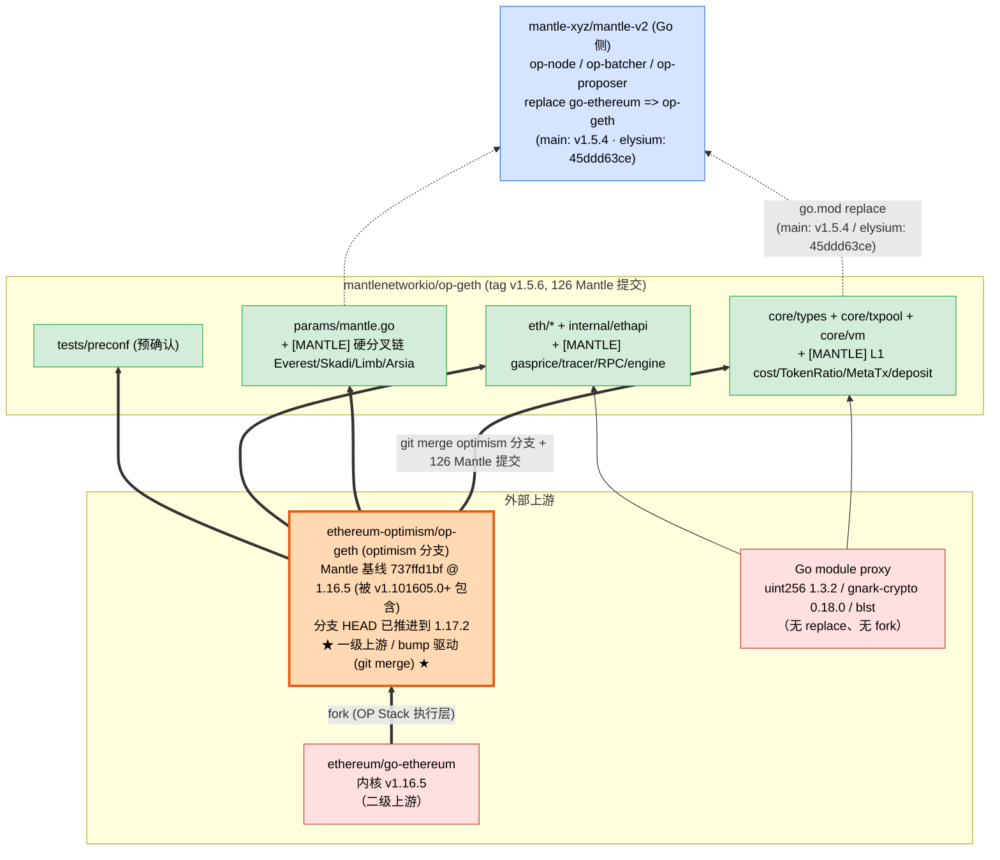
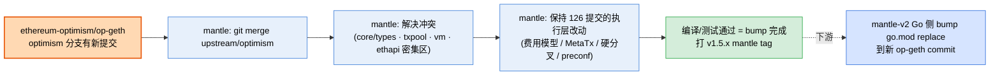

# mantle/op-geth 上游依赖拓扑分析

> 分析对象：`mantlenetworkio/op-geth`（本地路径 `references/mantle/op-geth`）
> 分析 ref：`origin/HEAD` 当前检出 = tag **`v1.5.6`**（commit `3c1c571e`）。
> 分析方法：静态分析（Go 模块 `go.mod`/`go.sum`、git remote 与 merge-base 基线、源码内 Mantle 标记、git 历史）+ 上游交叉验证。
> ⚠️ 与 Rust repo 的根本差异：op-geth 是 **Go 单体 fork**，上游接入靠 **git merge**（不是 Cargo/go.mod 的依赖 pin），因此「依赖分析」的重心是 *git 基线分支* 而非 *被替换的 fork 依赖*。

---

## 1. 结论速览（TL;DR）

**mantle/op-geth 是 `ethereum-optimism/op-geth` 的「Go 单体 fork」**——整个 go-ethereum/op-geth 代码树都在 in-tree，Go module 名仍是 `github.com/ethereum/go-ethereum`，**`go.mod` 里没有任何 `replace` 指令**（不存在「换 fork 依赖」这一层）。

它的 **bump 驱动上游是 `ethereum-optimism/op-geth`**，跟踪其 **`optimism` 分支**（remote `upstream/optimism`）：当前基线 merge-base 是 `737ffd1bf`（merge commit 信息为 "Merge branch 'master' into release/1.16"——这里的 `release/1.16` 是 op-geth 内部把 go-ethereum 1.16 线合入 optimism 分支的标签，**不是** OP 远端分支名；2025-10-16）。merge-base 处 go-ethereum 内核版本为 **v1.16.5**；该 commit 被后续 OP tag 包含（如 `v1.101605.0`），但 `git describe` 无法用 tag 描述它（"No tags can describe"）。Mantle 在该基线上叠了 **126 个提交**（执行层的 Mantle 专有改动）。

升级链条与 Rust 栈相反——它是「一层一层 merge 上游」而非「pin 一组 fork tag」：

```
ethereum/go-ethereum (v1.16.5 内核)
        ▲ fork（OP Stack 执行层改动：deposit tx / L1 attributes / superchain）
ethereum-optimism/op-geth  (optimism 分支)  ◀── Mantle 的真正 bump 目标（一级上游，git merge 接入）
        ▲ git merge + 126 个 Mantle 提交（费用模型 / MetaTx / BVM_ETH / 硬分叉 / preconf）
mantlenetworkio/op-geth (tag v1.5.6)
        │ 被 go.mod replace 消费
        ▼
mantle-xyz/mantle-v2 (Go 侧 op-node/op-batcher/... ← replace go-ethereum => op-geth)
```

各上游来源汇总：

| 上游来源 | 对 mantle 的角色 | 接入方式 | 基线 / 版本 | 谁控制 |
|---|---|---|---|---|
| **ethereum-optimism/op-geth** | **一级上游 / bump 驱动** | 整仓 fork + git merge（`optimism` 分支 / `upstream/optimism`） | merge-base `737ffd1bf`（被后续 tag 如 `v1.101605.0` 包含；`git describe` 无法描述） | 外部（OP Labs） |
| **ethereum/go-ethereum** | **二级上游（内核）** | 经由 op-geth 间接继承 | 内核 **v1.16.5**（`version/version.go`） | 外部（Ethereum 基金会） |
| **Go module 注册表（proxy.golang.org）** | 基础库 | go.mod 版本号（**无 replace、无 fork**） | holiman/uint256 1.3.2、gnark-crypto 0.18.0、blst、billy 等（全部 stock geth 依赖） | 外部 |

> 与 kona/reth 的关键区别：op-geth **没有** Mantle 自维护的被换 fork 依赖（没有 mantle-xyz/revm 这类节点）。Mantle 的所有执行层改动都是**直接写在 in-tree 源码里**，靠 git merge 跟随上游。

下游消费者（op-geth 是它的上游）：

| 下游 repo | 如何消费 op-geth | pin 的 ref |
|---|---|---|
| **mantle-xyz/mantle-v2**（Go 侧：op-node / op-batcher / op-proposer 等） | `go.mod`: `replace github.com/ethereum/go-ethereum => github.com/mantlenetworkio/op-geth` | **取决于 mantle-v2 的分支**：`origin/main` pin tag **`v1.5.4`**；本地检出的 `mantle-elysium` 分支 pin 伪版本 `v0.0.0-20260526034114-45ddd63ceae2`（commit `45ddd63ce`，2026-05-26） |

> ⚠️ **下游 pin 随 mantle-v2 的分支而变**：`mantle-v2/origin/main` 当前 pin op-geth tag **`v1.5.4`**（干净 tag）；而本地检出的 `mantle-elysium` 分支 pin 伪版本 `45ddd63ce`（`git describe` = `v1.5.5-553`，与本文检出的 op-geth `v1.5.6` 不是祖先关系，在不同开发线上）。做总拓扑图时，op-geth → mantle-v2 这条边的标签必须**明确 mantle-v2 用的是哪个 ref**——main 用 `v1.5.4`，elysium 用 `45ddd63ce`——不能假设两者相同，也不能直接用 op-geth 的最新 release tag。

---

## 2. mantle/op-geth 与上游的关系（已验证）

### 2.1 fork 形态

- **Go module 名仍是 `github.com/ethereum/go-ethereum`**（`go.mod:1`）——典型的「替换式 fork」：下游用 `replace` 指向本仓库即可无缝替换 go-ethereum。
- **`go.mod` 无任何 `replace` 指令**——所有第三方依赖走标准 Go module proxy，没有 Mantle 自维护的被换 fork（与 Rust 栈的 mantle-xyz/{revm,evm,op-alloy} 完全不同）。
- git remote 双源：`origin = mantlenetworkio/op-geth`、`upstream = ethereum-optimism/op-geth`——证明这是「跟随上游 op-geth、定期 merge」的 fork 工作流。
- 内核版本 **v1.16.5**（`version/version.go`：`Major=1 / Minor=16 / Patch=5 / Meta="stable"`）；Go 工具链 `go 1.24.0`（`go.mod:3`）。
- Mantle 自己的版本线：tag `v1.3.x` … `v1.5.6`（与 reth/kona 的 `v2.2.x` 方案不同，op-geth 走独立的 `v1.5.x` 线）。

### 2.2 bump 基线验证

- `git merge-base HEAD upstream/optimism` = `737ffd1bf`，提交信息 "Merge branch 'master' into release/1.16"（2025-10-16）。注意：`upstream/optimism` 才是被跟踪的远端分支（`git ls-remote --heads upstream` 显示 OP 没有 `release/1.16` 这个分支）；commit 信息里的 `release/1.16` 是 op-geth 内部合 go-ethereum 1.16 线的标签。
- `git describe --tags 737ffd1bf` 返回 **"No tags can describe"**——该 merge-base **不能**被某个 tag 描述为「最近 tag」。它只是被后续 OP tag *包含*（`git tag --contains 737ffd1bf` 的最早几个：`v1.101605.0`、`v1.101608.0`、…），这些 16xx 系列与 merge-base 处的内核 v1.16.5 一致；不要用 `v1.101701.0`（其 `version.go` 已是 go-ethereum **1.17.1**，与本文 1.16.5 内核叙述冲突）。
- merge-base 处 `version/version.go` 也是 v1.16.5（`git show 737ffd1bf:version/version.go`），与 Mantle HEAD 一致——即 Mantle 当前基线落在 `upstream/optimism` 历史上的 **1.16.5 那个点**。
- ⚠️ **`optimism` 分支本身不是「1.16 线」**：`upstream/optimism` 的当前 HEAD 已推进到 go-ethereum **1.17.2**（`git show upstream/optimism:version/version.go` → 1/17/2，最新 OP tag 如 `v1.101702.x`）。也就是说 Mantle 落后上游约一个 minor（1.16.5 → 1.17.2）；下次 bump 把 `upstream/optimism` 新提交 merge 进来时会跨越 1.16→1.17 的内核升级。Mantle 跟踪的是这个**持续推进的分支**，而非某个固定 tag 或固定 minor。
- `git rev-list --count 737ffd1bf..HEAD` = **126**——Mantle 在基线之上的提交数。

### 2.3 依赖策略（无 fork 替换）

`go.mod` 关键第三方依赖（全部为 stock geth 依赖，**无 Mantle/optimism fork**）：

| 依赖 | 版本 | 说明 |
|---|---|---|
| `github.com/holiman/uint256` | 1.3.2 | 256-bit 整数（EVM 算术核心） |
| `github.com/consensys/gnark-crypto` | 0.18.0 | 椭圆曲线 / KZG |
| `github.com/supranational/blst` | 0.3.16-… | BLS 签名（共识/blob） |
| `github.com/holiman/billy`、`bloomfilter/v2` | — | txpool / bloom |

> `grep -nE "ethereum-optimism|optimism" go.mod` **无命中**——op-geth 不通过 Go module 引入任何 optimism 库；OP Stack / superchain 逻辑全部在 in-tree 源码里。

### 2.4 Mantle 在 op-geth 源码内的改动（`737ffd1bf..HEAD`，126 提交）

改动按目录分布（`git diff --name-only 737ffd1bf..HEAD` 聚合，节选）：

| 目录 | 变更文件数 | Mantle 主题 |
|---|---|---|
| `core/types` | 21 | MetaTransaction、deposit tx、rollup L1 cost、receipt 字段 |
| `core/txpool` | 17 | MetaTx / preconf 交易校验、legacypool |
| `tests/preconf` | 11 | 预确认（preconfirmation）测试栈 |
| `eth/tracers` | 7 | tracer 适配 Mantle 交易/费用 |
| `internal/ethapi` | 6 | RPC（费用估算、simulate、MetaTx） |
| `core/vm` | 6 | EVM 适配（BVM_ETH / token gas） |
| `eth/{catalyst,gasprice,filters,downloader,ethconfig}` | 多处 | engine API / gas price / 配置 |
| `params` | 多处 | Mantle 链配置与硬分叉时间 |

核心子系统（已读源码确认，非纯测试）：

| 子系统 | 关键文件 | 改动内容 |
|---|---|---|
| **费用模型 / L1 cost** | `core/types/rollup_cost.go` | Mantle Arsia L1 cost 函数（`MantleArsiaL1AttributesSelector`、`L1CostIntercept = -42_585_600`、`L1CostFastlzCoef = 836_500`）；**TokenRatio**（MNT/ETH 比率，存于 state slot `TokenRatioSlot`）；`NewL1CostFunc` 按 `IsMantleArsia(blockTime)` 分支 |
| **MetaTransaction（代付交易）** | `core/types/meta_transaction.go` | `MetaTxPrefix`（"MantleMetaTxPrefix"）、gas fee sponsor 签名校验、sponsor percent (0,100]；MetaTx V2/V3 升级 |
| **费用扣减** | `core/state_transition.go`、`core/state_processor.go` | Mantle 费用在状态转移中的扣减逻辑 |
| **原生代币 / BVM_ETH** | `params.MantleUpgradeChainConfig.BVMETHMintUpgradeTime` 等 | MNT 作为 gas token、BVM_ETH 处理 |
| **deposit tx 类型** | `core/types/deposit_tx.go` | Mantle/OP 存款交易类型 |
| **deposit gas pool hotfix** | commit `ea8fbe44e "sub gas in GasPool for depositTx"`（改的是 `core/state_transition.go` + 测试，**非** `deposit_tx.go`） | 存款交易在状态转移里从 GasPool 扣 gas 的修复 |
| **硬分叉链** | `params/mantle.go`、`params/config.go` | `MantleUpgradeChainConfig`：`BaseFeeTime` / `BVMETHMintUpgradeTime` / `MetaTxV2UpgradeTime` / `MetaTxV3UpgradeTime` / `ProxyOwnerUpgradeTime` / `MantleEverestTime` / `MantleSkadiTime` / `MantleLimbTime` / `MantleArsiaTime`（mainnet chainId 5000 / sepolia 5003） |
| **预确认（preconf）** | `tests/preconf/*` | Mantle 预确认特性的测试栈 |

> **跨 repo 一致性**：op-geth 的 Mantle 硬分叉链（Everest / Skadi / Limb / Arsia）与 `mantle/kona` 的 `MantleHardForkConfig`（见 `mantle-kona-upstream-analysis.md` §2.4）**是同一条链**——op-geth 是 **Go 执行层**，kona 是 **Rust 派生/证明层**，两者用不同语言实现同一套 Mantle 费用模型 + 硬分叉语义。总拓扑图里这是一个重要的「语义一致性」约束：同一个 Mantle 硬分叉的升级，必须同时落到 op-geth（Go）和 kona/revm（Rust）两条独立技术栈。

---

## 3. 代码分层与上游详解

```
mantle/op-geth (整仓 = ethereum-optimism/op-geth 的 fork，module github.com/ethereum/go-ethereum)
├── core/            ← 状态转移/EVM/txpool（Mantle 费用模型 + MetaTx + deposit tx 集中于此）
│   ├── types/       ← 交易类型（meta_transaction / deposit_tx / rollup_cost / receipt）
│   ├── txpool/      ← 交易池（MetaTx / preconf 校验）
│   └── vm/          ← EVM（BVM_ETH / token gas 适配）
├── params/          ← 链配置（mantle.go：硬分叉时间 + chainId；config.go）
├── eth/             ← 全节点（backend / catalyst engine / gasprice / tracers / filters）
├── internal/ethapi/ ← JSON-RPC（费用估算 / simulate / MetaTx）
├── tests/preconf/   ← 预确认测试
└── （其余 go-ethereum/op-geth 全部包，in-tree 继承）
```

### 3.1 ethereum-optimism/op-geth（一级上游 / bump 驱动，`optimism` 分支）

- **接入方式**：整仓 fork + 定期 git merge（`upstream` remote = ethereum-optimism/op-geth，跟踪其 `optimism` 分支 / `upstream/optimism`）。
- **覆盖范围**：OP Stack 执行层全部——deposit 交易、L1 attributes、superchain 配置、engine API、rollup 同步。
- **影响面**：🔴 **极高（全局）**，且 **主动跟随**——Mantle 通过 merge `upstream/optimism` 的新提交来升级。上游对 `core/`、`eth/`、`params/` 的改动会直接进入 fork，并可能与 Mantle 的 126 个提交冲突（尤其是 `core/types`、`core/txpool`、`core/vm`、`internal/ethapi` 这些 Mantle 改动密集区）。

### 3.2 ethereum/go-ethereum（二级上游 / 内核 v1.16.5）

- **接入方式**：经由 op-geth 间接继承（op-geth 本身 fork 自 go-ethereum）。Mantle 不直接跟 go-ethereum，而是跟 op-geth 已经吸收过的版本。
- **影响面**：🟠 中高——go-ethereum 的协议/EVM 变更最终会经 op-geth 流入，但有 op-geth 作为缓冲层。

### 3.3 Go module 依赖（注册表上游，无 fork）

- `holiman/uint256`、`consensys/gnark-crypto`、`supranational/blst` 等全部为 stock geth 依赖，版本号由 go.mod 锁定，无 replace。
- **影响面**：🟡 低——这些是稳定基础库，且与上游 op-geth 的 go.mod 基本一致（随 merge 一起更新）。

### 3.4 下游：mantle-xyz/mantle-v2（op-geth 是其上游）

- mantle-v2 的 Go 侧（op-node / op-batcher / op-proposer 等 OP Stack 服务）通过 `go.mod` 的 `replace github.com/ethereum/go-ethereum => github.com/mantlenetworkio/op-geth` 把执行层换成本仓库。
- pin 的 op-geth ref 随 mantle-v2 分支不同：`origin/main` = tag **`v1.5.4`**；本地 `mantle-elysium` 分支 = 伪版本 `v0.0.0-20260526034114-45ddd63ceae2`（commit `45ddd63ce`）——后者与本文检出的 op-geth `v1.5.6` 不同源（见 §1 警告）。
- **含义**：op-geth 的执行层改动（费用模型 / MetaTx / 硬分叉）会通过这条 replace 边直接影响 mantle-v2 的 Go 服务行为。

---

## 4. 与 Rust 栈（mantle/reth、mantle/kona）的关键对比

| 维度 | mantle/op-geth | mantle/reth、mantle/kona |
|---|---|---|
| 语言 / 生态 | Go | Rust |
| fork 形态 | **整仓 Go 单体 fork**（module = go-ethereum） | reth=薄组合工作区；kona=整仓 fork |
| 上游接入方式 | **git merge**（跟 `upstream/optimism` 分支） | **依赖 pin**（Cargo git tag/branch/rev） |
| 被换 fork 依赖 | **无**（go.mod 零 replace） | 有：mantle-xyz/{revm,evm,op-alloy} |
| 一级上游 / bump 驱动 | ethereum-optimism/op-geth | reth=optimism op-reth；kona=op-rs/kona→optimism rust/kona |
| Mantle 改动重心 | 执行层：费用模型 + MetaTx + BVM_ETH + 硬分叉 + preconf | reth=费用模型；kona=派生层 DA + 硬分叉 + proof |
| 角色 | **执行客户端**（EL） | reth=EL（Rust）；kona=派生/证明（Rust） |

**核心启示（补充总建模原则）**：Mantle 的上游接入有**两种范式**——
1. **Cargo 依赖 pin 型**（Rust：reth/kona）：上游 = 一组带 ref 的 git/registry 依赖；分析靠 `Cargo.toml` + `Cargo.lock`。
2. **git merge 型**（Go：op-geth）：上游 = 一个被持续 merge 的 git 分支；分析靠 `git merge-base` + remote 配置。go.mod 的依赖几乎全继承自上游，**没有 Mantle 自控的 fork 依赖节点**。

做总拓扑图时，这两类上游边的语义不同：前者是「版本号边」（可机读 pin），后者是「分支追踪边」（merge-base + 提交差）。op-geth 这条边应标注 `(git merge: ethereum-optimism/op-geth @ optimism)`。

---

## 5. 「上游更新 → 受影响 Mantle 组件」对照表

| 上游来源 | 典型更新内容 | 直接受影响的 Mantle 组件 | 影响等级 | 升级触发方式 |
|---|---|---|---|---|
| **ethereum-optimism/op-geth**（`optimism` 分支；Mantle 基线在 1.16.5，分支 HEAD 已 1.17.2） | OP Stack 执行层、deposit tx、L1 attributes、engine API、superchain | 几乎所有 in-tree 包；**merge 冲突高发区** = `core/types`、`core/txpool`、`core/vm`、`internal/ethapi`、`params`（Mantle 126 提交密集处） | 🔴 极高 | **主动跟随**（git merge） |
| **ethereum/go-ethereum**（v1.16.x 内核） | EVM / 协议 / txpool / 状态 | 经 op-geth 间接流入；同上密集区 | 🟠 中高 | 被动继承（随 op-geth merge） |
| Go module 依赖（uint256 / gnark / blst） | 加密 / 算术 / txpool 库 | 全局重编译，但语义稳定 | 🟡 低 | 随上游 go.mod 更新 |

下游影响（op-geth 改动 → 谁受影响）：

| op-geth 改动 | 受影响下游 | 通过 |
|---|---|---|
| 费用模型 / MetaTx / 硬分叉 / 执行语义 | **mantle-v2 Go 服务**（op-node/op-batcher/op-proposer） | `go.mod` replace go-ethereum => op-geth |
| 硬分叉语义（Everest/Skadi/Limb/Arsia） | **需与 kona/revm（Rust 栈）保持一致** | 语义约束（非代码依赖） |

---

## 6. 上游依赖拓扑图

### 6.1 主拓扑



### 6.2 升级（bump）传导链



---

## 7. 证据索引（可复现）

| 结论 | 证据 |
|---|---|
| Go 单体 fork，module = go-ethereum | `go.mod:1` = `module github.com/ethereum/go-ethereum`；`grep -n '^replace' go.mod` 无命中 |
| 双 remote（origin/upstream） | `git remote -v` → origin=mantlenetworkio/op-geth、upstream=ethereum-optimism/op-geth |
| 内核版本 v1.16.5（HEAD 与 merge-base 一致） | `version/version.go` 与 `git show 737ffd1bf:version/version.go`：均 `Major=1 / Minor=16 / Patch=5`；`go.mod:3` `go 1.24.0` |
| 分析 ref = v1.5.6 | `git rev-parse HEAD` = `3c1c571e`；`git describe --tags` = `v1.5.6` |
| bump 基线 = op-geth `optimism` 分支 | `git merge-base HEAD upstream/optimism` = `737ffd1bf`（2025-10-16）；OP 远端无 `release/1.16` 分支（`git ls-remote --heads upstream`）；`git describe --tags 737ffd1bf` = "No tags can describe"；`git tag --contains` 最早含它的是 `v1.101605.0`/`v1.101608.0`（**不是** `v1.101701.0`，后者内核已 1.17.1） |
| Mantle 提交数 = 126 | `git rev-list --count 737ffd1bf..HEAD` = 126 |
| 无 fork 依赖 | `grep -nE 'ethereum-optimism\|optimism' go.mod` 无命中；deps 全为 holiman/consensys/supranational 等 stock 库 |
| Mantle 改动分布 | `git diff --name-only 737ffd1bf..HEAD` → core/types 21、core/txpool 17、tests/preconf 11、eth/tracers 7、internal/ethapi 6、core/vm 6… |
| 费用模型 / TokenRatio | `core/types/rollup_cost.go`：`MantleArsiaL1AttributesSelector`、`TokenRatioSlot`、`L1CostIntercept=-42585600`、`NewL1CostFunc` 按 `IsMantleArsia` 分支 |
| MetaTransaction | `core/types/meta_transaction.go`：`MetaTxPrefix`（"MantleMetaTxPrefix"）、gas fee sponsor 签名、sponsor percent |
| 硬分叉链 | `params/mantle.go`：`MantleUpgradeChainConfig`（BaseFee/BVMETHMint/MetaTxV2/MetaTxV3/ProxyOwner/Everest/Skadi/Limb/Arsia），mainnet chainId 5000 |
| 下游 mantle-v2 消费（随分支不同） | `mantle-v2/origin/main go.mod`：`replace … => …/op-geth v1.5.4`；本地 `mantle-elysium` 分支 go.mod：`… => …/op-geth v0.0.0-20260526034114-45ddd63ceae2` |
| elysium pin ≠ 分析 ref | `git merge-base --is-ancestor 45ddd63ceae2 HEAD` → 否；`git describe 45ddd63ce` = `v1.5.5-553`（与 op-geth `v1.5.6` 在不同开发线） |

---

## 8. 给后续工具阶段的备注（对应 DESCRIPTION「未来扩展」）

- 本文覆盖 `mantle/op-geth`，与 `mantle/reth`、`mantle/kona`、`mantle/revm`、`mantle/mantle-v2` 分析共同构成 Mantle Rust+Go 双栈的上游图。
- **新增建模范式（Go merge 型上游）**：op-geth 不属于「Cargo 依赖 pin 型」。它的上游是一个**被持续 merge 的 git 分支**（ethereum-optimism/op-geth 的 `optimism` 分支 / `upstream/optimism`），识别方法是 `git merge-base HEAD <upstream-remote>` + remote 配置，而非 `Cargo.lock`。注意 merge-base 通常**无法被 `git describe` 描述**（落在两个 tag 之间），只能用 `git tag --contains` 找包含它的后继 tag——且要选与 **merge-base 内核版本**一致的那条 tag 线（这里 merge-base 是 1.16.5，对应 16xx 系列，不是 17xx；注意分支 HEAD 可能已超前到更高 minor，本例 `upstream/optimism` HEAD 已是 1.17.2）。总拓扑图需要支持两类上游边：
  1. **版本号边**（Cargo pin：reth/kona/revm）——可机读 `source = "git+...#<sha>"`。
  2. **分支追踪边**（git merge：op-geth）——标注 `<upstream-repo> @ <branch>`，边权用 merge-base + ahead 提交数。
- **下游边**：op-geth → mantle-v2（Go `replace`）。这是目前唯一一条 Mantle repo 之间的 Go 依赖边，且 **mantle-v2 不同分支 pin 不同 op-geth ref**（`main` = tag `v1.5.4`；`mantle-elysium` = 伪版本 `45ddd63ce`）——边标签必须**先确定 mantle-v2 的分支**再取其 `go.mod` 里实际 pin 的 ref，不能假设统一、也不能用 op-geth 的最新 release tag。
- **语义一致性约束（非代码依赖，但需在总图标注）**：Mantle 硬分叉链（Everest/Skadi/Limb/Arsia）同时存在于 op-geth（Go 执行层）与 kona（Rust 派生/证明层）。一次硬分叉升级要在两条独立技术栈同步落地。
- 可机读来源：`go.mod`（module 名 + require + 是否有 replace）+ `git remote -v`（upstream 识别）+ `git merge-base HEAD upstream/<branch>`（基线）+ `git rev-list --count <base>..HEAD`（Mantle 改动量）。
