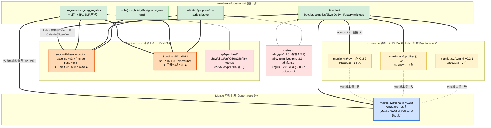
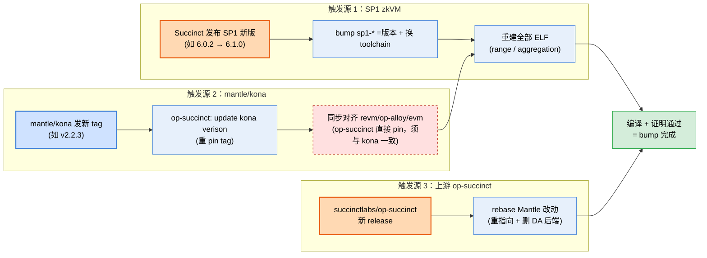

# mantle/op-succinct 上游依赖拓扑分析

> 分析对象：`mantle-xyz/op-succinct`（本地路径 `references/mantle/op-succinct`）
> 分析时间：2026-06-13
> 分析方法：静态分析（`Cargo.toml` workspace 配置、`Cargo.lock` 已解析的 git/registry pin、git `upstream` remote 与 merge-base、源码 diff vs 上游基线、磁盘结构）+ 与 mantle/kona 交叉验证

---

## 1. 结论速览（TL;DR）

**mantle/op-succinct 是 `succinctlabs/op-succinct` 的 fork**——一个基于 **SP1 zkVM** 的 OP Stack「有效性证明（validity proof）」系统。它把 OP Stack 的 derivation + 执行（kona）跑进 SP1 zkVM 里，生成 zk 证明，提交到 L1 的 `OPSuccinctL2OutputOracle`。

与前三个 repo（reth / kona / mantle-v2）最大的不同：**Mantle 对 op-succinct 业务逻辑的改动很轻**——绝大部分 Mantle 特性（DA blob 格式、Arsia 硬分叉、费用参数）下沉在依赖项 `mantle-xyz/kona` 里，op-succinct 本体只保留一层很薄的 Mantle 适配。Mantle 的适配主要通过三件事完成：

1. **依赖重指向（dependency re-pointing）**：把 op-succinct 原本指向 `op-rs/kona`（tag `kona-client/v1.0.1`）的全部 kona 依赖，整体换成 **Mantle 自己的 kona fork `mantle-xyz/kona` tag `v2.2.3`**；并把 revm/op-alloy/evm 换成 Mantle fork；alloy 基础库从 `0.15.8` 大幅升到 `1.x`。
2. **裁剪 DA 后端**：**移除 Celestia / EigenDA / hana 的依赖与可编译 crate**（`utils/celestia/*`、`programs/range/celestia`、`fault-proof/*`、`hana-*` 依赖均已删除）。Mantle 走自己的 DA，只保留 Ethereum DA 路径。（注：文档、`justfile`、源码注释里仍有 celestia/eigenda 的 stale 残留，见 §2.2-B。）
3. **薄 Mantle 适配层**：op-succinct 自身源码里有少量 Mantle 适配——`utils/ethereum/client/src/executor.rs` 把数据源类型别名设为 `MantleEthereumDataSource`（来自 mantle/kona 的 `kona_derive`），`utils/client/src/oracle/blob_provider.rs` 为 `mantle_blob_source` + `blob_source` 双克隆 blob provider，`utils/client/src/precompiles/mod.rs` 处理 `OpSpecId::ARSIA`（Mantle Arsia 硬分叉）。这些是「接线」级别的适配，重活仍在 kona。

**关键拓扑事实：op-succinct 位于 `mantle-xyz/kona` 的下游。** op-succinct 在自己的 `Cargo.toml` 里**直接声明**了 revm/op-alloy/evm 三个 Mantle fork（`Cargo.toml` L148/154/157，为 zkVM 配置了 `bn`、`default-features=false` 等 feature），并**特意把版本与 `mantle-xyz/kona v2.2.3` 对齐**——证据是解析出的 fork SHA 与包数量，与 mantle/kona v2.2.x **逐字符一致**（revm 13 包 @`56aee9a6`、op-alloy 7 包 @`769c12a9`、evm 2 包 @`ea9e2a86`）。对齐的原因是同一 cargo workspace 内 kona 与 op-succinct 必须解析出**同一份** revm/op-alloy/evm，否则会冲突。因此拓扑上既有 `op-succinct → revm/op-alloy/evm` 的**直接边**，也有「版本须与 kona 一致」的**对齐约束**——不是单纯的 `kona → fork → op-succinct` 继承。

升级链条：

```
succinctlabs/op-succinct (baseline ~v3.x)        sp1-patches/*  (crypto precompile 补丁)
        ▲ fork（证明 harness + SP1 集成）              ▲
        │                                       Succinct Labs SP1 zkVM (sp1-* =6.1.0, crates.io)
        │                                              ▲ zkVM 工具链（新上游）
op-rs/kona ──fork──▶ mantle-xyz/kona @ v2.2.3 ─────────┤
（一级上游，见 kona 分析）   ▲ 完整 fork + Mantle DA/费用      │ 整体作为依赖被消费
                          │                            ▼
                  mantle-xyz/{revm,op-alloy,evm}   mantle-xyz/op-succinct
                  （op-succinct 直接 pin，          ★ 本 repo（最下游）★
                   版本须与 kona 对齐）
```

各上游来源汇总：

| 上游来源 | 对 mantle/op-succinct 的角色 | 接入方式 | 解析版本（Cargo.lock） | 谁控制 |
|---|---|---|---|---|
| **succinctlabs/op-succinct** | **一级上游 / bump 驱动**（证明 harness） | 整仓 fork（`upstream` remote） | 基线 ~v3.x（workspace version 3.4.1；merge-base = 上游 `#555`） | 外部（Succinct Labs） |
| **Succinct SP1 zkVM**（`sp1-sdk/zkvm/lib/prover/...`） | **关键外部上游**（zkVM 运行时/证明系统） | crates.io 固定版本 `=6.1.0` | sp1-* `6.1.0`（Hypercube） | 外部（Succinct Labs） |
| **sp1-patches/*** | zkVM 加速的 crypto 补丁 | 根 `[patch.crates-io]` git tag：RustCrypto-hashes / bn / elliptic-curves / tiny-keccak | sha2/sha3/substrate-bn/k256/p256/tiny-keccak（sp1-6.0.0 系列）；另有 `signatures` 等为 lockfile 中的传递 git 依赖 | 外部（Succinct Labs） |
| **mantle-xyz/kona** | **内部一级上游**（被本 repo 直接消费） | git tag | `v2.2.3` @ `72a20ab9`（**25 包**） | Mantle（见 kona 分析） |
| **mantle-xyz/revm** | 直接声明的 fork（版本与 kona 对齐） | git tag（op-succinct 自身 Cargo.toml 直接 pin） | `v2.2.2` @ `56aee9a6`（**13 包**，含 op-revm/revm-precompile） | Mantle（上游 bluealloy/revm） |
| **mantle-xyz/op-alloy** | 直接声明的 fork（版本与 kona 对齐） | git tag（op-succinct 自身 Cargo.toml 直接 pin） | `v2.2.0` @ `769c12a9`（**7 包**） | Mantle（上游 alloy-rs/op-alloy） |
| **mantle-xyz/evm** | 直接声明的 fork（版本与 kona 对齐） | git tag（op-succinct 自身 Cargo.toml 直接 pin） | `v2.2.1` @ `ea9e2a86`（**2 包**：alloy-evm / alloy-op-evm） | Mantle（上游 alloy-rs/evm） |
| **crates.io 注册表** | 基础库 | 版本号 | alloy（pin 1.1.0，解析 1.5.2）/ alloy-primitives（pin 1.3.1，解析 **1.5.2**）/ kzg-rs 0.2.8 / c-kzg 2.0.0 / gcloud-sdk 0.28.4 | 外部 |

> 注意：op-succinct 在自身 `Cargo.toml` 里**直接声明**了 revm/op-alloy/evm 三个 fork（不是仅靠 kona 传递），但**特意把 tag/SHA 与 `mantle-xyz/kona v2.2.3` 对齐**（revm v2.2.2、op-alloy v2.2.0、evm v2.2.1，解析 SHA/包数与 kona 逐字符相同）。原因是同一 cargo workspace 内 kona 与 op-succinct 必须解析出同一份 fork，否则冲突。所以这是「直接依赖 + 版本须与 kona 一致」，而非「kona 单向继承」。

---

## 2. mantle/op-succinct 与 succinctlabs/op-succinct 的关系（已验证）

### 2.1 fork 形态

- git 配置含 `upstream	git@github.com:succinctlabs/op-succinct.git`，`origin = mantle-xyz/op-succinct`——标准的「fork + upstream 跟踪」形态。
- `Cargo.toml` `authors = ["ratankaliani", "zachobront", "fakedev9999", "yuwen01"]`、`homepage`/`repository` 仍指向 succinctlabs——证明整仓 fork、非重写。
- merge-base(HEAD, upstream/main) = `530df86 chore: support contract verification for fp (#555)`；Mantle 在其上做了约 **68 个提交**（`git rev-list --count 530df86..HEAD`）。
- Mantle 侧 git 历史以「SP1 版本 bump + ELF 重建 + kona tag bump」为主线（如 `feat(sp1): upgrade to SP1 v6.0.2 (Hypercube)`、`upgrade: SP1 6.0.2 → 6.1.0`、`update kona verison`、大量 `upgrade elfs`）。

### 2.2 Mantle 相对上游基线做了什么（`git diff 530df86..HEAD`）

**A. 依赖重指向（核心适配手段）**

| 依赖 | 上游基线 | mantle/op-succinct | 关系 |
|---|---|---|---|
| `kona-*`（13 个 crate） | `op-rs/kona` tag `kona-client/v1.0.1` | **`mantle-xyz/kona` tag `v2.2.3`** | **换 fork**（指向 Mantle 的 kona） |
| `alloy-*`（network/rpc/consensus 等） | crates.io `0.15.8` | crates.io `1.1.0`（解析 1.5.2） | **大版本升级**（0.15 → 1.x） |
| `op-alloy-*` | （上游 crates.io / op-rs） | `mantle-xyz/op-alloy` tag `v2.2.0` | 换 fork |
| `revm` / `op-revm` / `revm-precompile` | （上游 crates.io） | `mantle-xyz/revm` tag `v2.2.2` | 换 fork |
| `alloy-evm` / `alloy-op-evm` | （上游 crates.io） | `mantle-xyz/evm` tag `v2.2.1` | 换 fork |
| workspace `version` | `3.0.0-rc.1` | `3.4.1` | Mantle 自行对齐版本号 |

**B. 裁剪 DA 后端（删除 ~9900 行）**

`git diff --stat` 显示大量删除，磁盘上对应目录已不存在：

- 删除 `utils/celestia/{client,host}`、`programs/range/celestia`、`hana-*`（celestiaorg/hana）依赖 → **移除 Celestia DA**。
- 删除 `fault-proof/*`（含 celestia challenger/proposer Dockerfile、grafana、prometheus）→ 移除独立的 fault-proof 子系统。
- CI 提交 `ci: remove eigenda`、`chore: remove celestia` → **移除 EigenDA / Celestia**。
- **范围限定**：移除的是**依赖与可编译 crate / 源码目录**——`grep "op-rs/kona\|celestiaorg/hana\|eigenda" --include=*.toml` 在全仓 **零命中**，确认 Cargo 依赖图里已无旧上游。但**文档 / 脚本 / 注释仍有 stale 残留**，例如 `justfile:416-433`（celestia/eigenda 的 DA feature 说明与 SRS 符号链接逻辑）、`book/SUMMARY.md:23,40`（Celestia DA 文档条目）、`utils/host/src/host.rs:107,121`（注释里提到 Celestia/Blobstream）。所以准确说法是「**依赖与可编译 crate 已移除，文档/脚本/注释尚有未清理的引用**」，而非全仓零残留。

**C. 业务源码改动（65 个 .rs 文件）**

这些改动主体是「适配 + 删除」，但**并非完全没有 Mantle 专有内容**——之前用大小写敏感的 `grep "[MANTLE]"` 得出「零改动」是方法缺陷（漏掉 `Mantle`/`mantle`/`ARSIA`）。实际分布：

- 删除类：`utils/celestia/*`、`fault-proof/*`、`programs/range/celestia` 的源文件。
- API 适配类：因 kona `kona-client/v1.0.1 → mantle v2.2.3`、alloy `0.15 → 1.x` 的 trait/签名变更，调整 `utils/client/src/{boot,client,types}.rs`、`witness/executor.rs`、`oracle/blob_provider.rs`、`precompiles/factory.rs` 等。
- **Mantle 适配类（薄层，确有 Mantle 专有引用）**：
  - `utils/ethereum/client/src/executor.rs:5,46,59`：`use kona_derive::MantleEthereumDataSource`，并把 `type DA = MantleEthereumDataSource<...>`、用 `MantleEthereumDataSource::new_from_parts(...)` 构造数据源。
  - `utils/client/src/oracle/blob_provider.rs:13-14`：为 `MantleEthereumDataSource` 的 `mantle_blob_source` 与 `blob_source` 双路径克隆 blob provider。
  - `utils/client/src/precompiles/mod.rs:67`：在 spec 匹配中处理 `OpSpecId::ARSIA`（Mantle Arsia 硬分叉）。
- 功能调整类：`scripts/prove`、`validity/`、signer（新增 `utils/signer`、`utils/signer-gcp`，对应 git 历史的 web3 signer / GCP KMS 支持）。

> 关键判断：**Mantle 让 op-succinct「证明 Mantle 链而非 OP 链」的能力，主要（但非全部）来自换上 `mantle-xyz/kona` 这一个依赖**——DA blob 格式、硬分叉、费用参数的「重活」封装在 kona fork 里（见 kona 分析 §2.4）；op-succinct 本体在其上保留一层薄适配（接线 `MantleEthereumDataSource`、处理 `ARSIA` spec、双路径 blob provider）+ 删掉用不到的 DA 后端。

---

## 3. 代码分层与上游详解

```
mantle/op-succinct (workspace = succinctlabs/op-succinct fork)
├── programs/                      ← 跑进 SP1 zkVM 的 guest 程序（编译成 ELF）
│   ├── range/ethereum             ← range program（OP derivation+执行 的区块区间证明，Ethereum DA）
│   ├── range/utils
│   └── aggregation                ← aggregation program（聚合多个 range 证明）
├── elf/                           ← SP1 预编译产物：range-elf-embedded(6.4M)、aggregation-elf(771K)
├── utils/
│   ├── client                     ← zkVM 内的 client（boot/oracle/precompiles/witness）
│   ├── host                       ← host 侧 witness 生成
│   ├── ethereum/{client,host}     ← Ethereum DA 专用路径
│   ├── proof / build / elfs       ← 证明、构建、ELF 嵌入
│   └── signer / signer-gcp        ← 提交证明的签名器（含 GCP KMS）
├── validity                       ← validity proposer（生成证明并上链 L2OutputOracle）
└── scripts/{prove,utils}          ← prove 驱动、config / cost_estimator 工具
```

### 3.1 succinctlabs/op-succinct（一级上游 / bump 驱动）

- **接入方式**：整仓 fork，`upstream` remote 跟踪；Mantle 周期性吸收上游（主要为 SP1 集成、证明 harness、合约改动）。
- **覆盖范围**：整个 zkVM 证明框架（range/aggregation program、host/client 分层、validity proposer、SP1 prover 集成、链上合约接口）。
- **影响面**：🔴 **极高（全局）**。上游对 SP1 集成方式、witness 格式、program 边界、proposer 流程的改动会直接进入 fork（需 rebase Mantle 的依赖重指向 + DA 裁剪）。

### 3.2 Succinct SP1 zkVM（关键外部上游，`sp1-* =6.1.0`，crates.io）

- **包**：`sp1-sdk` / `sp1-zkvm` / `sp1-lib` / `sp1-prover` / `sp1-prover-types` / `sp1-core-executor` / `sp1-hypercube` / `sp1-primitives` / `sp1-build`，全部精确锁定 `=6.1.0`（代号 Hypercube）。
- **用途**：zkVM 运行时（guest 端 `sp1-zkvm`）、证明生成与网络证明（host 端 `sp1-sdk`，含 `network`/`prove` feature）、ELF 构建（`sp1-build`）。
- **影响面**：🔴 **极高且独有**——这是 reth/kona/mantle-v2 三个 repo **都没有**的上游。SP1 的 major 版本（6.0.2 → 6.1.0）变更会强制 **重建所有 ELF**（git 历史里每次 SP1 bump 都伴随 `upgrade elfs` / `rebuild ELFs`），并可能改变证明系统/验证密钥。
- **升级触发**：Mantle 主动跟随 SP1 release（精确 `=` pin 表明对 zkVM 版本极度敏感——证明系统不允许漂移）。

### 3.3 sp1-patches/*（zkVM crypto 加速补丁，`[patch.crates-io]`）

- **根 `[patch.crates-io]` 条目（仅 6 个，见 `Cargo.toml:187-193`）**：`RustCrypto-hashes`（sha2 0.10.9 / sha3 0.10.8）、`bn`（substrate-bn 0.6.0）、`elliptic-curves`（k256 13.4 / p256 13.2）、`tiny-keccak 2.0.2`——全部 `sp1-6.0.0` 系列 tag。
- **lockfile 中解析出的 sp1-patches 传递依赖**：除上述根 patch 外，`Cargo.lock` 还含 `sp1-patches/signatures`（tag `sp1-skip-verify-on-recovery`，`Cargo.lock:3536`）等——它们是上游/SP1 依赖树内部引入的传递 git 源，**不是** op-succinct 根 Cargo.toml 显式声明的 patch。
- **用途**：把通用 crypto 实现替换为 SP1 zkVM 内有「precompile 加速」的版本（哈希、bn254 配对、椭圆曲线），大幅降低证明成本。`Cargo.toml` 注释明确：「Keccak with the SHA3 patch is more efficient」、「Use kzg-rs and substrate-bn for the zkVM」。
- **影响面**：🟠 中高——影响 zkVM 内 crypto 正确性与证明性能；版本与 SP1 主版本绑定。
- **来源**：与 SP1 同属 Succinct Labs（外部）。

### 3.4 mantle-xyz/kona（内部一级上游，tag `v2.2.3`，25 包）

- **接入方式**：13 条 workspace 依赖（`kona-mpt/derive/driver/preimage/executor/proof/client/host/providers-alloy/rpc/protocol/registry/genesis`）全部 git tag `v2.2.3`；Cargo.lock 解析 25 个 `kona-*` 包 @ `72a20ab9`。
- **用途**：**zkVM guest 内的 OP Stack derivation + 执行核心**——op-succinct 的 range program 本质就是「在 zkVM 里运行 kona 的 derivation pipeline + executor，证明状态转移正确」。
- **影响面**：🔴 **极高**。Mantle 链特性（DA blob 格式、Arsia 硬分叉、费用参数）全部封装在这里。mantle/kona 的任何 bump（如跟随 op-rs/kona 升级、改派生逻辑）都需要 op-succinct **重新 pin tag + 重建 ELF**（git 历史 `update kona verison` 即此动作）。
- **版本对齐关系**：op-succinct 在自己的 `Cargo.toml` 里**直接声明**了 revm/op-alloy/evm（见 §3.5），但 tag/SHA **与 mantle/kona v2.2.3 对齐**——保证同一 workspace 内 kona 与 op-succinct 解析出同一份 fork。

### 3.5 mantle-xyz/{revm, op-alloy, evm}（op-succinct 直接声明、版本与 kona 对齐的 fork 集）

| fork | tag（op-succinct 自身 `Cargo.toml` 直接 pin） | 解析 SHA | 包数 | 与 mantle/kona 是否一致 |
|---|---|---|---|---|
| mantle-xyz/revm | `v2.2.2`（`Cargo.toml:157-161`） | `56aee9a6` | 13（含 op-revm、revm-precompile） | ✅ **完全一致** |
| mantle-xyz/op-alloy | `v2.2.0`（`Cargo.toml:148-151`） | `769c12a9` | 7 | ✅ **完全一致** |
| mantle-xyz/evm | `v2.2.1`（`Cargo.toml:154-155`） | `ea9e2a86` | 2（alloy-evm、alloy-op-evm） | ✅ **完全一致** |

- **直接依赖，而非纯继承**：op-succinct 的根 `Cargo.toml` 显式 pin 了这三个 fork（并为 zkVM 配置 feature，如 revm 的 `bn`、`default-features=false`）。所以拓扑上有 `op-succinct → revm/op-alloy/evm` 的**直接边**。
- **但版本须与 kona 对齐**：之所以 tag/SHA 与 kona 逐字符相同，是因为同一 cargo workspace 内 kona 与 op-succinct 必须解析出同一份 revm/op-alloy/evm，否则冲突。所以这是「直接依赖 + 与 kona 的对齐约束」，建模时应同时画出直接边与对齐约束，而不是只画 `kona → fork → op-succinct` 继承。
- **影响面**：🔴 高（EVM 执行语义 / OP 类型层）——升级时 op-succinct 与 kona 须协同（任一方单独 bump fork 会破坏 workspace 解析）。
- **zkVM 特化点**：`utils/client/src/precompiles/factory.rs` 用 `op_revm` + `alloy_op_evm` 构造 `ZkvmOpEvmFactory`（带 FPVM-accelerated precompile override `OpZkvmPrecompiles`）——这是 op-succinct 在 Mantle revm/op-evm 之上的薄封装，把 EVM 跑进 zkVM。

### 3.6 crates.io（注册表上游）

- alloy 基础库（workspace pin 1.1.0，解析 1.5.2）、`alloy-primitives`（workspace pin 1.3.1，**解析 1.5.2**，带 `sha3-keccak` feature）、`kzg-rs 0.2.8`、`c-kzg 2.0.0`、`gcloud-sdk 0.28.4`、metrics/opentelemetry 观测栈。注意 `1.3.1` 只是 `Cargo.toml` 的 constraint，`Cargo.lock:439` 实际解析为 `1.5.2`。
- 影响面：🟠 中（alloy 1.x 是被 SP1/kona/op-succinct 共享的类型地基；major 变更影响面大）。
- **注意**：op-succinct 把 alloy 从上游基线的 `0.15.8` 升到了 `1.x`，与 mantle/kona（alloy 1.0.42）同处 alloy 1.x 线——保证 workspace 内 alloy 版本可统一解析。

### 3.7 工具链（rust-toolchain）

- `nightly-2025-09-15` + `llvm-tools`/`rustc-dev`——SP1 ELF 编译需要特定 nightly。SP1 升级常伴随 toolchain 变更（git 历史 `change toolchain`）。

---

## 4. 与其他三个 Mantle repo 的关键对比

| 维度 | mantle/reth | mantle/kona | mantle/op-succinct |
|---|---|---|---|
| 角色 | OP 执行层节点 | OP 派生 / 故障证明栈 | **SP1 zkVM 有效性证明系统** |
| 一级上游 / bump 驱动 | optimism `op-reth`（vendored） | op-rs/kona（tag baseline） | **succinctlabs/op-succinct** |
| 在 Mantle 栈中的位置 | 中游（依赖 mantle-v2 rust 子树） | 中游（直接 fork op-rs/kona） | **最下游**（依赖 mantle/kona） |
| Mantle 源码改动 | 费用模型注入（有改动） | 派生层 DA / 硬分叉（有改动） | **改动很轻**（依赖重指向 + DA 裁剪 + 薄 Mantle 适配层：`MantleEthereumDataSource`/`ARSIA`） |
| kona 依赖 | —（不依赖 kona） | 自身即 kona | **依赖 mantle/kona v2.2.3（25 包）** |
| revm/op-alloy/evm fork | reth 自选 ref（revm 走 mantle-elysium 分支） | kona 自选 ref（revm v2.2.2 tag） | **自身直接 pin（revm v2.2.2 等），但 ref 须与 kona 对齐（逐字符同）** |
| 独有外部上游 | — | — | **SP1 zkVM (=6.1.0) + sp1-patches/*** |

**核心启示（补充前三个 repo 的建模原则）**：

1. **存在「repo→repo」的内部上游边**：op-succinct → mantle/kona 是 Mantle 仓库之间的依赖。总拓扑图必须能表达「Mantle repo 作为另一个 Mantle repo 的上游」，否则会漏掉「mantle/kona 的 bump 会传导到 op-succinct」这条关键链路。
2. **直接依赖 + 对齐约束（非单向继承）**：op-succinct 自身直接 pin 了 revm/op-alloy/evm，但版本被「与 kona 解析出同一份」这一 workspace 约束锁定。建模时应同时画出 `op-succinct → fork` 的直接边，与 `op-succinct ↔ kona` 之间的「fork 版本须一致」对齐约束——而不是简化成「继承自 kona」。
3. **新增上游维度——zkVM 工具链**：SP1 是前三个 repo 没有的上游类别，且与「ELF 重建」强绑定。影响分析必须把「SP1 bump → 重建所有 ELF → 验证密钥变更」作为一条独立传导链。

---

## 5. 「上游更新 → 受影响 Mantle 组件」对照表

| 上游来源 | 典型更新内容 | 直接受影响的 op-succinct 组件 | 影响等级 | 升级触发方式 |
|---|---|---|---|---|
| **succinctlabs/op-succinct** | 证明 harness、program 边界、witness 格式、proposer/合约 | 几乎所有 in-tree crate（需 rebase 依赖重指向 + DA 裁剪） | 🔴 极高 | **主动跟随**（fork upstream） |
| **SP1 zkVM (sp1-* )** | zkVM 版本 / 证明系统 / 验证密钥 | `programs/*`（ELF 全部重建）、`utils/{client,host,build,elfs}`、`validity` | 🔴 极高 | **主动跟随**（精确 `=` pin） |
| **sp1-patches/*** | zkVM crypto 加速实现 | zkVM 内 crypto（hash/bn/curve） | 🟠 中高 | 随 SP1 主版本 |
| **mantle-xyz/kona** | Mantle DA/硬分叉/费用、派生逻辑、随 op-rs/kona 升级 | `programs/range/*`（derivation+执行）、`utils/client`（boot/precompiles/witness） | 🔴 极高 | **主动跟随**（`update kona verison` + 重建 ELF） |
| mantle-xyz/revm（← bluealloy） | EVM opcode / 费用模型 / precompile | `utils/client/precompiles`、zkVM 执行 | 🔴 高 | **直接 pin，须与 kona 对齐** |
| mantle-xyz/op-alloy（← alloy-rs） | OP/Mantle 交易收据类型 | 全栈类型层 | 🔴 高 | **直接 pin，须与 kona 对齐** |
| mantle-xyz/evm（← alloy-rs/evm） | EVM 抽象 / OP EVM 工厂 | `ZkvmOpEvmFactory` | 🟠 中高 | **直接 pin，须与 kona 对齐** |
| crates.io alloy 1.x | 核心类型 major 变更 | 全栈重编译 | 🟠 中 | 版本号可控 |
| crates.io kzg-rs / c-kzg | KZG blob 验证 | blob provider / witness | 🟡 低 | 版本号可控 |

---

## 6. 上游依赖拓扑图

### 6.1 主拓扑



### 6.2 升级（bump）传导链



---

## 7. 证据索引（可复现）

| 结论 | 证据 |
|---|---|
| op-succinct 是 succinctlabs/op-succinct 的 fork | `git remote -v`：`upstream = succinctlabs/op-succinct`；`Cargo.toml` L21-23 authors/homepage/repository = succinctlabs |
| 基线 ~v3.x | `git merge-base HEAD upstream/main` = `530df86 (#555)`；`Cargo.toml` version 3.4.1（diff 显示由上游 `3.0.0-rc.1` 改来）；Mantle 侧 68 commits |
| 依赖整体从 op-rs/kona 重指向到 mantle/kona | `git diff 530df86..HEAD -- Cargo.toml`：13 个 kona-* 由 `op-rs/kona kona-client/v1.0.1` → `mantle-xyz/kona v2.2.3` |
| kona fork 解析版本 | `Cargo.lock`：`mantle-xyz/kona?tag=v2.2.3#72a20ab919...`，25 个 kona-* 包 |
| op-succinct 直接 pin revm/op-alloy/evm（非纯继承） | `Cargo.toml` L148-161 直接声明 op-alloy/evm/revm 的 git+tag；与 mantle/kona 对齐 |
| revm/op-alloy/evm fork 与 kona 版本一致 | `Cargo.lock`：revm `v2.2.2#56aee9a6`(13包)、op-alloy `v2.2.0#769c12a9`(7包)、evm `v2.2.1#ea9e2a86`(2包) —— 与 mantle/kona 分析中 SHA/包数逐字符相同 |
| SP1 zkVM 上游 | `Cargo.toml` L163-171 sp1-* `=6.1.0`；`Cargo.lock` sp1-sdk/zkvm/lib/... version 6.1.0 |
| sp1-patches：根 patch vs 传递依赖 | 根 `[patch.crates-io]` 仅 6 项（`Cargo.toml` L187-193：sha2/sha3/substrate-bn/p256/k256/tiny-keccak）；`sp1-patches/signatures`（`Cargo.lock:3536`）等为 lockfile 中的传递 git 源，非根 patch |
| 删除 Celestia/EigenDA/hana（依赖与可编译 crate） | `git diff --stat`：删 `utils/celestia/*`、`programs/range/celestia`、`fault-proof/*`、`hana-*`；commit `ci: remove eigenda` / `chore: remove celestia`；磁盘上对应源码目录不存在 |
| 旧上游已离开 Cargo 依赖图（但非全仓零残留） | `grep "op-rs/kona\|celestiaorg/hana\|eigenda" --include=*.toml` → 零命中（Cargo 层）；但 `justfile:416-433`、`book/SUMMARY.md:23,40`、`utils/host/src/host.rs:107,121` 仍有 celestia/eigenda 的文档/脚本/注释残留 |
| op-succinct 自身有薄 Mantle 适配层 | `utils/ethereum/client/src/executor.rs:5,46,59`（`MantleEthereumDataSource`）、`utils/client/src/oracle/blob_provider.rs:13-14`（`mantle_blob_source`）、`utils/client/src/precompiles/mod.rs:67`（`OpSpecId::ARSIA`）。注：早先 `grep "[MANTLE]"`（大小写敏感）漏判，不能作为「零改动」依据 |
| zkVM EVM 工厂 | `utils/client/src/precompiles/factory.rs`：`ZkvmOpEvmFactory` 用 `op_revm`/`alloy_op_evm` + `OpZkvmPrecompiles`（FPVM-accelerated precompiles） |
| SP1 ELF 产物 | `elf/range-elf-embedded`(6.4M)、`elf/aggregation-elf`(771K)；git 历史每次 SP1/kona bump 伴随 `upgrade elfs` |
| toolchain | `rust-toolchain.toml` channel `nightly-2025-09-15` |

---

## 8. 给后续工具阶段的备注（对应 DESCRIPTION「未来扩展」）

- 本文为第一阶段静态分析产物，覆盖 `mantle/op-succinct`，是四个 repo（reth / kona / mantle-v2 / op-succinct）中**最下游**的一个。
- **新增建模要素（本 repo 首次出现）**：
  1. **Mantle repo 之间的依赖边**：`op-succinct → mantle/kona`。总拓扑图的节点不能只分「Mantle / 外部」两类，需支持「Mantle repo 互为上下游」。这条边意味着 **mantle/kona 的每次 bump 都会向 op-succinct 传导**。
  2. **直接依赖 + 对齐约束（非单向继承）**：op-succinct 在自身 `Cargo.toml` 直接 pin 了 revm/op-alloy/evm（直接边），但版本被「同一 workspace 内须与 kona 解析出同一份」这一约束锁定。建模需要两种边：`repo → fork` 的依赖边，以及 `repo ↔ repo` 的「fork 版本须一致」对齐约束（本文用实线表直接依赖、虚线无向表对齐约束）。这与 reth「自选 ref」是不同的关系类型。
  3. **zkVM 工具链维度**：SP1（`=6.1.0`）+ sp1-patches 是独立上游类别，与「ELF 重建」强绑定，影响等级 🔴。
- **「证明链」连续性**：reth(执行) / kona(派生+FPVM) / op-succinct(zk 有效性证明) 三者共享同一套 Mantle fork（revm/op-alloy/evm），但 **ref 选择由各自的 bump 驱动上游决定**——做总图时务必让「同一 fork 仓库 + 不同 tag/branch」可被区分（reth 走 revm mantle-elysium 分支；kona 与 op-succinct 共用 revm v2.2.2 tag）。
- 可机读来源：`Cargo.toml`（git+tag）+ `Cargo.lock`（`source = "git+...#<sha>"` 最可信）+ `git remote`（识别 fork 的 upstream）+ `git merge-base HEAD upstream/main`（识别基线）+ `git diff <baseline>..HEAD -- Cargo.toml`（识别「重指向」类适配）。
