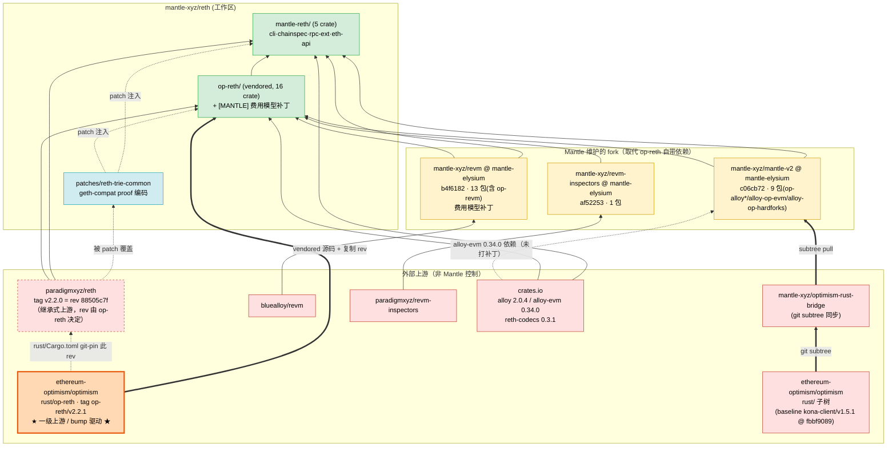
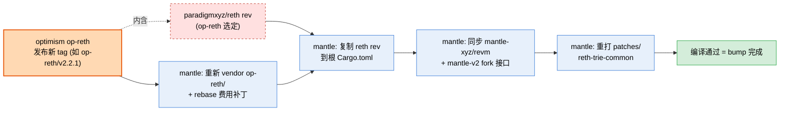
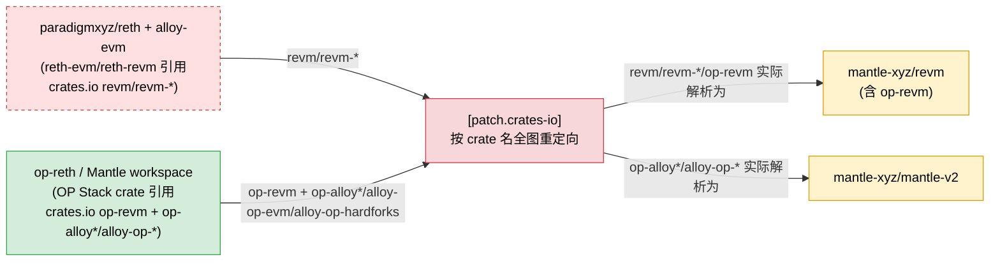

# mantle/reth 上游依赖拓扑分析

> 分析对象：`mantle-xyz/reth`（本地路径 `references/mantle/reth`）
> 分析时间：2026-06-13
> 分析方法：静态分析（`Cargo.toml` workspace 配置、`Cargo.lock` 已解析的 git/registry pin、源码内 `[MANTLE]` 标记）+ GitHub 上游交叉验证

---

## 1. 结论速览（TL;DR）

**核心认识（已经过 GitHub 验证）：mantle/reth 的真正「bump 驱动上游」是 Optimism monorepo 里的 op-reth，而不是 paradigmxyz/reth。**

mantle/reth 跟随 **`ethereum-optimism/optimism` 仓库 `rust/op-reth`**（tag `op-reth/v2.2.1`）来升级：它把该目录的源码 vendored 进自己的 `op-reth/` 目录，并且 **直接复制了 op-reth 在其 `rust/Cargo.toml` 里 pin 的 paradigmxyz/reth git rev**。换句话说：

- paradigmxyz/reth 的版本（rev `88505c7f` = tag `v2.2.0`）**不是 Mantle 自己选的**，而是 op-reth `v2.2.1` 替它选好的——Mantle 照抄。
- 因此 paradigmxyz/reth 对 mantle/reth 来说是 **间接 / 继承式上游**；Optimism op-reth 才是 **一级上游 / bump 入口**。

升级链条：

```
paradigmxyz/reth  (tag v2.2.0 = rev 88505c7f)
        ▲  rust/Cargo.toml 里 git-pin 此 rev
ethereum-optimism/optimism : rust/op-reth   (tag op-reth/v2.2.1)   ◀── Mantle 的真正 bump 目标
        ▲  vendored 源码 + 换 fork + 打补丁
mantle-xyz/reth
```

各上游来源汇总：

| 上游来源 | 对 mantle 的角色 | 接入方式 | 解析版本 | 谁控制 |
|---|---|---|---|---|
| **ethereum-optimism/optimism · rust/op-reth** | **一级上游 / bump 驱动** | 源码 vendored 进 `op-reth/`（16 crate） | tag `op-reth/v2.2.1` | 外部（OP Labs） |
| **paradigmxyz/reth** | **继承式上游**（rev 由 op-reth 决定） | git rev pin（约 70 条 `reth-*`） | `88505c7f` = `v2.2.0` | 外部（Paradigm） |
| **mantle-xyz/revm** | Mantle 替换的 fork | git branch | `mantle-elysium` @ `b4f6182`（13 包，含 op-revm） | Mantle（上游 bluealloy/revm） |
| **mantle-xyz/mantle-v2** | Mantle 替换的 fork | git branch | `mantle-elysium` @ `c06cb72`（mantle/reth 的 Cargo.lock 解析值，9 包：op-alloy*/alloy-op-evm/alloy-op-hardforks） | Mantle（其上游是 optimism `rust/` 子树，见下方注） |
| **mantle-xyz/revm-inspectors** | Mantle 替换的 fork | git branch | `mantle-elysium` @ `af52253`（1 包） | Mantle（上游 paradigmxyz/revm-inspectors） |
| **crates.io 注册表** | 基础库 | 版本号 | alloy 2.0.4 / alloy-evm 0.34.0 / reth-codecs 0.3.1 | 外部 |

> ⚠️ `mantle-v2` 的「谁控制」一栏不能简单写成「上游 alloy-rs」。`mantle-v2/rust` 本身是 **`ethereum-optimism/optimism` 仓库 `rust/` 子树的下游**（经 `mantle-xyz/optimism-rust-bridge` 用 `git subtree` 同步，baseline = optimism `kona-client/v1.5.1` @ `fbbf9089`）。它在该子树里维护的 `op-alloy*` / `alloy-op-evm` / `alloy-op-hardforks` 是 path crates；`alloy-rs/evm`（crates.io `alloy-evm 0.34.0`）只是其中一个 **未打补丁的注册表依赖**，不是整个 `mantle-v2` 的 fork 上游。详见 §3.4。

> ⚠️ 上一版本本文把 paradigmxyz/reth 当成「Mantle 自主选择的主上游」，这是错的。正确模型见本节与 §3。

---

## 2. mantle/reth 与 op-reth 的关系（已验证）

### 2.1 验证证据

在 `ethereum-optimism/optimism` 仓库的 tag `op-reth/v2.2.1` 上：

- 存在目录 `rust/op-reth/`，其 **核心 workspace crate set** 与 mantle 一致：mantle 根 workspace 把 `op-reth/bin/` + 15 个 `op-reth/crates/*`（`chainspec / cli / consensus / evm / exex / flashblocks / hardforks / node / payload / primitives / reth / rpc / storage / trie / txpool`）共 **16 个 member** 编入构建，这组 crate 与 upstream `rust/op-reth` 对齐——证明 mantle 的 `op-reth/` 就是从这里 vendored 来的。
  - 注意是 **crate set 对齐，而非完整目录逐文件一致**：upstream `op-reth/v2.2.1` 还含 examples、`tests/` 配置等；mantle 本地 `op-reth/crates/` 下也有非 member 目录（如 `tests/`），bin 侧保留了 `proof-bench`。逐文件比对会有出入，但作为 bump 入口要追踪的那组执行层 crate 是同一套。
- 其 workspace 清单 `rust/Cargo.toml` 里有：
  ```toml
  # ==================== RETH CRATES (git @ 88505c7fcbfdebfd3b56d88c86b62e950043c6c4) ====================
  reth = { git = "https://github.com/paradigmxyz/reth", rev = "88505c7fcbfdebfd3b56d88c86b62e950043c6c4" }
  ...
  ```
- mantle/reth 根 `Cargo.toml` L146 几乎照抄该段，仅把注释改成：
  ```toml
  # ==================== RETH CRATES (git @ v2.2.0, pinned by upstream op-reth) ====================
  ```
  且所有 `reth-*` 都 pin 到 **同一个 rev `88505c7f`**。

- 交叉验证：`gh api repos/paradigmxyz/reth/git/refs/tags/v2.2.0` → 指向 `88505c7fcbfdebfd3b56d88c86b62e950043c6c4`，与 mantle pin 的 rev 逐字符相同。该 rev 也是 gnosis、morph、succinct 等整个 OP/reth 生态共享的 v2.2.0 pin。

**结论**：用户描述属实——mantle/reth 按 Optimism op-reth bump，paradigmxyz/reth 的 rev 是从 op-reth 的 Cargo.toml 直接复制的。

### 2.2 Mantle 相对 op-reth v2.2.1 的「差异」

mantle/reth ≈ op-reth v2.2.1 + 以下三类改动：

**(A) 保持与 op-reth 一致：**
- paradigmxyz/reth rev `88505c7f`（继承）
- `alloy-evm = 0.34.0`（crates.io 上游，**故意不打 Mantle 补丁**，见 mantle-v2#359）

**(B) 把 op-reth 的依赖换成 Mantle fork：**

| 依赖 | op-reth v2.2.1 用的版本 | mantle/reth 换成 |
|---|---|---|
| `revm` / `op-revm` / `revm-*` | crates.io `revm 38.0.0` / monorepo path `op-revm 19.0.0` | `mantle-xyz/revm` @ `mantle-elysium` |
| `revm-inspectors` | crates.io `0.39.0` | `mantle-xyz/revm-inspectors` @ `mantle-elysium` |
| `op-alloy` / `alloy-op-evm` / `alloy-op-hardforks` | monorepo path `op-alloy 0.24.0` / `alloy-op-evm 0.31.0` / `alloy-op-hardforks 0.4.7` | `mantle-xyz/mantle-v2` @ `mantle-elysium` |

> 注意：op-reth v2.2.1 把 `op-revm`、`op-alloy`、`alloy-op-evm`、`alloy-op-hardforks` 作为 **monorepo 内的 path 依赖**自带；Mantle 把这些 path 依赖整体替换成了自己的 git fork。

**(C) Mantle 自己新增的改动：**
- 在 vendored `op-reth/` 内打 **费用模型补丁**（`op-reth/` 内 **9 个文件**带 `[MANTLE]` 标记）。
- `patches/reth-trie-common`：geth 兼容的 proof 编码（覆盖 reth 核心 crate，含 1 个 `[MANTLE]` 文件）。
- `mantle-reth/` 自定义层（5 crate，其中 `mantle-reth/crates/cli/src/txpool.rs` 含 1 个 `[MANTLE]` 文件）。

> `[MANTLE]` 标记全 repo 共 **11 个文件**：`op-reth/` 内 9 个 + `mantle-reth/crates/cli/src/txpool.rs` 1 个 + `patches/reth-trie-common/src/proofs.rs` 1 个。

---

## 3. 代码分层与上游详解

工作区（`[workspace]`）由三个 in-tree 层 + 外部依赖组成：

```
mantle/reth (workspace)
├── op-reth/        ← vendored 自 optimism monorepo rust/op-reth (op-reth/v2.2.1)，16 crate，打 Mantle 费用补丁
├── mantle-reth/    ← Mantle 自定义层（5 crate），default-members = mantle-reth/crates/cli
└── patches/        ← 对 reth 核心 crate 的最小覆盖（经 [patch] 注入）
    └── reth-trie-common  ← geth 兼容的 proof 编码
```

### 3.1 ethereum-optimism/optimism · rust/op-reth（一级上游 / bump 驱动）

- **接入方式**：源码 vendored 进 `op-reth/`（不是 git 依赖），跟踪 tag `op-reth/v2.2.1`。
- **包含**：16 个 OP Stack 执行层 crate（`reth-optimism-*` + `op-reth` bin）。
- **Mantle 在其内的补丁**：集中在 **费用模型**——
  - `op-reth/crates/evm/src/l1.rs`：`token_ratio` 改为从 `GAS_ORACLE_CONTRACT` 状态读取；L1 cost 超出 u64 需用更大整数。
  - `op-reth/crates/txpool/src/validator.rs`：逐 tx `token_ratio` 的 LRU 缓存（按 block hash）。
  - `op-reth/crates/evm/src/execute.rs`、`consensus/src/proof.rs`：pre-Arsia 链跳过 / 冻结 EIP-1559 basefee。
  - `chainspec/src/lib.rs`、`node/src/engine.rs`、`rpc/src/eth/{receipt,call}.rs`：Arsia 硬分叉（`setL1BlockValuesArsia()` selector）适配。
- **影响面**：🟠 **中高（手工同步）**。op-reth 出新 tag 时，Mantle 需重新 vendor 并 rebase 这些费用补丁。这是 Mantle 升级工作量的主要来源。

### 3.2 paradigmxyz/reth（继承式上游，rev `88505c7f` = v2.2.0）

- **接入方式**：约 70 条 `reth-*` git dep，rev 全部 = `88505c7f`；Cargo.lock 解析出 **102 个包**。**该 rev 由 op-reth v2.2.1 决定，Mantle 照抄。**
- **覆盖范围**：db / network / trie / provider / RPC 框架 / stages / engine / payload / EVM 抽象（`reth-evm`、`reth-revm`）/ node-builder——执行层地基。
- **影响面**：🔴 **极高（全局）**，但 **升级节奏被动**：Mantle 通常不主动 bump 这个 rev，而是等 op-reth 升级后跟随。trait 签名（`reth-node-api`、`reth-evm`、`reth-rpc-eth-api`）变更会逐层传导到 op-reth 与 mantle-reth。

### 3.3 mantle-xyz/revm（费用模型 fork，`mantle-elysium` @ `b4f6182`）

- 上游链路：`bluealloy/revm` → `mantle-xyz/revm`。包含 13 包（含 `op-revm`）。
- 取代 op-reth 自带的 crates.io revm 38.0.0 / path op-revm。被 `mantle-reth-eth-api`、`mantle-reth-rpc-ext` 直接使用，并经 `reth-revm`/`reth-evm` 渗透到执行路径。
- 影响面：🔴 高（EVM 执行语义 + 费用模型真相所在地，注意 `alloy-evm` 反而是上游未打补丁的）。

### 3.4 mantle-xyz/mantle-v2（Rust crates，`mantle-elysium` @ `c06cb72`）

- **真正的上游链路**（按本地 `mantle-v2/rust/MANTLE_CHANGES.md`）：
  ```
  ethereum-optimism/optimism  rust/ 子树  (baseline kona-client/v1.5.1 @ fbbf9089)
        │  git subtree（经 mantle-xyz/optimism-rust-bridge 同步）
        ▼
  mantle-xyz/mantle-v2 @ mantle-elysium  rust/  （Mantle 在子树上叠加 [MANTLE] 改动）
  ```
  `mantle-v2/rust` 是 optimism monorepo `rust/` 子树的下游，**不是 `alloy-rs` 的 fork**。其 `Cargo.toml` 的 `homepage`/`repository` 也仍指向 `ethereum-optimism/optimism`。
- mantle/reth 从该仓库 git fork 拉回的是 **9 个 path crate**：`op-alloy*`（`2.0.0`，6 个子 crate + meta）、`alloy-op-evm`（`0.32.0`）、`alloy-op-hardforks`（`0.5.0`）。取代 op-reth 自带的 monorepo path op-alloy 0.24.0 / alloy-op-evm 0.31.0；被 mantle-reth 全部 5 crate + op-reth 类型层广泛依赖。
- `alloy-rs/evm` 的角色仅限于 **crates.io 上的 `alloy-evm 0.34.0`**——`mantle-v2/rust` 把它当未打补丁的注册表依赖（Phase 5 已从 fork 回退到上游，见 MANTLE_CHANGES.md §2.3），不要把它当成整个 `mantle-v2` 的 fork 来源。
- **版本提醒（lock vs 本地 checkout）**：mantle/reth 的 `Cargo.lock` 把 mantle-v2 解析到 `c06cb72`（PR #359 合并点）——这是本分析的权威依据。本地 `mantle-v2` 当前 checkout HEAD 是 `afc419536`，且落后 `origin/mantle-elysium` 2 个提交（`3dcaba2b3` ci: update op-reth、`736f4e718` merge #361）。但 `c06cb72..afc419536` **没有 `rust/` 改动**（仅 `op-acceptance-tests/` 的 Go 测试），故 Rust 依赖模型不受这段差异影响；若引用「最新 mantle-v2」需说明用的是 lock 解析值、本地 HEAD 还是远端 tracking branch。
- 影响面：🔴 高（OP/Mantle 交易收据类型、硬分叉、OP EVM 工厂——类型层地基）。

### 3.5 mantle-xyz/revm-inspectors（`mantle-elysium` @ `af52253`）

- 上游链路：`paradigmxyz/revm-inspectors` → Mantle fork。1 包。取代 op-reth 的 crates.io 0.39.0。
- 影响面：🟡 低——**功能范围低**，主要限于 tracing / `debug_trace*` 等 debug RPC；并非在依赖图上完全边缘（它仍被 RPC 层正常链接），只是改动面与升级影响集中在 trace 子系统。

### 3.6 crates.io（注册表上游）

- alloy 基础库 `2.0.4`、`alloy-primitives 1.5.6`、`alloy-trie 0.9.4`、`alloy-hardforks 0.4.7`；
- `alloy-evm 0.34.0`（与 op-reth 一致，**故意上游不打补丁**）；
- 已发布 reth crate：`reth-codecs / reth-primitives-traits / reth-rpc-traits / reth-zstd-compressors` = `0.3.1`。
- 影响面：🟠 中（版本号可控；alloy 基础类型 major 变更影响面等同 reth）。

### 3.7 mantle-reth/（Mantle 自定义层，非上游，列出供参照）

| crate | 职责 |
|---|---|
| `mantle-reth-cli` | 节点入口、chain spec 解析、版本注入（默认二进制） |
| `mantle-reth-chainspec` | Mantle 链规格 |
| `mantle-reth-rpc-ext` | Mantle 专有 RPC（`eth_getBlockRange`、`eth_sendRawTransactionWithPreconf`） |
| `mantle-reth-eth-api` | Eth API helper（Arsia gas 估算余额检查、state export hook） |
| `mantle-reth-integration-tests` | 集成测试 |

---

## 4. 关键机制：`[patch]` 如何放大上游耦合

根 `Cargo.toml` 末尾两段 patch 是「上游更新如何传导」的核心：

```toml
[patch."https://github.com/paradigmxyz/reth"]
reth-trie-common = { path = "patches/reth-trie-common" }   # 用本地 geth-compat 版替换 reth 核心

[patch.crates-io]
revm / op-revm / revm-*  = { git = "mantle-xyz/revm", branch = "mantle-elysium" }
revm-inspectors          = { git = "mantle-xyz/revm-inspectors", ... }
alloy-op-evm / alloy-op-hardforks / op-alloy-* = { git = "mantle-xyz/mantle-v2", ... }
```

`[patch.crates-io]` 的作用（注释原文）：「没有它，paradigmxyz/reth 会用 crates.io 的 revm，而我们用 git revm，导致依赖图里出现不兼容的重复类型。」

**两个运维约束：**
1. **升级链是串行的**：op-reth 出新 tag → Mantle 重新 vendor `op-reth/` 并 rebase 费用补丁 → 继承新的 paradigmxyz/reth rev → 同步升级 `mantle-xyz/revm` 和 `mantle-xyz/mantle-v2` 使其与新 reth 接口兼容 → 重打 `patches/reth-trie-common`。任一环节接口不匹配即编译失败。
2. paradigmxyz/reth 的 rev 不能单独乱动——它必须与 op-reth 选定的 rev 一致，否则 op-reth 层会与 reth 核心 ABI 错配。

---

## 5. 「上游更新 → 受影响 Mantle 组件」对照表

| 上游来源 | 典型更新内容 | 直接受影响的 Mantle 组件 | 影响等级 | 升级触发方式 |
|---|---|---|---|---|
| **optimism rust/op-reth** | OP Stack 执行层逻辑、新 tag | `op-reth/` 全层（需重 vendor + rebase 费用补丁），并继承新 reth rev | 🟠 中高 | **主动跟随**（bump 入口） |
| paradigmxyz/reth | trait 签名、db 格式、stage/engine、RPC 框架 | op-reth 全层 + mantle-reth/* + patches/reth-trie-common | 🔴 极高 | **被动继承**（随 op-reth） |
| mantle-xyz/revm（← bluealloy） | EVM opcode / 费用模型 / precompile | mantle-reth-eth-api、rpc-ext、op-reth/evm 执行路径 | 🔴 高 | Mantle 自控 |
| mantle-xyz/mantle-v2（← optimism `rust/` 子树） | OP/Mantle 交易收据类型、硬分叉、OP EVM 工厂 | mantle-reth 全部 5 crate + op-reth 类型层 | 🔴 高 | Mantle 自控 |
| crates.io alloy 基础库 | 核心类型 major 变更 | 全栈重编译 | 🟠 中 | 版本号可控 |
| mantle-xyz/revm-inspectors（← paradigmxyz） | tracing inspector | RPC trace（`debug_trace*`，功能范围局部） | 🟡 低 | Mantle 自控 |
| alloy-evm 0.34.0（crates.io，未打补丁） | EVM 抽象 | op-reth/evm、mantle-reth-rpc-ext/eth-api | 🟡 低 | 与 op-reth 同步 |

> 传递依赖备注：`sigp/discv5`（节点发现协议）等是 reth-network 拉入的 **transitive dep**，不是 mantle/reth 的主拓扑上游，故不列入上表主体；升级随 reth rev 一并带入。

---

## 6. 上游依赖拓扑图

### 6.1 主拓扑（突出 op-reth 作为 bump 驱动、reth 作为继承式上游）



### 6.2 升级（bump）传导链



### 6.3 `[patch.crates-io]` 强制重定向（为何升级必须同步 fork）

两类 crates.io 名字被重定向，但它们的**声明来源不同**：



> 说明：`[patch.crates-io]` 按 crate 名生效，并不区分声明者，重定向到两个不同 fork：
> - **revm / revm-\* / op-revm → `mantle-xyz/revm`**。其中 `revm` / `revm-*` 主要是 `paradigmxyz/reth` 核心（`reth-evm`/`reth-revm`）与 `alloy-evm` 引用的 crates.io revm——注释举的就是这个例子（「没有它 paradigmxyz/reth 会用 crates.io revm」）；而 **`op-revm` 属于 OP Stack（op-reth）这侧**的依赖，不是 paradigmxyz/reth 核心引用的，但同样 patch 到 `mantle-xyz/revm`（根 `Cargo.toml` L244/425）。
> - **op-alloy\* / alloy-op-evm / alloy-op-hardforks → `mantle-xyz/mantle-v2`**。这些来自 OP Stack（op-reth）这侧。**两层不是同一组**：workspace **直接依赖**把 **9 个**包指向 `git = mantle-xyz/mantle-v2`（根 `Cargo.toml` L240-254：`op-alloy`、`op-alloy-consensus/network/provider/rpc-types/rpc-types-engine/rpc-jsonrpsee`、`alloy-op-evm`、`alloy-op-hardforks`）；而 `[patch.crates-io]` 兜底（L427-434）只覆盖其中**会作为 crates.io 传递依赖出现的 7 个子集**——`alloy-op-evm`、`alloy-op-hardforks`、`op-alloy-consensus/network/rpc-types/rpc-types-engine/rpc-jsonrpsee`，**不含** `op-alloy`(meta) 与 `op-alloy-provider`（这两个只靠 workspace 直接依赖解析）。
>
> 此处 `op-alloy*` 指 mantle-v2 提供的那 9 个 git 包，**不含 `op-alloy-flz`**——后者在 mantle/reth 里是纯 crates.io 依赖（`Cargo.toml` L255 `op-alloy-flz = "0.13.1"`），既不 patch、也不来自 mantle-v2。两条来源也不要混为「paradigmxyz/reth 内部声明 op-alloy」。

---

## 7. 证据索引（可复现）

| 结论 | 证据 |
|---|---|
| op-reth 是 bump 驱动，源在 optimism monorepo `rust/op-reth` | `gh api repos/ethereum-optimism/optimism/git/refs/tags/op-reth/v2.2.1` → tag 存在；upstream `rust/op-reth` 与 mantle `op-reth/` 的**核心 workspace crate set 对齐**（bin + 15 个 `crates/*`，共 16 member），非完整目录逐文件一致（详见 §2.1） |
| op-reth v2.2.1 pin reth @ 88505c7f | optimism `rust/Cargo.toml` @ tag `op-reth/v2.2.1` 含 `reth = { git=paradigmxyz/reth, rev="88505c7f…" }` 及注释 `RETH CRATES (git @ 88505c7f…)` |
| mantle 照抄该 rev | `Cargo.toml` L146 注释 `(git @ v2.2.0, pinned by upstream op-reth)`；L147–216 全部 rev = `88505c7f` |
| rev 88505c7f = paradigmxyz/reth v2.2.0 | `gh api repos/paradigmxyz/reth/git/refs/tags/v2.2.0` → `88505c7fcbfdebfd3b56d88c86b62e950043c6c4` |
| 该 rev 是 OP/reth 生态共享 v2.2.0 pin | GitHub code search：gnosis/morph/succinct/mantle-xyz/optimism-rust-bridge 等均引用 |
| Mantle 把 revm/op-alloy 换成 fork | op-reth v2.2.1 用 `revm 38.0.0`/`op-revm 19.0.0`(path)/`op-alloy 0.24.0`(path)/`alloy-op-evm 0.31.0`(path)/`alloy-op-hardforks 0.4.7`(path)；mantle 改为 `mantle-xyz/revm`、`mantle-xyz/mantle-v2`（`Cargo.toml` L218–254, 410–434） |
| revm/mantle-v2/inspectors 解析版本 | `Cargo.lock`：13 / 9 / 1 个包，rev `b4f6182`/`c06cb72`/`af52253` |
| alloy-evm 故意用上游 | `Cargo.toml` L12, 235–236 注释 `no Mantle patches; see mantle-v2#359`（与 op-reth 一致 0.34.0） |
| `[MANTLE]` 标记分布 | 全 repo `grep -rl "\[MANTLE\]"` = **11 文件**：`op-reth/` 内 9（`crates/{chainspec,consensus/{lib,proof},evm/{execute,l1},rpc/{error,eth/call,eth/receipt},txpool/validator}.rs`）+ `mantle-reth/crates/cli/src/txpool.rs` 1 + `patches/reth-trie-common/src/proofs.rs` 1 |
| reth-trie-common geth-compat patch | `patches/reth-trie-common/src/proofs.rs` L621/676/742/790；description `[MANTLE PATCH: geth-compat proof encoding]` |
| mantle-v2 上游 = optimism `rust/` 子树（非 alloy-rs fork） | 本地 `mantle-v2/rust/MANTLE_CHANGES.md` L13：`Upstream tracking point = optimism kona-client/v1.5.1 @ fbbf9089`，经 `mantle-xyz/optimism-rust-bridge` `git subtree pull` 同步；`mantle-v2/rust/Cargo.toml` L6-7 `homepage`/`repository` 指向 `ethereum-optimism/optimism` |
| mantle-v2 提供的 path crate 版本 | 本地 `mantle-v2/rust/Cargo.toml`：`op-alloy* = 2.0.0`（L264-269, 423）、`alloy-op-evm = 0.32.0`（L272）、`alloy-op-hardforks = 0.5.0`（L273）均为 `path = ...` |
| mantle-v2 把 alloy-evm 留在上游 | 本地 `mantle-v2/rust/Cargo.toml` L373 `alloy-evm = "0.34.0"`（无 path、无 patch），L648-652 注释 `[MANTLE] alloy-evm is intentionally NOT patched...`；MANTLE_CHANGES.md §2.3（Phase 5 从 fork 回退到 crates.io 上游） |
| mantle-v2 lock 解析 vs 本地 HEAD | mantle/reth `Cargo.lock` 解析 mantle-v2 → `c06cb72`；本地 `mantle-v2` `git rev-parse HEAD` = `afc419536`，`git rev-list --count HEAD...origin/mantle-elysium` = 落后 2（`3dcaba2b3`/`736f4e718`）；`git diff --stat c06cb72..afc419536 -- rust/` 为空（仅 `op-acceptance-tests/` Go 测试变化） |
| 其余 fork 上游 | `mantle-xyz/revm` ← `bluealloy/revm`、`mantle-xyz/revm-inspectors` ← `paradigmxyz/revm-inspectors`（各仓库 `git remote` / 上游 README 可核） |

---

## 8. 给后续工具阶段的备注（对应 DESCRIPTION「未来扩展」）

- 本文为 DESCRIPTION 要求的**第一阶段静态分析**产物，仅覆盖 `mantle/reth`。
- **重要建模启示**：判断一个 Mantle repo 的「真正上游」时，不能只看 `Cargo.toml` 里写的 git URL，而要识别**「bump 驱动上游」与「继承式上游」的区别**。mantle/reth 写着 paradigmxyz/reth，但它实际跟随的是 optimism op-reth；reth 的 rev 是被复制的。后续工具应支持标注这种「跟随/继承」关系（可对比 fork 的 Cargo.toml 与其 vendor 来源仓库同 tag 的 Cargo.toml 是否逐行复制）。
- 可机读的依赖事实来源：
  1. 仓库 `Cargo.toml` 的 `[workspace.dependencies]` + `[patch.*]`（声明意图）；
  2. `Cargo.lock` 的 `source = "git+..."`（已解析真实 pin，最可信）；
  3. 头部注释常直接写明 vendor 来源与「pinned by upstream X」（本仓库即如此）。
- 上游 repo 节点清单（汇总到总拓扑图）：
  - **一级（bump 驱动）** `ethereum-optimism/optimism`（`rust/op-reth`，tag `op-reth/v2.2.1`）；
  - **继承** `paradigmxyz/reth`（rev 由 op-reth 决定）；
  - **Mantle fork** `mantle-xyz/revm`、`mantle-xyz/mantle-v2`、`mantle-xyz/revm-inspectors`；
  - **二级**：`bluealloy/revm`（→ mantle-xyz/revm）；`ethereum-optimism/optimism` `rust/` 子树经 `mantle-xyz/optimism-rust-bridge`（→ mantle-xyz/mantle-v2，**这是 mantle-v2 的权威上游，不是 alloy-rs**）；`paradigmxyz/revm-inspectors`（→ mantle-xyz/revm-inspectors）；
  - **注册表/单点依赖**：crates.io `alloy-rs/*`（含 `alloy-evm 0.34.0`，由 mantle-v2 与 op-reth 直接消费，未经 fork）。
