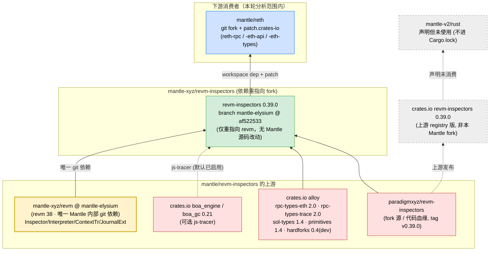

# mantle/revm-inspectors 上游依赖拓扑分析

> 分析对象：`mantle-xyz/revm-inspectors`（本地 `references/mantle/revm-inspectors`）
> 分析分支：**`mantle-elysium`**（HEAD `af522533`，下游 reth 的 `Cargo.lock` 实测 pin 此 commit）。注意：本地 checkout 处于 `main`（`91196e3`），但下游消费的是 `mantle-elysium` 分支；两者内容几乎一致（见 §2）。
> 分析时间：2026-06-13
> 分析方法：静态分析（`Cargo.toml` 已解析 pin、git 分支/tag、对上游 baseline tag `v0.39.0` 做 diff、下游 `Cargo.lock` 反查消费者）+ 上游确认

---

## 1. 结论速览（TL;DR）

**mantle/revm-inspectors 是 `paradigmxyz/revm-inspectors` 的「依赖重指向 fork」（dependency re-pointing fork），位于 Mantle Rust 栈的「中间层」——它的下游是 mantle/reth，上游是 mantle/revm。**

- **它不是叶子，也不是顶层消费者，而是中间节点**：它**消费** `mantle-xyz/revm`（唯一的 Mantle 内部 git 依赖），又被 `mantle/reth` **消费**。拓扑链是 `mantle/revm → mantle/revm-inspectors → mantle/reth`。这是迄今分析的几个仓库里第一个「既是下游又是上游」的中间件。
- **Mantle 对 inspector 源码几乎零改动**：对 baseline 上游 tag `v0.39.0` 做 diff，**真实改动只有 4 个文件、6 增 6 删**，且唯一有意义的一处是 `Cargo.toml` 把 `revm = "38.0.0"`（crates.io）**重指向**为 `revm = { git = mantle-xyz/revm, branch = mantle-elysium }`。其余是 `deny.toml` 放行该 git 源、两处测试里的纯格式/clippy 改动。**没有任何 Mantle 协议/费用模型逻辑写进 inspector 源码**——它继承 op-succinct 同款的「只改依赖指向、不改源码」适配模式。
- **「为什么必须用 fork」= revm 类型一致性**：inspector 直接 `impl Inspector<CTX> for TracingInspector`，并绑定 revm 的 `Interpreter`/`ContextTr`/`JournalExt`/`OpCode` 等核心类型（见 §4）。reth-rpc 的 tracing 必须与 reth 其余部分用**同一个 revm 实例**，否则依赖图里出现两个不兼容的 `revm` crate → 编译失败。fork 把自身 `revm` 依赖钉死到 `mantle-xyz/revm@mantle-elysium`，保证类型一致。
- **fork 在功能上等价于「registry 版 + patch revm→fork」**：这是 Cargo 机制上的等价路径——用 registry `revm-inspectors 0.39.0` 不打 patch、靠 `[patch.crates-io] revm→fork` 间接让 inspector 绑定 Mantle revm，效果与显式 fork 相同。mantle-v2 的 manifest 形态接近这条路径（声明 registry 版、未 patch revm-inspectors 本身），但⚠️**它只是「声明未使用」，并非已生效的实例**（其 lock 里根本没有 revm-inspectors，见 §5）。reth 则选择显式 fork。
- **真实下游只有一个：mantle/reth**（限定在本轮已分析的 `reth / mantle-v2 / kona / op-succinct` 范围内）。mantle-v2 虽在 `[workspace.dependencies]` 声明了 `revm-inspectors = "0.39.0"`，但**没有任何成员 crate 使用它**，故其 `Cargo.lock` 里 revm-inspectors 条目数为 **0**（声明但未消费）。kona、op-succinct 完全无引用。
  > ⚠️ **范围外观察**：组织级代码搜索显示 `mantle-xyz/mantle-v3` 的 `op-service/rethdb-reader/Cargo.lock` 含一个旧版 `revm-inspectors`，但其来源是 **`paradigmxyz/evm-inspectors?rev=75a187b`(上游,非本 Mantle fork)**，因此**不构成本 fork 的下游边**，也不推翻本报告；此处仅作记录,提醒「真实下游只有一个」是限定在本轮分析范围内的结论。（mantle-v3 不在本地 references 中，未一手复现。）

```
   paradigmxyz/revm-inspectors        crates.io alloy            mantle-xyz/revm
   (fork 源 / 代码血缘, v0.39.0)    (rpc-types-eth/trace,      (@mantle-elysium, revm 38)
            ▲                         sol-types, primitives)         ▲ 唯一 Mantle 内部 git 依赖
            └──────────────┬───────────────┘                        │   (Inspector/Interpreter/Context 类型)
                           │                                        │
                  mantle-xyz/revm-inspectors  ◀────────────────────┘
                  branch mantle-elysium @ af522533  (v0.39.0, 仅重指向 revm)
                           │
                  workspace dep + [patch.crates-io]
                           │
                     mantle/reth   ←（reth-rpc / reth-rpc-eth-api / reth-rpc-eth-types 消费）

   旁路（非本 fork 的边）：
     crates.io revm-inspectors 0.39.0（上游 registry 版）-. 声明未消费 .-> mantle-v2/rust（不进 lock）
```

---

## 2. 仓库身份与依赖性质

| 项 | 值 |
|---|---|
| 上游（fork 源） | `paradigmxyz/revm-inspectors`（`git remote upstream`） |
| 分析/消费分支 | `mantle-elysium` @ `af522533`（reth lock 实测 pin 此 commit）。本地 checkout 在 `main` @ `91196e3`，内容与 mantle-elysium 几乎一致 |
| 当前版本 | `0.39.0`（对齐上游 tag `v0.39.0`；上游 main 已到 `0.41.1`，故本 fork 落后约两个 minor） |
| 包形态 | **单 crate 纯库**，无 workspace、无 `Cargo.lock`（库不锁版本） |
| 唯一 Mantle 内部依赖 | `revm = { git = "mantle-xyz/revm", branch = "mantle-elysium" }`（替换上游的 `revm = "38.0.0"`） |
| 外部依赖（库 crate） | crates.io：`alloy-rpc-types-eth 2.0`、`alloy-rpc-types-trace 2.0`、`alloy-sol-types 1.4`、`alloy-primitives 1.4`、`anstyle`、`colorchoice`、`thiserror 2.0`、`serde`/`serde_json`、可选 `boa_engine`/`boa_gc 0.21`（js-tracer）。dev：`alloy-hardforks 0.4`、`snapbox` |
| 提供的能力 | TracingInspector（call tracer）、geth/parity trace builder、prestate、opcode 计数、access-list、storage、transfer、edge coverage、JS tracer（boa） |

**fork delta（对上游 tag `v0.39.0` 的真实 diff）—— 仅 4 文件 / 6 增 6 删：**

| 文件 | 改动 | 性质 |
|---|---|---|
| `Cargo.toml` | `revm = "38.0.0"` → `revm = { git = mantle-xyz/revm, branch = mantle-elysium }` | **唯一实质改动**（依赖重指向） |
| `deny.toml` | `allow-git = ["…/mantle-xyz/revm"]`；`wildcards` deny→warn | 放行上面那条 git 源（仓库本地 lint 配置，不影响消费者） |
| `src/tracing/js/mod.rs` | 删 2 个测试用例里的空行 | 纯格式 |
| `tests/it/geth.rs` | `.iter()`（弃用 key）→ `.values()` | clippy 风格，测试内 |

> 结论：**revm-inspectors 是 op-succinct 同类的「依赖重指向 fork」**——靠改 manifest 适配，而非改源码。它不携带 Mantle 协议语义；Mantle 语义全部在它依赖的 `mantle-xyz/revm` 里（BVM_ETH/token_ratio/ARSIA/JOVIAN 费用模型，见 mantle/revm 分析）。

---

## 3. 拓扑位置：中间节点（下游 of revm，上游 of reth）

这是本仓的核心特征，也是它区别于此前分析过的几个仓库的地方：

| 此前分析的仓库 | 拓扑角色 |
|---|---|
| mantle/revm | 叶子/根上游（出度低、入度高） |
| mantle/op-succinct | 最下游消费者（入度高、出度为 0） |
| **mantle/revm-inspectors** | **中间件（既被消费又消费别人）** |

依赖链：

```
mantle-xyz/revm@mantle-elysium (revm 38)
        │  （Inspector / Interpreter / ContextTr / JournalExt 类型）
        ▼
mantle-xyz/revm-inspectors@mantle-elysium (v0.39.0)
        │  （workspace dep + patch.crates-io）
        ▼
mantle/reth → reth-rpc / reth-rpc-eth-api / reth-rpc-eth-types（debug_trace* / trace_* RPC）
```

> ⚠️ **lockstep 约束**：mantle/revm 一旦 bump revm 大版本（如 38→41），reth 会**同时**通过两条边受到 revm：①reth 自己的 `[patch.crates-io]` 直指 revm 全家；②经由 revm-inspectors 间接依赖 revm。这两条边必须**同步移动**——revm-inspectors 也得升到匹配 revm 版本的上游 release（如 revm 41 ↔ revm-inspectors 0.41.x），否则 reth 依赖图里会出现两个不兼容的 `revm`。仓库历史正印证了这点：HEAD 的 `91196e3 feat: upgrade to upstream v0.39.0 for Mantle Elysium` 就是为配合 revm 38（elysium）而做的协同升级。

---

## 4. 为什么 reth 必须用这个 fork（revm 类型耦合证据）

inspector 不是松散调用 revm，而是**直接实现 revm 的 trait、绑定其核心类型**。`src/tracing/mod.rs`：

```rust
use revm::{
    bytecode::opcode::{self, OpCode},
    context::{JournalTr, LocalContextTr},
    context_interface::ContextTr,
    inspector::JournalExt,
    interpreter::{ ... CallInputs, CallOutcome, CreateInputs, Interpreter, InterpreterResult },
    primitives::{hardfork::SpecId, Address, Bytes, Log, B256, U256},
    Inspector, JournalEntry,
};
...
impl<CTX> Inspector<CTX> for TracingInspector { ... }   // 第 600 行
```

- 这些类型（`Interpreter`、`ContextTr`、`JournalExt`、`Inspector`、`OpCode`…）都由 `revm` 提供。
- reth-rpc 在执行 `debug_traceTransaction` / `trace_*` 时，把 `TracingInspector` 挂进 reth 自己的 revm 执行上下文。若 inspector 编译用的是 stock crates.io `revm`，而 reth 用的是 `mantle-xyz/revm`，则两个 `revm` crate 实例类型不通 → 编译失败。
- 因此 inspector 的 `revm` 依赖**必须**与 reth 全图统一为 `mantle-xyz/revm@mantle-elysium`。fork 直接把 manifest 钉死实现这一点。

---

## 5. 下游消费者（实测）

| 下游 | 是否真正消费 | 接入方式 | 证据 |
|---|---|---|---|
| **mantle/reth** | ✅ 是 | `[workspace.dependencies]` git fork + `[patch.crates-io]` git fork（双声明） | `reth/Cargo.toml:233` 与 `:423` 均为 `revm-inspectors = { git = mantle-xyz/revm-inspectors, branch = mantle-elysium }`；`reth/Cargo.lock` 解析为 `git+…/revm-inspectors?branch=mantle-elysium#af522533` |
| 实际拉入它的 reth crate | — | 传递依赖 | `reth/Cargo.lock` 反查：`reth-rpc`、`reth-rpc-eth-api`、`reth-rpc-eth-types`（均为上游 reth 的 RPC tracing crate，非 Mantle 源码——故 Mantle 自有 `.rs` 里搜不到 `revm_inspectors`） |
| **mantle-v2/rust** | ⚠️ 声明但**未使用** | `[workspace.dependencies]` registry `"0.39.0"`，**未打 patch** | `mantle-v2/rust/Cargo.toml:365` 有声明，但无任何成员 crate 引用 → `mantle-v2/rust/Cargo.lock` 中 revm-inspectors 条目数 = **0** |
| mantle/kona | ❌ 无 | — | 全仓 0 引用 |
| mantle/op-succinct | ❌ 无 | — | 全仓 0 引用 |

> **要点**：在本轮分析的四仓范围内，唯一的真实消费者是 **mantle/reth**，且消费它的是**上游 reth 的 RPC crate**（reth-rpc*），不是 Mantle 自写的代码。mantle-v2 的声明是「workspace 占位但未激活」，做拓扑时不应画成实边（否则会高估 revm-inspectors 的下游扇出）。
>
> ⚠️ **范围限定**：本表只覆盖 `reth / mantle-v2 / kona / op-succinct`。组织内其它仓库（如 `mantle-xyz/mantle-v3` 的 `op-service/rethdb-reader`）也可能出现 `revm-inspectors`，但据组织级搜索其来源是上游 `paradigmxyz/evm-inspectors@75a187b` 而非本 Mantle fork，故不是本 fork 的下游。绝对表述「只有一个」须带此范围限定。

---

## 6. 上游依赖与「更新影响」

### 6.1 上游 → mantle/revm-inspectors

| 上游 | 内容 | 影响等级 |
|---|---|---|
| **paradigmxyz/revm-inspectors**（fork 源） | 全部 inspector 实现（call/prestate/opcode/JS tracer、geth/parity builder） | 🔴 高（上游发版需 rebase；当前落后到 0.39 vs 上游 0.41） |
| **mantle-xyz/revm@mantle-elysium**（唯一 Mantle git 依赖, revm 38） | `Inspector`/`Interpreter`/`ContextTr`/`JournalExt`/`OpCode` 等核心类型 | 🔴 高（revm 大版本 bump 必须同步升 inspector，见 §3 lockstep） |
| crates.io **alloy**（rpc-types-eth/trace 2.0、sol-types/primitives 1.4、hardforks 0.4 dev） | trace 输出类型（geth/parity 帧、prestate diff、access list） | 🟠 中（输出格式/类型变动会改 builder API） |
| crates.io **boa_engine/boa_gc 0.21**（`js-tracer` feature） | JS tracer 运行时 | 🟢 低（影响仅限 JS tracer；⚠️ 但**对默认 reth 节点构建已启用**——见下） |

> ⚠️ **js-tracer 在 mantle-reth 默认 feature 中已启用**：`mantle-reth/crates/cli/Cargo.toml:64` 的 `default = [..., "js-tracer", ...]` 会链式打开 `reth-rpc/js-tracer`、`reth-rpc-eth-types/js-tracer`（op-reth bin 同理）。所以「可选」是就 revm-inspectors crate 本身而言；对**默认配置的 mantle-reth 节点**，boa/JS tracer 通常已编入。即便如此，其影响仍局限在 **debug trace / JS tracer 路径**，不进入共识/执行路径。

### 6.2 mantle/revm-inspectors → 下游

| 下游 | 接入方式 | 受影响组件 | 影响等级 |
|---|---|---|---|
| **mantle/reth** | git fork（workspace dep + patch.crates-io） | reth-rpc / reth-rpc-eth-api / reth-rpc-eth-types：`debug_traceTransaction`、`debug_traceCall`、`trace_*`（parity）、prestate tracer、opcode/4byte 统计、JS tracer | 🟠 中 |

> **影响半径明显小于 mantle/revm**：revm-inspectors 只触及 reth 的 **tracing / debug RPC 层**，**不参与 EVM 执行与共识**。这里出 bug 会让 `debug_trace*` / `trace_*` RPC 出错或 panic，但**不影响区块有效性、不影响 fault proof**。相比之下 mantle/revm 的改动半径覆盖全部 EVM 执行（reth+kona+mantle-v2）。

---

## 7. 上游依赖拓扑图



---

## 8. 证据索引（可复现）

| 结论 | 证据 |
|---|---|
| fork 自 paradigmxyz/revm-inspectors | `git remote -v`：upstream = paradigmxyz/revm-inspectors |
| 消费分支 mantle-elysium @ af522533 | `git rev-parse origin/mantle-elysium` = `af522533`；reth `Cargo.lock` 的 revm-inspectors source 行 = `git+…/revm-inspectors?branch=mantle-elysium#af522533` |
| 版本 0.39.0，对齐上游 tag v0.39.0 | `Cargo.toml` version=0.39.0；上游存在 tag `v0.39.0`（`1741db70`）；上游 main 已 0.41.1 |
| 唯一实质改动 = revm 重指向 | `git diff v0.39.0..mantle-elysium` 仅 4 文件 6/6；`Cargo.toml` 把 `revm="38.0.0"` → `git=mantle-xyz/revm,branch=mantle-elysium`；其余为 deny.toml allow-git + 两处测试格式/clippy |
| 无 Mantle 协议逻辑 | `git grep -i "MANTLE\|BVM_ETH\|token_ratio"` 在 src 下 0 命中 |
| 与 revm 类型强耦合 | `src/tracing/mod.rs` `use revm::{Inspector, Interpreter, ContextTr, JournalExt, OpCode, …}`；`impl<CTX> Inspector<CTX> for TracingInspector`（第 600 行） |
| reth 双声明（dep + patch） | `reth/Cargo.toml:233`（workspace dep）与 `:423`（[patch.crates-io]）均指向 fork@mantle-elysium |
| reth 实际消费者 = RPC crate | `reth/Cargo.lock` 反查：`reth-rpc`、`reth-rpc-eth-api`、`reth-rpc-eth-types` 列 revm-inspectors 为依赖 |
| mantle-v2 声明但未消费 | `mantle-v2/rust/Cargo.toml:365` `revm-inspectors = "0.39.0"`（registry，未在 patch 段）；`mantle-v2/rust/Cargo.lock` 中 revm-inspectors 条目数 = 0 |
| kona / op-succinct 无引用 | 两仓全文搜索 revm-inspectors = 0 文件 |
| js-tracer 在 mantle-reth 默认 feature 中启用 | `mantle-reth/crates/cli/Cargo.toml:64` `default = [..., "js-tracer", ...]` → `js-tracer` 链至 `reth-rpc/js-tracer`、`reth-rpc-eth-types/js-tracer`（`op-reth/crates/reth/Cargo.toml:145` 亦同）→ 默认节点构建会编入 boa |

> 注：mantle-v3 用上游 `paradigmxyz/evm-inspectors@75a187b`（非本 fork）一条属 **GPT 复核观察、非本次一手证据**，故不列入上表，仅记于 §5「范围外观察」脚注。

---

## 9. 给后续工具阶段的备注

- **新角色：中间件节点（middle node）**。revm-inspectors 是 Rust 栈里第一个「既消费 Mantle fork（revm）又被 Mantle fork（reth）消费」的仓库。总拓扑里它应画在 `mantle/revm` 与 `mantle/reth` 之间，形成 `revm → revm-inspectors → reth` 链，且与「reth 直接 patch revm」并行——存在 revm→reth 的**双路径**。
- **建模要点（本仓贡献）**：
  1. **「依赖重指向 fork」识别**：本仓与 op-succinct 同类——fork 的全部实质 delta 只是把某条依赖从 registry 改指向另一个 Mantle fork（这里是 revm）。工具应能识别这类 fork：它**不携带本仓语义**，真正的耦合在被重指向的依赖（revm）上。判断方法 = 对匹配的上游 baseline tag 做 diff，若改动集中在 manifest/deny 配置即为此类。**不要按「与 upstream/main 的 diff」来判断**——上游 main 已领先（0.41.1），那份 diff 是上游自身演进，会把 1000+ 行误算成 Mantle 改动；必须对**匹配版本的 baseline tag**（v0.39.0）diff。
  2. **lockstep 约束建模**：revm 版本与 revm-inspectors 版本必须配套（revm 38 ↔ inspectors 0.39，revm 41 ↔ 0.41）。到 reth 的 revm 双路径必须同步升级。工具可把这类「版本配套」标注为约束边。
  3. **「声明 ≠ 消费」**：mantle-v2 在 workspace 声明了 registry revm-inspectors 但无成员使用，故不进 lock。采集下游边时**必须以 `Cargo.lock` 解析结果为准**，不能只看 manifest 的 `[workspace.dependencies]` 声明，否则会把 mantle-v2 误画成消费者，高估扇出。
  4. **fork ≈ registry + patch（机制等价，非已生效实例）**：reth 用显式 fork；「registry `revm-inspectors` + `[patch.crates-io] revm→fork`」是 Cargo 机制上的等价路径，对「让 inspector 绑定 Mantle revm」效果相同。⚠️ 但**不要把 mantle-v2 当作这条路径已生效的样例**——mantle-v2 只是声明了 registry 版而无成员使用（lock 里 0 条目），是「等价路径的 manifest 形态」而非「已激活的实例」。工具在合成图时可注明：本 fork 存在的唯一价值是显式化 revm 绑定，并非携带独立逻辑。
  5. **影响分层**：revm-inspectors 的改动半径限于 reth 的 tracing/debug RPC（reth-rpc*），不触及共识/执行/证明。给「更新影响」打分时，中间件节点的影响应按其下游**实际使用面**收敛，而非按「被 reth 依赖」笼统判为高。
- 至此 Rust 侧已覆盖 revm（叶子）、reth/kona/mantle-v2（消费者）、op-succinct（最下游）、revm-inspectors（中间件）。合成总图时，revm-inspectors 作为 `revm → reth` 之间的中间节点接入，**在本轮已分析仓库范围内下游仅 reth(rpc)**（已观察到的 mantle-v3 命中来自上游 `paradigmxyz/evm-inspectors` 而非本 fork；其它仓库需单独核对，见 §5 范围外观察）。
