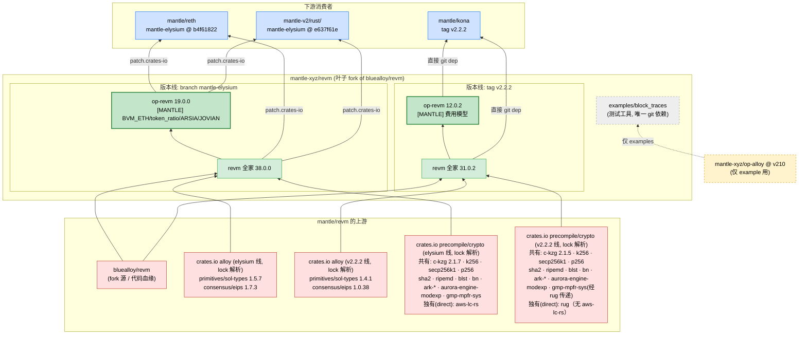

# mantle/revm 上游依赖拓扑分析

> 分析对象：`mantle-xyz/revm`（本地 `references/mantle/revm`）
> 分析分支：**`mantle-elysium`**（HEAD `b4f61822`）。注意：远端默认 HEAD 是 `main`；`mantle-elysium` 是 reth / mantle-v2 当前消费的分支，是本文的分析入口，并非仓库默认分支。
> 分析时间：2026-06-13
> 分析方法：静态分析（`Cargo.toml`/`Cargo.lock` 已解析 pin、`[MANTLE]` 标记、git 分支/tag）+ 上游确认

---

## 1. 结论速览（TL;DR）

**mantle/revm 是 `bluealloy/revm` 的 fork，是整个 Mantle Rust 技术栈的「最底层 / 叶子节点」。**

- **它是叶子 fork**：发布的库 crate（revm 全家 + `op-revm`）**没有任何 Mantle 内部依赖**。它的上游有两类——① `bluealloy/revm`（代码血缘）；② **crates.io 注册表依赖**，其中除 alloy 基础库外，`crates/precompile` 还引入一整套密码学/precompile 依赖（`c-kzg`、`k256`、`secp256k1`、`p256`、`sha2`、`ripemd`、`blst`、`bn`(substrate-bn)、`ark-*`、`aurora-engine-modexp`、`aws-lc-rs` 等）。唯一一处指向 Mantle fork 的 git 依赖（`mantle-xyz/op-alloy`）只存在于 `examples/block_traces/`（一个 receipt 回放测试工具），**不进入发布的 crate**。
- **它是被共享的关键上游**：mantle/reth、mantle/kona、mantle-v2/rust/ 都消费它，但**接入方式不同**——reth 与 mantle-v2 通过 `[patch.crates-io]` 把 revm 全家重定向到这个 fork；**kona 不用 patch，而是在 `[workspace.dependencies]` 里直接 git 依赖 `revm`/`op-revm`（tag `v2.2.2`）**。它是 Mantle EVM / 费用模型的**单一事实来源**。
- **一仓多版本线**：同一个 repo 用不同 ref 服务不同下游——`mantle-elysium`（revm 38）给 reth/mantle-v2；tag `v2.2.2`（revm 31 / op-revm 12.0.2）给 kona。

```
  crates.io alloy (lock 解析, 随 ref: elysium 1.5.7/1.7.3 · v2.2.2 1.4.1/1.0.38)   bluealloy/revm（fork 源）
                        ▲                                   ▲
                        └───────────────┬───────────────────┘
                                  mantle-xyz/revm  (叶子 fork)
                       branch mantle-elysium (revm38) · tag v2.2.2 (revm31) · ...
                                        │
                ┌─────────────────┬─────┴──────────────────────┐
        [patch.crates-io]   [patch.crates-io]          直接 git 依赖(workspace dep)
                │                 │                            │
          mantle/reth        mantle-v2/rust/              mantle/kona
        (mantle-elysium      (mantle-elysium              (tag v2.2.2
         @ b4f61822)          @ e637f61e)                  revm31/op-revm12.0.2)
```

---

## 2. 仓库身份与依赖性质

| 项 | 值 |
|---|---|
| 上游（fork 源） | `bluealloy/revm`（`git remote upstream`） |
| 分析分支 | `mantle-elysium` @ `b4f61822`（远端默认分支是 `main`；`mantle-elysium` 是 reth/mantle-v2 消费的分支） |
| 下游解析到的 rev（同一分支，不同时点） | mantle/reth → `b4f61822`（当前 HEAD）；mantle-v2/rust → `e637f61e`（同分支较早 commit）。两者解析值不同，做拓扑时按各自 `Cargo.lock` 取值 |
| 工作区 crate | `revm` `primitives` `bytecode` `database(-interface)` `state` `interpreter` `inspector` `precompile` `context(-interface)` `handler` `op-revm` `statetest-types` `ee-tests` |
| 版本（mantle-elysium） | revm `38.0.0`、op-revm `19.0.0`、context `16.0.1`、interpreter `35.0.1` … |
| 外部依赖（库 crate） | 全部来自 **crates.io 注册表**，分两类，**两类都随 ref 漂移**：① **alloy 基础库**（`alloy-primitives/sol-types/consensus/eips/rlp/trie`，lock 解析值：mantle-elysium = primitives/sol-types `1.5.7` + consensus/eips `1.7.3`；v2.2.2 = `1.4.1` + `1.0.38`）；② **precompile/crypto 依赖**（被 `crates/precompile` 使用）：共有 `c-kzg`、`k256`、`secp256k1`、`p256`、`sha2`、`ripemd`、`blst`、`bn`(substrate-bn)、`ark-*`、`aurora-engine-modexp`。**两个口径的差异要分清**：<br/>· **direct manifest 依赖**：mantle-elysium 直接列 `gmp-mpfr-sys` + `aws-lc-rs`；v2.2.2 直接列 `rug`（big-int 包装库）。<br/>· **lock 解析（含传递）**：`c-kzg` 解析为 elysium `2.1.7` / v2.2.2 `2.1.5`（manifest 约束写的是 2.1.7 / 2.1.4）；`gmp-mpfr-sys 1.6.8` **两条线 lock 里都有**（v2.2.2 经 `rug` 传递引入），所以它不是 elysium 独有；lock 层真正的集合差异是 **`aws-lc-rs` 仅 elysium 有**、**`rug` 仅 v2.2.2 有** |
| Mantle 内部依赖 | **无**（库 crate）；仅 `examples/block_traces/` 用 `mantle-xyz/op-alloy@v210`（测试工具，非发布） |

**验证**：整个 `mantle-elysium` 分支里，唯一含 `git =` 依赖的 Cargo.toml 是 `examples/block_traces/Cargo.toml`；`op-revm` 的运行时依赖只有 `revm`（workspace）+ `alloy-sol-types`（crates.io）。因此发布库是**纯叶子 fork**。

---

## 3. 多版本线（一仓服务多下游）

mantle/revm 用不同 ref 给不同消费者，**版本号不同但同源**：

> 下表 revm/op-revm 为 crate 自身版本；alloy 列为 **revm 仓库自身 `Cargo.lock` 的解析值**（非 manifest 约束）。

| ref | revm 版本 | op-revm 版本 | crates.io alloy（lock 解析，随 ref 不同！） | 接入方式 | 消费者 |
|---|---|---|---|---|---|
| branch `mantle-elysium` | `38.0.0` | `19.0.0` | primitives/sol-types `1.5.7`、consensus/eips `1.7.3` | `[patch.crates-io]` | **mantle/reth**（@b4f61822）、**mantle-v2/rust/**（@e637f61e） |
| tag `v2.2.2` | `31.0.2` | `12.0.2`（kona lock 实测） | primitives/sol-types `1.4.1`、consensus/eips `1.0.38` | 直接 git workspace dep | **mantle/kona** |
| tag `v2.2.0/v2.2.1`、branch `mantle-arsia`、`v69_mantle`、tag `v98-mantle-arsia.*` 等 | 多条 | — | — | — | Mantle 各发布/开发线 |

> ⚠️ **连 crates.io alloy 基础库的版本也随 ref 漂移**（上为 lock 解析值；对应 manifest 约束分别是 elysium `1.5.2/1.4.2`、v2.2.2 `1.3.1/1.0.27`）。所以总拓扑里「mantle/revm → crates.io alloy」这条边也必须按 ref 标注版本，不能让 kona 线继承到 mantle-elysium 的 alloy 版本。注意：下游（reth/kona）最终解析到的 alloy 版本以**各自的** `Cargo.lock` 为准，可能因全图统一而与 revm 自身 lock 再有出入。

> 这解释了为什么之前分析 reth/kona 时看到同一个 `mantle-xyz/revm` 被 pin 到不同 ref：reth 走 `mantle-elysium`（revm38），kona 走 `v2.2.2`（revm31 / op-revm 12.0.2）。做总拓扑图时，到 revm 的边必须带 ref/版本标签。
>
> ⚠️ **kona 侧存在 registry/git 双版本并存**：kona 的 `Cargo.lock` 里同时有从 crates.io 来的 `revm-* `（如 `revm-primitives 20.2.1`）和从 `mantle-xyz/revm@v2.2.2` 来的 git 版（如 `revm-primitives 21.0.2`）。因为 kona 只把顶层 `revm`/`op-revm` 显式指向 git fork，而部分传递依赖仍解析到注册表版本——这与 reth/mantle-v2 用 `[patch.crates-io]` 强制全图统一的效果不同。

---

## 4. Mantle 的修改（费用模型与协议）

⚠️ **`[MANTLE]` 显式标记覆盖不完整，不能用它来统计真实 diff。** `git grep "[MANTLE]" origin/mantle-elysium` 只命中 **5 个文件**：

| crate | 带 `[MANTLE]` 标记的文件 |
|---|---|
| **op-revm** | `src/handler.rs`、`src/l1block.rs`（2 个） |
| context | `src/cfg.rs` |
| database | `src/alloydb.rs` |
| interpreter | `src/gas.rs` |

但**真实改动比标记多**：例如 `crates/state/src/lib.rs` 有 BVM_ETH 相关改动却**没有 `[MANTLE]` 标记**。因此要准确统计 Mantle 的修改面，必须**对 `bluealloy/revm` 对应 baseline 做 diff**，而不能依赖 grep 标记。（早前一版把数量写成「op-revm 4 + context/database/interpreter/state 各 1」，那是 grep 了 `MANTLE|BVM_ETH|token_ratio` 的宽匹配结果，与真正的 `[MANTLE]` 标记数不符，特此更正。）

> ⚠️ **上述 5 文件分布仅适用于 `mantle-elysium`。** 不同版本线的标记分布不同——例如 `v2.2.2`（kona 线）`git grep "[MANTLE]"` **只命中 `crates/context/src/cfg.rs` 1 个文件**。所以 `v2.2.2` / kona 线的 Mantle 改动面必须按它自己的 ref + baseline 单独统计，不能复用 mantle-elysium 的分布。

**op-revm 的 Mantle 协议主题**（按标记文件与代码上下文归纳）：

- **BVM_ETH**：ETH 充值在 Mantle 上以 BVM_ETH 代币形式 mint/transfer；充值失败（OOG/CREATE）时仍正确 mint（近期 #29/#31 修复）；warm/cold 在 `process_eth_deposit` 内重置为 cold，避免泄漏到下一笔交易。
- **token_ratio**：eth/MNT 比率对 gas 的缩放——`gas_limit = gas_limit / token_ratio`，退款与剩余按 ratio 缩放后还原。
- **ARSIA 硬分叉**：启用后计算附加成本并从 caller 余额扣除；启用 operator fee；按接收方分发费用。
- **JOVIAN 硬分叉**：`daFootprintGasScalar`（打包进单个存储槽的 16-bit 属性）、operator fee scalar 乘子。

> 这些就是「为什么下游所有 EVM 执行都必须走 `mantle-xyz/revm` 的对应 fork ref」的原因——Mantle 的费用模型（MNT 作为 gas token、L1 DA 成本、Arsia/Jovian）写死在这里。注意「对应 ref」因消费者而异：**reth / mantle-v2 走 `mantle-elysium`，kona 走 `v2.2.2`**，并非统一都是 mantle-elysium。

---

## 5. 上游依赖与「更新影响」

mantle/revm 自身上游类别不多（叶子），但它被广泛依赖，所以**它的更新影响面极大**：

| 上游 → mantle/revm | 内容 | 影响等级 |
|---|---|---|
| bluealloy/revm | EVM 核心（opcode、interpreter、precompile、journaling） | 🔴 高（fork rebase 时需合并） |
| crates.io alloy（lock 解析随 ref：elysium 1.5.7/1.7.3、v2.2.2 1.4.1/1.0.38） | 基础类型（U256/B256、consensus、eips） | 🟠 中 |
| crates.io precompile/crypto（union：`c-kzg`、`k256`、`secp256k1`、`p256`、`sha2`、`ripemd`、`blst`、`bn`、`ark-*`、`aurora-engine-modexp`、`gmp-mpfr-sys`、`aws-lc-rs`、`rug` ——**per-ref 差异见 §2/§6**） | `crates/precompile` 的密码学实现（KZG、椭圆曲线、哈希、modexp、BLS/BN 配对、big-int） | 🟠 中（密码学/共识敏感，版本 bump 需谨慎） |

| mantle/revm 更新 → 下游 | 接入方式 | 受影响组件 | 影响等级 |
|---|---|---|---|
| **mantle/reth**（mantle-elysium @ b4f61822） | `[patch.crates-io]` | reth EVM 执行路径全部（`reth-revm`/`reth-evm` 内部 revm 也被 patch 到此） | 🔴 极高 |
| **mantle-v2/rust/**（mantle-elysium @ e637f61e） | `[patch.crates-io]` | op-alloy 消费方、kona-executor | 🔴 高 |
| **mantle/kona**（tag v2.2.2） | 直接 git workspace dep | kona-executor（fault proof 执行）→ 直接影响证明正确性 | 🔴 高 |

> mantle/revm 的一次改动会同时波及 EL 节点（reth）、派生/证明（kona）、平台（mantle-v2），它是 Mantle Rust 栈里**改动半径最大**的单点。但要注意接入方式不同：**reth 与 mantle-v2 用 `[patch.crates-io]` 强制全图统一**（连 reth 内部的 `reth-revm` 也被改写）；**kona 只在 workspace 里直接 git 依赖 `revm`/`op-revm`（tag v2.2.2），不发 patch**，所以 kona 的依赖图里 registry 版 revm-* 与 git 版会并存（见 §3 ⚠️）。

---

## 6. 上游依赖拓扑图

> 关键：mantle/revm 是「一仓多版本线」，下游按 ref 分到**不同版本线节点**。图中把两条线拆开，避免误读成 kona 消费 revm38。



---

## 7. 证据索引（可复现）

| 结论 | 证据 |
|---|---|
| fork 自 bluealloy/revm | `git remote -v` upstream = bluealloy/revm |
| mantle-elysium HEAD = b4f61822 | `git rev-parse origin/mantle-elysium`。reth 的 `Cargo.lock` 解析到 `b4f61822`；mantle-v2/rust 的 `Cargo.lock` 解析到同分支较早 commit `e637f61e`（两者不同） |
| 叶子 fork（库无 Mantle 依赖） | 整分支唯一含 `git =` 的 Cargo.toml 是 `examples/block_traces/`；`op-revm` 运行时依赖仅 revm + crates.io alloy-sol-types |
| 库依赖全来自 crates.io | `Cargo.lock` 唯一 git 源是 `mantle-xyz/op-alloy@v210`（3 包），且仅被 example 引用 |
| 版本：revm 38 / op-revm 19（mantle-elysium） | `crates/revm/Cargo.toml` version 38.0.0；`crates/op-revm/Cargo.toml` 19.0.0 |
| v2.2.2 = revm 31.0.2 / op-revm 12.0.2（kona 用） | `git show v2.2.2:crates/revm/Cargo.toml` → 31.0.2；`git show v2.2.2:crates/op-revm/Cargo.toml` → 12.0.2；kona `Cargo.lock` 亦显示 op-revm 12.0.2 |
| `[MANTLE]` 标记覆盖不完整 | `git grep "[MANTLE]" origin/mantle-elysium` 仅命中 5 文件（op-revm:handler/l1block、context/cfg、database/alloydb、interpreter/gas）；`state/src/lib.rs` 有 BVM_ETH 改动却未标记 → 真实 diff 需按 bluealloy baseline 比对 |
| reth/mantle-v2 用 patch，kona 用直接 git dep | reth、mantle-v2/rust 的 `Cargo.toml` 有 `[patch.crates-io]` 重定向 revm 全家；kona 的 `Cargo.toml` **无 `[patch]` 段**，而是 `revm`/`op-revm = { git=mantle-xyz/revm, tag=v2.2.2 }`，且其 lock 中 registry 版 revm-* 与 git 版并存 |

---

## 8. 给后续工具阶段的备注

- mantle/revm 是 Mantle Rust 栈的**叶子/根上游**——在总拓扑图里它应是入度高、出度低（出度仅 bluealloy + crates.io）的关键节点；它的改动半径覆盖 reth/kona/mantle-v2 全部 EVM 执行路径。
- **建模要点（本仓贡献）**：
  1. **一仓多版本线**：同一 fork repo 用不同 branch/tag 服务不同下游（mantle-elysium=revm38、v2.2.2=revm31）。到该节点的边必须带 ref，且节点可能需要按版本线拆分子节点。
  2. **区分发布依赖 vs 示例依赖**：判断「真实上游」时要排除 `examples/`、`dev-dependencies`——本仓唯一的 Mantle-fork git 边就在 example 里，若按 Cargo.lock 笼统统计会误判 op-revm 依赖 op-alloy。
  3. **同一 crate 的接入方式不一致**：下游对同一个 fork 可能用 `[patch.crates-io]`（reth、mantle-v2，强制全图统一），也可能用 `[workspace.dependencies]` 直接 git 依赖（kona，不发 patch → registry 版与 git 版并存）。这两种边在采集时来源不同（patch 段 vs 普通 dep 段），且对依赖图的「是否唯一化」影响不同，必须分别识别。
  4. **以 `Cargo.lock` 解析值为准、按仓取值**：同一分支在不同下游会解析到不同 commit（reth=b4f61822、mantle-v2=e637f61e）。边的版本标签应取各下游自己的 lock，而非本仓 HEAD。
  5. **上游 crates.io 依赖随 ref 漂移的是「版本 + 依赖集合」两者，且要分清 manifest vs lock**：
     - 版本漂移：alloy 基础库 lock 解析在 mantle-elysium=1.5.7/1.7.3、v2.2.2=1.4.1/1.0.38（manifest 约束分别是 1.5.2/1.4.2 与 1.3.1/1.0.27）。
     - **集合漂移**（更隐蔽）：precompile/crypto 依赖**连「有没有这个 crate」都因 ref 而异**。但要区分 direct manifest 与 lock 解析：direct 上 elysium 列 `gmp-mpfr-sys`+`aws-lc-rs`、v2.2.2 列 `rug`；而 lock 解析图里 `gmp-mpfr-sys` **两条线都有**（v2.2.2 经 rug 传递），真正的 lock 级集合差异是 `aws-lc-rs`(elysium-only) 与 `rug`(v2.2.2-only)。
     - 结论：到 crates.io 的边必须**按版本线分别建模**（既不同版本、也不同节点集合），并**分清「direct manifest 依赖」与「lock 解析（含传递）」两个口径**——同一个 crate 可能在一条线是直接依赖、在另一条线是传递依赖。统一以各 ref 自己的 `Cargo.lock` 为准（manifest 只是 semver 下限）。
- 至此 Mantle Rust 栈四仓（reth / kona / mantle-v2 / revm）已分析完毕，可据此合成 Rust 侧总拓扑：`bluealloy/revm` + `crates.io 注册表依赖（alloy 基础库 + precompile/crypto，均随 ref 漂移）` → `mantle-xyz/revm` →（reth/mantle-v2 经 patch、kona 经直接 git dep）→ {reth, kona, mantle-v2}；`alloy-rs/op-alloy` → {mantle-v2/rust/op-alloy, mantle-xyz/op-alloy} → {reth, kona}；optimism op-reth/kona → {reth(vendored), kona(fork), mantle-v2(subtree)}。
