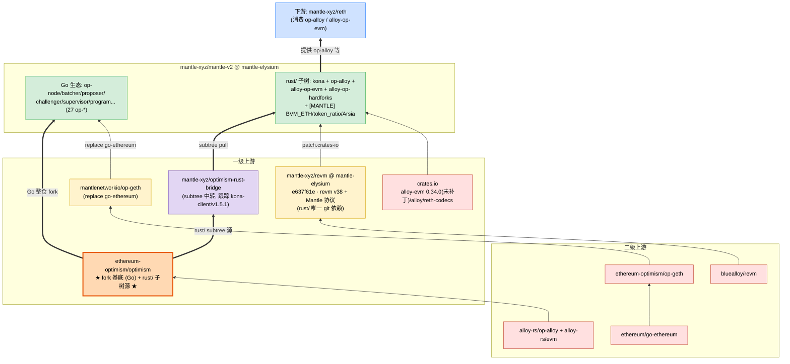
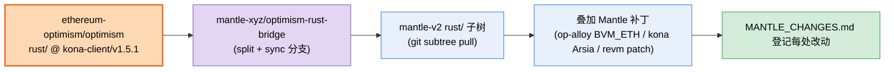

# mantle/mantle-v2（mantle-elysium 分支）上游依赖拓扑分析

> 分析对象：`mantle-xyz/mantle-v2`，分支 **`mantle-elysium`**
> 快照基准：HEAD **`afc419536`**（本地 `references/mantle/mantle-v2`）。本文所有结论基于此快照。
> 分析时间：2026-06-13
> 注：远端 `mantle-elysium` 此后已推进到 `736f4e718`（+2 提交），但新增提交未改动 `go.mod` / `rust/Cargo.toml` / `rust/Cargo.lock` / `rust/MANTLE_CHANGES.md`，故下述拓扑结论不受影响。
> 分析方法：静态分析（go.mod、`rust/Cargo.toml`/`rust/Cargo.lock` 已解析 pin、`rust/MANTLE_CHANGES.md` 权威登记、`[MANTLE]` 标记、git 历史）+ GitHub 上游交叉验证

---

## 1. 结论速览（TL;DR）

**mantle-v2 与前两个 repo 性质完全不同**——它不是单一语言的库 fork，而是 **`ethereum-optimism/optimism`（OP Stack 大 monorepo）的整仓 fork**，是 Mantle 的「平台仓库」。它内部有 **两个独立的依赖生态**：

1. **Go 生态（仓库主体，27 个 `op-*` 组件）**：OP Stack 节点软件（op-node / op-batcher / op-proposer / op-challenger / op-supervisor / op-program …）。
2. **Rust 生态（`rust/` 子树）**：`op-alloy` / `alloy-op-evm` / `alloy-op-hardforks` / `kona` 等 crate——**这一部分是 mantle/reth 的上游**（reth 从这里拉取 op-alloy 等）。

因此 mantle-v2 在 Mantle 总拓扑里既是**下游**（fork 自 OP monorepo、依赖 op-geth/revm），又是**上游**（向 mantle/reth 提供 op-alloy 等 Rust crate）。

两个生态各自的 bump 驱动与依赖：

| 生态 | bump 驱动上游 | 关键外部依赖 |
|---|---|---|
| **Go** | `ethereum-optimism/optimism`（fork 基底，module 路径不变） | **`mantlenetworkio/op-geth`**（replace go-ethereum）、`ethereum-optimism/superchain-registry` |
| **Rust（`rust/`）** | optimism monorepo 的 `rust/` 子树 @ tag **`kona-client/v1.5.1`**（经 bridge 仓库 subtree-pull） | **`mantle-xyz/revm` @ mantle-elysium**（唯一 git 依赖）、crates.io `alloy-evm 0.34.0`（未打补丁） |

---

## 2. 仓库身份与 fork 基底

- **Go module**：`go.mod` 里 `module github.com/ethereum-optimism/optimism`、`go 1.24.0`——保留上游 module 路径，证明是 `ethereum-optimism/optimism` 的整仓 fork。
- **关键 replace**：`replace github.com/ethereum/go-ethereum => github.com/mantlenetworkio/op-geth v0.0.0-20260526034114-45ddd63ceae2`——执行层（EL）被换成 Mantle 的 op-geth fork。
- **Rust 子树**：`rust/` 目录是从 optimism monorepo 的 `rust/` 子树 `git subtree` 进来的（详见 §4）。
- 分支 `mantle-elysium` 是 Mantle 当前主力分支；reth 当年 pin 的 `c06cb72` 就在此分支历史上（提交 `rust/remove-op-reth-and-evm-upstream`）。

---

## 3. Go 生态的上游依赖（仓库主体）

### 3.1 结构

27 个 `op-*` 顶层目录，是 OP Stack 的 rollup 节点软件全家桶：`op-node`（共识/派生）、`op-batcher`（批量提交）、`op-proposer`（输出根提交）、`op-challenger` / `op-dispute-mon`（故障证明博弈）、`op-supervisor` / `op-interop-mon`（interop）、`op-program`（fault proof program）、`op-conductor`、`op-deployer`、`op-e2e` 等，外加 `cannon`（MIPS VM）、`gas-oracle`、`packages/`（合约）。

### 3.2 上游依赖

| 上游 | 角色 | 接入方式 | 影响 |
|---|---|---|---|
| **ethereum-optimism/optimism** | **一级上游 / fork 基底** | 整仓 fork（module 路径保留） | 🔴 OP Stack 升级（新 hardfork、协议变更）直接进入 fork |
| **mantlenetworkio/op-geth** | 执行层（EL） | go.mod `replace` go-ethereum | 🔴 高——所有 import `github.com/ethereum/go-ethereum` 的 Go 包都解析到 Mantle op-geth（EL client、tx/types、genesis、RPC、predeploy 等路径的执行/状态/MNT gas 行为） |
| ethereum-optimism/superchain-registry | 链注册表/校验 | go.mod require | 🟡 链配置数据 |

**op-geth 的上游链路**（已验证）：`ethereum/go-ethereum` → `ethereum-optimism/op-geth` → `mantlenetworkio/op-geth`（fork parent = ethereum-optimism/op-geth）。

> 注：op-geth 是独立 repo（`references/mantle/op-geth`，上游 ethereum-optimism/op-geth）。mantle-v2 通过 go.mod replace 锁定其某个 commit（`20260526034114-45ddd63ceae2`）。

---

## 4. Rust 生态的上游依赖（`rust/` 子树）

这是与 mantle/reth、mantle/kona 直接相关的部分。

### 4.1 子树来源与 bump 机制（核心）

`rust/MANTLE_CHANGES.md` 是「每一处 Mantle 改动的权威登记表」，明确记载：

| 项 | 值 |
|---|---|
| 上游跟踪点 | optimism `kona-client/v1.5.1` @ `fbbf9089`（2026-05-12） |
| Bridge 仓库 | `https://github.com/mantle-xyz/optimism-rust-bridge` |
| 同步方式 | `git subtree pull`（bridge → `rust/`） |
| Rust 工具链 | 1.94 |

即：**`rust/` 子树 = optimism monorepo 的 `rust/` 目录（含 kona + op-alloy + alloy-op-evm + alloy-op-hardforks + op-revm）在 `kona-client/v1.5.1` 处的快照，经 bridge 仓库中转、用 subtree-pull 同步进来，再叠加 Mantle 补丁。** 这是 Rust 侧的 bump 驱动上游。

### 4.2 workspace 成员与外部依赖

`rust/Cargo.toml` 的 `[workspace]`：

- **members（全部 in-tree path）**：`kona/*`（bin/proof/node/protocol/providers/utilities/examples）、`op-alloy/crates/*`、`alloy-op-evm/`、`alloy-op-hardforks/`。
- **exclude**：`op-revm/`（本地子树存在但不编译，revm 从 fork 取）。
- **default-members**：`kona/bin/{host,client,node}`。

**已解析的外部 git 依赖（`rust/Cargo.lock`，最可信）**：

```
唯一 git 源：mantle-xyz/revm @ branch mantle-elysium #e637f61e  → 13 个包（含 op-revm）
```

| 依赖 | 来源 | 说明 |
|---|---|---|
| revm 全家 + op-revm | **`mantle-xyz/revm` @ mantle-elysium** | 唯一 git 依赖；revm v38 + Mantle 协议改动（BVM_ETH、token_ratio、ARSIA/JOVIAN、Arsia fee 校验）。`[patch.crates-io]` 把 13 个 revm-* crate 全部重定向至此 |
| alloy-evm | crates.io `alloy-evm 0.34.0` | **未打补丁** = 纯上游 alloy-rs/evm（Phase 5 撤销了 mantle-xyz/evm fork，因为 `token_ratio` trait 方法是死代码） |
| alloy-op-evm | **workspace path crate**（`path = "alloy-op-evm/"`，v0.32.0） | 来自 `rust/` 子树本身，**非 crates.io**；它是 reth 消费的 OP/Mantle EVM trait 层 |
| revm-inspectors | crates.io `0.39.0` | 上游 paradigmxyz/revm-inspectors |
| alloy / reth-codecs 等 | crates.io | 基础库 |
| paradigmxyz/reth `@88505c7f`(v2.2.0) | **声明但未使用（vestigial）** | `rust/Cargo.toml` 仍保留整段 reth git 依赖,但 `rust/Cargo.lock` 中 **0 处引用**——Phase 5 删除 `op-reth/` 后成为残留声明,EL 节点已迁至 `mantle-xyz/reth` |

### 4.3 Mantle 在 Rust 侧的改动（`[MANTLE]` 标记）

`MANTLE_CHANGES.md` 登记的主要改动：

- **op-alloy**（§3.2）：`TxDeposit` 增加 BVM_ETH 字段 `eth_value` / `eth_tx_value`（含 RLP 编解码、严格边界解码、测试）；`L1BlockInfo` 增加 `token_ratio` 字段（Mantle 的 eth/MNT 比率，用于 L1 fee 与 RPC receipt）。
- **kona-hardforks**（§3.3）：新增 `Arsia` 升级交易包（7 笔 deposit tx）+ `MantleHardforks::ARSIA`。
- **kona-genesis**（§3.4）：RollupConfig / SystemConfig 的 Mantle 谓词、hardfork 时间戳、BaseFee 配置。
- **已移除的死代码**（Phase 1.5 / 5）：`MantleBlobSource` / `MantleEthereumDataSource`（从未接入管线，Arsia 后用标准 blob 格式）、`alloy-op-evm` 的 `token_ratio` trait 方法、`op-reth/` 子树。

> 有意思的对比：standalone **mantle-xyz/kona**（见 `mantle-kona-upstream-analysis.md`）保留并接入了 `MantleBlobSource`，基线是 `kona-client/v1.2.2`；而 mantle-v2/rust/kona 基线更新（v1.5.1）且移除了这些 blob 源。**Mantle 组织内存在两套 kona,版本与裁剪不同。**

---

## 5. mantle-v2 作为「上游」：谁依赖它

| 下游消费者 | 消费内容 | 引用方式 |
|---|---|---|
| **mantle/reth** | `op-alloy*`、`alloy-op-evm`、`alloy-op-hardforks` | `git = mantle-xyz/mantle-v2, branch = mantle-elysium`（reth 的 `[workspace.dependencies]` + `[patch.crates-io]`） |

即 mantle-v2 的 `rust/` 子树是 reth「OP/Mantle 类型层」的来源。mantle-v2 自己依赖 `mantle-xyz/revm`，reth 也依赖 `mantle-xyz/revm`——两者都**声明同一个 `mantle-elysium` 分支来源**（这正是 reth 用 `[patch.crates-io]` 把 revm 统一指向该 fork 的原因）。

> ⚠️ **revm pin skew（需单独验证兼容性）**：两者声明同一分支，但当前 lockfile 解析到**不同 commit**——`mantle-v2/rust/Cargo.lock` 是 `e637f61e`，`mantle/reth/Cargo.lock` 是 `b4f61822`。分支名相同**不代表已锁定到同一 revm 版本**；二者的 revm 实际兼容性需对照 commit 单独确认，不能假定自动一致。

> 注：mantle/kona（standalone）的 op-alloy 来自独立的 `mantle-xyz/op-alloy` 仓库，**不**来自 mantle-v2。所以 op-alloy 在 Mantle 侧有两个发布入口。

---

## 6. 「上游更新 → 受影响组件」对照表

| 上游来源 | 典型更新 | 受影响组件 | 影响等级 | 触发方式 |
|---|---|---|---|---|
| ethereum-optimism/optimism | OP Stack 协议/节点逻辑 | Go 侧全部 op-* + rust/ 子树 | 🔴 极高 | 主动跟随（Go fork + rust subtree-pull） |
| mantlenetworkio/op-geth | EL 执行/状态/gas | 所有 import go-ethereum 的 Go 包（经 replace） | 🔴 极高 | go.mod replace 锁 commit |
| mantle-xyz/revm（← bluealloy） | EVM/费用模型/hardfork | alloy-op-evm、kona proof/client/host/executor、启用 revm feature 的 genesis/hardforks，以及下游 reth 执行栈；op-alloy 类型层多为间接受影响 | 🔴 高 | mantle-elysium 分支 |
| optimism rust/ 子树（kona-client tag） | kona/op-alloy/alloy-op-evm 上游 | rust/ 全部 + 下游 reth | 🔴 高 | bridge subtree-pull |
| crates.io alloy-evm 0.34.0 | EVM 抽象 | rust/ alloy-op-evm 等 | 🟠 中 | 版本号（未打补丁） |
| ethereum-optimism/superchain-registry | 链注册数据 | Go 侧链配置 | 🟡 低 | go.mod |
| paradigmxyz/reth `@88505c7f` | （声明未用） | 无（vestigial） | ⚪ 无 | — |

---

## 7. 上游依赖拓扑图

### 7.1 主拓扑（双生态）



### 7.2 Rust 子树同步链



---

## 8. 证据索引（可复现）

| 结论 | 证据 |
|---|---|
| fork 自 ethereum-optimism/optimism | `go.mod` `module github.com/ethereum-optimism/optimism` |
| go-ethereum 换成 op-geth | `go.mod` `replace ...go-ethereum => github.com/mantlenetworkio/op-geth v0.0.0-20260526034114-45ddd63ceae2` |
| op-geth ← ethereum-optimism/op-geth | `gh api repos/mantlenetworkio/op-geth` → parent = ethereum-optimism/op-geth |
| rust/ 跟踪 optimism kona-client/v1.5.1 | `rust/MANTLE_CHANGES.md` §1（baseline 表，bridge 仓库 mantle-xyz/optimism-rust-bridge） |
| rust/ 唯一 git 依赖 = mantle-xyz/revm | `rust/Cargo.lock` 仅 1 个 git 源 `mantle-xyz/revm?branch=mantle-elysium#e637f61e`（13 包） |
| revm pin skew（mantle-v2 ≠ reth） | mantle-v2 `rust/Cargo.lock` → `e637f61e`；mantle/reth `Cargo.lock` → `op-revm/revm = b4f61822`（reth `Cargo.lock` L5906、L10232）。同分支不同 commit |
| reth 实际消费的 mantle-v2 pin | mantle/reth `Cargo.lock` → `mantle-xyz/mantle-v2?branch=mantle-elysium#c06cb723`（例如 L410；其余 op-alloy* 条目同为 c06cb723） |
| revm 经 [patch.crates-io] 重定向 | `rust/Cargo.toml` L632-646（13 个 revm-* → mantle-xyz/revm@mantle-elysium） |
| alloy-evm 未打补丁 = 上游 0.34.0 | `rust/Cargo.toml` L373 + MANTLE_CHANGES §2.3（Phase 5 撤销 fork，token_ratio 为死代码） |
| reth 块为 vestigial | `rust/Cargo.toml` L285+ 声明 reth@88505c7f；`rust/Cargo.lock` 中 0 处引用 |
| workspace 成员 | `rust/Cargo.toml` L14-37（kona/* + op-alloy + alloy-op-evm + alloy-op-hardforks；exclude op-revm） |
| Mantle 改动重心 | MANTLE_CHANGES §3：op-alloy BVM_ETH/token_ratio、kona Arsia/MantleHardforks、genesis Mantle 配置 |
| mantle-v2 是 reth 上游 | mantle/reth `Cargo.toml`：op-alloy*/alloy-op-evm/alloy-op-hardforks = `git mantle-xyz/mantle-v2 branch mantle-elysium` |

---

## 9. 给后续工具阶段的备注（对应 DESCRIPTION「未来扩展」）

- mantle-v2 暴露了几个前两个 repo 没有的**建模复杂度**，工具需要支持：
  1. **单仓多生态**：一个 repo 可能同时有 Go（go.mod）和 Rust（Cargo）两套依赖图，需分别解析并标注语言。
  2. **既是下游又是上游**：mantle-v2 fork 自 OP monorepo（下游），又向 reth 提供 op-alloy（上游）。总拓扑里它是中间节点,边要分进/出方向。
  3. **subtree / bridge 同步**：Rust 侧不是 git 依赖,而是 `git subtree pull`（经 bridge 仓库）。识别此类「vendored 子树」要靠仓内文档（`MANTLE_CHANGES.md` 的 baseline 表）或 subtree merge 提交,而非 Cargo/go.mod。
  4. **声明 vs 实际使用**：`rust/Cargo.toml` 声明了 reth,但 `Cargo.lock` 未引用——**判定真实依赖必须以 lock 文件的解析结果为准**,声明清单会有残留。
  5. **同一 crate 多发布入口**：op-alloy 既在 mantle-v2/rust/op-alloy,也在独立 mantle-xyz/op-alloy;kona 既在 mantle-v2/rust/kona(v1.5.1),也在 standalone mantle-xyz/kona(v1.2.2)。节点去重/版本标注需谨慎。
- 与已分析的 `mantle-reth` / `mantle-kona` 文档共同构成总拓扑的基础;mantle-v2 是连接「alloy-rs/bluealloy 上游」与「mantle/reth」的关键中间节点。
